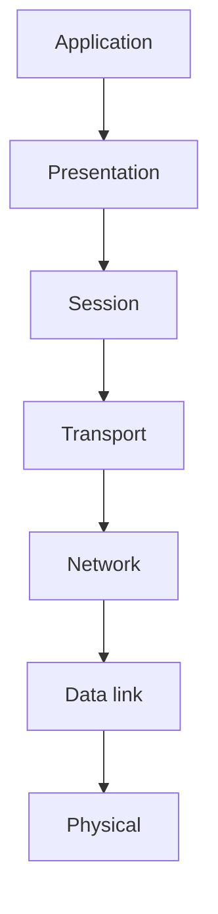

# Эталонная модель OSI (Open Systems Interconnection, ISO 7498)

## TL;DR
Семиуровневая теоретическая модель, разработанная ISO в 1980-х как универсальный «единственно правильный» эталон описания сетей. Сами протоколы OSI проиграли TCP/IP, но **модель** прижилась как удобный учебный язык. Уровни (снизу): **физический → канальный → сетевой → транспортный → сеансовый → представления → прикладной**.

## Какую проблему решает
Дать индустрии общий словарь: вместо «у нас своя реализация» все говорят на одном языке — «это L2-устройство», «это уязвимость L7». Модель **классифицирует** функции в сети по уровням абстракции и позволяет сравнивать чужие архитектуры.

## Как работает

| L | Уровень | Что делает | Примеры |
|---|---|---|---|
| 7 | Application | прикладные службы | HTTP, SMTP |
| 6 | Presentation | формат данных, шифрование, сжатие | TLS (часто относят сюда), MIME |
| 5 | Session | управление сеансами | RPC, NetBIOS |
| 4 | Transport | end-to-end, надёжность | TCP, UDP |
| 3 | Network | маршрутизация, адресация | IP, ICMP |
| 2 | Data link | фреймы по каналу, MAC | Ethernet, PPP |
| 1 | Physical | биты в сигнал | RJ-45, оптоволокно |

Отправитель: данные идут L7→L1 с инкапсуляцией. Получатель: L1→L7 с декапсуляцией. См. [[Уровневая архитектура]].

## Пример
HTTPS-запрос в терминах OSI:
- **L7 (App):** HTTP GET.
- **L6 (Presentation):** TLS-шифрование, gzip-сжатие.
- **L5 (Session):** state TCP-соединения (по практике слой почти пуст).
- **L4 (Transport):** TCP-сегмент.
- **L3 (Network):** IP-пакет.
- **L2 (Data link):** Ethernet-фрейм.
- **L1 (Physical):** биты в кабеле.

## Связи
- **Базируется на:** [[Уровневая архитектура]] — конкретное её воплощение.
- **Используется в:** [[Гибридная модель Tanenbaum]] — практическая 5-уровневая, основанная на OSI без сеансового и представления.
- **Соседи по уровню:** [[Эталонная модель TCP/IP]] — конкурирующая 4-уровневая.
- **Противопоставляется:** TCP/IP-модель победила в стеке, OSI — в словаре.

## Подводные камни
- **OSI-модель ≠ OSI-протоколы.** Модель полезна; протоколы (X.25, ASN.1, X.400 и т.п.) практически не выжили в интернете.
- L5 и L6 в реальности **почти пусты**. То, что туда формально относят (TLS, RPC, MIME), часто живёт в приложении. Поэтому Tanenbaum предлагает гибридную 5-уровневую модель.
- Маркетинг любит говорить «это L7-firewall» — обычно имеется в виду «инспектирует HTTP», а не строгий OSI L7. Используй модель как карту, не как Священное Писание.

## Дальше читать
- [[Эталонная модель TCP/IP]] — что победило фактически.
- [[Гибридная модель Tanenbaum]] — компромисс, по которому организована книга.
- Tanenbaum, гл. 1, §1.6.1, §1.6.3 (стр. PDF 89–96).
