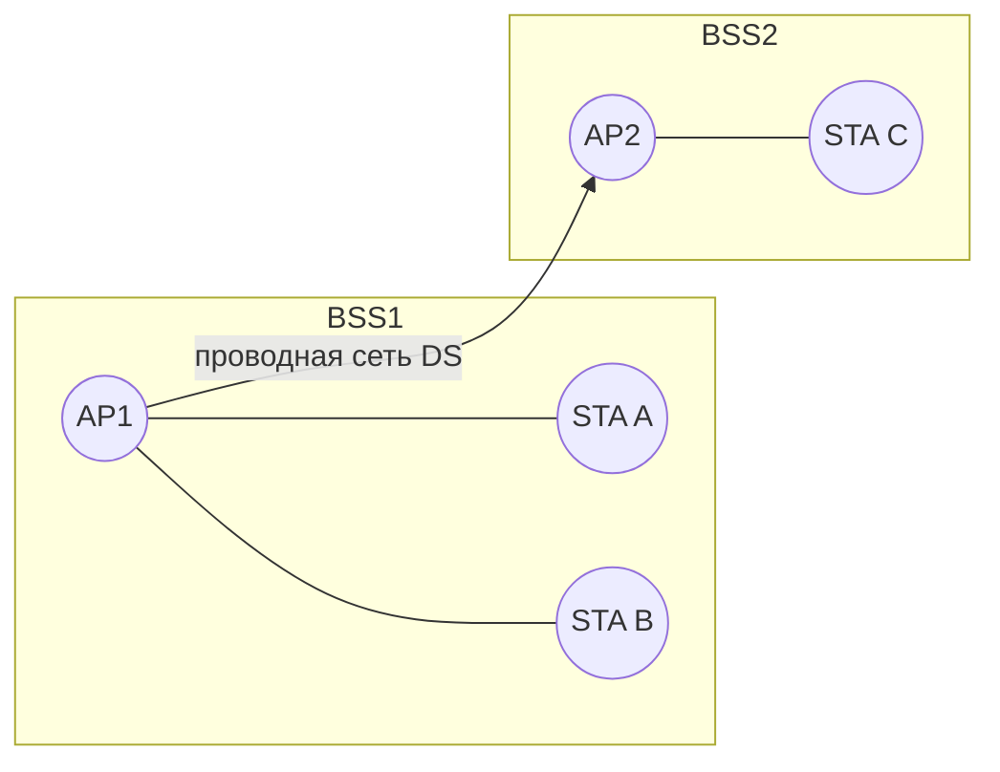

# 802.11 — Wi-Fi архитектура

## TL;DR
IEEE 802.11 — стандарт беспроводных LAN. Базовые элементы: **STA** (станция, клиент), **AP** (access point, точка доступа), **BSS** (Basic Service Set — STA + AP), **ESS** (Extended Service Set — несколько BSS, объединённых одной L2-сетью). Может работать **infrastructure** (через AP) или **ad-hoc** (peer-to-peer без AP). Использует радио в 2.4/5/6 ГГц с MAC-протоколом [[CSMA/CA]] + DCF.

## Какую проблему решает
Эфир — общая среда без проводов. Нужен стандартный способ:
- найти AP и присоединиться к ней (**ассоциация**);
- адресовать конкретного клиента в общем эфире;
- координировать доступ (избежать коллизий);
- защищать общение от чужих ушей.

Стандарт 802.11 решает это, и за счёт массовости стал доминирующим способом подключения мобильных устройств к LAN.

## Как работает

**Базовые сущности (топология):**



- **STA** — клиент: ноут, телефон, IoT-устройство.
- **AP** — точка доступа: мост между радио и проводной сетью. Объявляет свой SSID через **beacon-фреймы** (~10 раз в секунду).
- **BSS** — одна AP + её клиенты. Идентифицируется **BSSID** = MAC AP.
- **ESS** — несколько AP с одним SSID, соединённых через **DS** (Distribution System — обычно проводной Ethernet). Клиент роумит между AP без смены SSID.

**Режимы:**
- **Infrastructure** — через AP. Стандартный домашний/офисный Wi-Fi.
- **Ad-hoc (IBSS)** — равноправные STA без AP. Редко используется.
- **Mesh** (802.11s) — AP соединены через эфир. «Mesh-Wi-Fi» в маркетинге.

**Физический уровень (см. [[Wi-Fi — обзор]]):**
- Полосы: 2.4 ГГц / 5 ГГц / 6 ГГц (Wi-Fi 6E).
- Модуляция: OFDM, MIMO, OFDMA (Wi-Fi 6).
- Канальные ширины: 20/40/80/160 МГц.

**MAC-уровень:**
- **Default — DCF** (Distributed Coordination Function): [[CSMA/CA]] + random backoff.
- Опциональный **PCF** (Point Coordination Function) — AP опрашивает клиентов; редко используется.
- **EDCA** (Wi-Fi Multimedia / WMM) — расширение DCF с приоритетами для голоса/видео.
- **OFDMA** в Wi-Fi 6 — AP может назначать **подканалы** разным клиентам параллельно.

**Структура фрейма 802.11:**

```
+---------+---------+--------+--------+--------+--------+--------+----------+-----+
| Frame   | Duration| MAC1   | MAC2   | MAC3   | Seq    | MAC4*  | Payload  | CRC |
| Control | / NAV   | (DST)  | (SRC)  | (BSS)  |  Ctrl  | (опц.) | 0-2312   | -32 |
+---------+---------+--------+--------+--------+--------+--------+----------+-----+
```

**Frame Control (16 бит)** содержит ~11 подполей: Protocol Version, Type/Subtype (data/control/management), **To DS / From DS**, More Frag, Retry, Power Mgt, More Data, Protected (WEP/WPA), Order. Type/Subtype различает: `00xx` management (beacon, probe, association), `01xx` control (RTS, CTS, ACK), `10xx` data.

**Sequence Control (16 бит):** 4 бита fragment number + 12 бит sequence number (для детектирования дублей и сборки фрагментов).

**До 4 MAC-адресов** (отличие от Ethernet с 2): три используются всегда (DST конечный, SRC конечный, BSSID = MAC AP), четвёртый — только для **WDS / mesh** (AP↔AP передача). Tanenbaum (илл. 4.29) показывает 3-адресный default. Payload до **2312 байт** MAC-уровня (2304 без security overhead).

## Пример
**Подключение ноута к домашнему Wi-Fi:**
1. Ноут сканирует каналы, видит beacon с SSID «Home».
2. **Probe Request → Probe Response.**
3. **Authentication** (open или WPA-PSK).
4. **Association Request → Association Response.** Ноут стал членом BSS, AP назначила ему slot для траффика.
5. **DHCP-запрос** через broadcast-фрейм → AP мостит в Ethernet → роутер отвечает.
6. Ноут готов к интернету.

Каждый шаг — обмен 802.11-фреймами с MAC-адресами AP и ноута.

## Связи
- **Базируется на:** [[Wi-Fi — обзор]] (общий контекст), [[Подуровень MAC]] (роль), [[Спектр электромагнитных волн]] (физика).
- **Используется в:** [[802.11 MAC — DCF]], [[CSMA/CA]], [[NAV — Network Allocation Vector]], [[RTS/CTS]] — конкретные механизмы.
- **Соседи по уровню:** [[Ethernet — IEEE 802.3]] — проводной аналог LAN.
- **Противопоставляется:** [[Bluetooth]] — PAN, master-slave, не Wi-Fi-LAN.

## Подводные камни
- 802.11 — **общая среда**: все клиенты одной BSS делят полосу AP. 50 устройств в одной точке доступа — узкое место.
- **SSID** — public, не secret. Скрытый SSID не безопасность, а удобство (меньше засветки).
- BSSID = MAC AP. Это значит, что в ESS у каждой AP **свой BSSID** при общем SSID — иначе коллизии MAC.
- В 802.11 есть **management** (beacon, probe), **control** (RTS, CTS, ACK) и **data**-фреймы. Они используют разные форматы; беглый «Wireshark» учит это различать.

## Дальше читать
- [[802.11 MAC — DCF]] — детальная механика MAC.
- [[RTS/CTS]], [[NAV — Network Allocation Vector]] — управление эфиром.
- Tanenbaum, гл. 4, §4.4 (стр. PDF 358–376).
