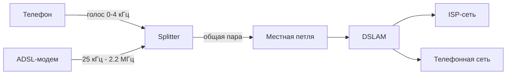

# ADSL (Asymmetric Digital Subscriber Line)

## TL;DR
Технология передачи цифровых данных по обычной телефонной паре с **асимметричными** скоростями (downstream быстрее upstream) и **одновременной работой телефона**. Разделяет полосу пары на голос (низкие частоты) и данные (высокие). Использует **DMT** — практически OFDM на 4-кГц-поднесущих. Главная технология последней мили на меди в 2000-х.

## Какую проблему решает
Голос на местной петле занимает 0.3–3.4 кГц — пара физически способна нести десятки тысяч раз больше. ADSL использует «незанятый» частотный диапазон выше голоса для **данных**, не мешая телефону. И асимметрия — потому что домашний пользователь обычно качает больше, чем отдаёт.

## Как работает

**Полоса витой пары** (типичный ADSL2+):
- 0–4 кГц — голос (телефония как обычно).
- 25.875–138 кГц — upstream (вверх).
- 138 кГц – 2.2 МГц — downstream (вниз).

**Сплиттер (filter):** на стороне абонента и на DSLAM разделяет голос и данные физически. Без сплиттера телефон шумит при работе модема.

**DMT (Discrete MultiTone):** делит полосу данных на 256 поднесущих по ~4.3 кГц. На каждой — независимая [[Цифровая модуляция — амплитуда-частота-фаза|QAM]] (от 2 до 15 бит/символ). На «плохих» поднесущих (где затухание/помехи) — меньше бит, на хороших — больше. Это **adaptive modulation**.

**Скорости (типичные):**

| Стандарт | Downstream | Upstream | Полоса |
|---|---|---|---|
| ADSL (G.992.1) | 8 Мбит/с | 1 Мбит/с | 1.1 МГц |
| ADSL2 | 12 Мбит/с | 1.4 Мбит/с | 1.1 МГц |
| ADSL2+ | 24 Мбит/с | 1.4 Мбит/с | 2.2 МГц |
| VDSL2 | 100 Мбит/с | 50 Мбит/с | 17 МГц |
| G.fast | 1 Гбит/с | 1 Гбит/с | 106/212 МГц |

Все эти скорости — **при коротких линиях**. На 5 км ADSL2+ деградирует до 3 Мбит/с.

## Пример
**Дом в пригороде, 2007 г.:**
- Линия 1.5 км от АТС, медная пара хорошего качества.
- ADSL2+, 16 Мбит/с вниз, 1 Мбит/с вверх.
- Стандартный сплиттер делит голос и данные.
- DSLAM в АТС, оптика от АТС к ISP.

**Поведение:**
- Сосед по линии включил видеоконференцию → твой DSL замедлился.
- Дождь нарушил изоляцию пары → перепогрузилась модуляция, ноутбук «упал» в скорости.

## Связи
- **Базируется на:** [[Местная петля]] (физическая среда), [[OFDM]] (DMT — частный случай).
- **Используется в:** [[Сети широкополосного доступа]] — один из вариантов последней мили.
- **Соседи по уровню:** [[DOCSIS]] (по кабелю), FTTH (по оптике), 5G FWA (по радио).
- **Противопоставляется:** dial-up — узкополосный, занимает голос; FTTH — гораздо шире и симметрично, но требует новой проводки.

## Подводные камни
- Скорость **сильно** зависит от длины и качества пары. В рекламе всегда «до 24 Мбит/с»; на практике от 2 до 20.
- Сплиттер ОБЯЗАТЕЛЕН на каждой телефонной розетке. Без него — помехи и в голосе, и в данных.
- ADSL — не Ethernet; внутри идёт обычно **PPPoE** или **PPPoA**, что добавляет инкапсуляцию и аутентификацию.
- В 2026 г. многие операторы списывают ADSL и переключают абонентов на оптику.

## Дальше читать
- [[Местная петля]] — физика среды.
- [[DOCSIS]] — кабельный конкурент.
- [[OFDM]] — теория DMT.
- Tanenbaum, гл. 2, §2.5.2; гл. 3, §3.5.2 (стр. PDF 170–179, 300–303).
