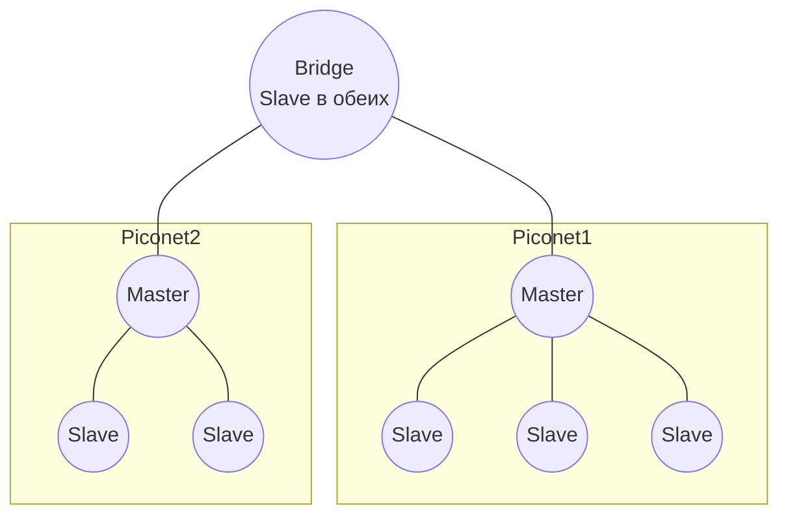

# Bluetooth

## TL;DR
Стандарт IEEE 802.15.1 для PAN (personal area networks) — связь устройств в пределах 1–10 метров. Работает в нелицензируемой полосе 2.4 ГГц с **frequency hopping** (FHSS). **Piconet**: master + до 7 активных slaves, master управляет TDM-слотами. **Scatternet**: несколько piconet'ов, объединённых через узлы-мосты. Современный профиль — **BLE** (Bluetooth Low Energy) для IoT.

## Какую проблему решает
Wi-Fi для коротких связей (наушники, мышка, IoT-датчик) избыточен по энергии и сложности. Нужен дешёвый, маломощный стандарт для ad-hoc подключения устройств в пределах личного пространства. Bluetooth даёт это: чип ~$5, энергия минимальна (BLE — годы от монетки), стандарт массовый.

## Как работает

**Топология:**
- **Piconet** — master + до 7 активных slave-устройств. По сути централизованный TDM: master решает, кто говорит когда. Slave'ы напрямую друг с другом **не общаются**.
- **Scatternet** — несколько piconet'ов соединены через узлы-мосты (которые master в одной и slave в другой).
- **Parked nodes** — спят, реактивируются по сигналу.

**Физический уровень:**
- **Полоса:** 2.4 ГГц ISM, 79 каналов по 1 МГц (Bluetooth 1.x–4.x BR/EDR).
- **Hopping:** 1600 раз/с (FHSS) — устойчивость к помехам Wi-Fi.
- **AFH** (Adaptive Frequency Hopping) — пропуск занятых Wi-Fi-каналов.
- **Скорость:** 1 Мбит/с (BR), 3 Мбит/с (EDR), 24 Мбит/с (HS, через 802.11 AMP), 2 Мбит/с (BLE 5).

**MAC-уровень:**
- TDM-слоты длиной **625 мкс**.
- Master в чётных слотах → slave в нечётных.
- Multi-slot фреймы 1/3/5 слотов для больших данных.

**Bluetooth Low Energy (BLE):**
- Появился в 4.0 (2010) — другой стек, оптимизированный под минимум энергии.
- 40 каналов (37 data + 3 advertising) по 2 МГц.
- Pairing/connection быстрее, чем у classic.
- Используется в IoT-сенсорах, фитнес-трекерах, AirTag, Apple Find My, Beacon-системах.

**Bluetooth 5.x (с 2016):**
- Дальность × 4 (LE Long Range до ~200 м).
- Скорость × 2 (до 2 Мбит/с).
- LE Audio (с 5.2): новый аудиокодек LC3, multi-stream, broadcast.

## Пример
- **Беспроводные наушники AirPods:** телефон = master, наушники = slave. Голос/музыка по profile A2DP/LE Audio.
- **AirTag:** BLE advertising каждые ~2 с, помогает Apple-устройствам поблизости определить местоположение через Find My.
- **Wireless mouse:** BLE HID profile, telephone master.

## Связи
- **Базируется на:** [[Подуровень MAC]] (отдельный MAC, отличный от 802.11), [[Расширение спектра — FHSS]] (физика), [[Спектр электромагнитных волн]] (2.4 ГГц ISM).
- **Используется в:** PAN-сценарии, IoT, аудио-аксессуары.
- **Соседи по уровню:** [[Wi-Fi — обзор]] — другая беспроводная семья, для LAN; ZigBee/802.15.4 — конкурент в IoT.
- **Противопоставляется:** Wi-Fi — много пользователей, выше скорость, выше энергия.

## Подводные камни
- **2.4 ГГц = общий с Wi-Fi и микроволновками.** AFH помогает, но при перегрузке Wi-Fi может страдать звук в bluetooth-наушниках.
- BLE и Bluetooth Classic — **разные стеки**, не совместимы (но многие устройства поддерживают оба).
- В piconet **только** master и slave; нет peer-to-peer между slave'ами в чистом Bluetooth (есть в mesh-расширениях после 4.2).
- **Безопасность:** ранние версии (BR/EDR + Just Works pairing) уязвимы; современный SSP/LE Secure Connections с ECDH защищён.

## Дальше читать
- [[Расширение спектра — FHSS]] — физика.
- [[Wi-Fi — обзор]] — для контраста.
- Tanenbaum, гл. 4, §4.5 (стр. PDF 376–384).
