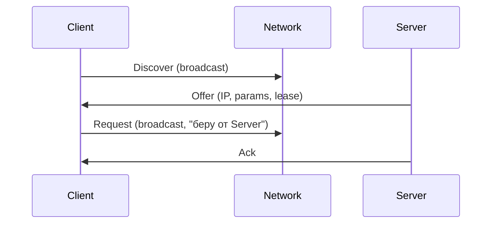

# DHCP — Dynamic Host Configuration Protocol

## TL;DR
Протокол автоматической **раздачи IP-адресов и сетевых параметров** хостам в LAN. Клиент при старте broadcast'ит «нужен адрес» (Discover), сервер предлагает (Offer), клиент запрашивает конкретный (Request), сервер подтверждает (Ack). Также раздаёт DNS-серверы, gateway, NTP, домен, и сотни других опций. Стандарт RFC 2131. Без DHCP каждый хост в сети нужно настраивать вручную.

## Какую проблему решает
Назначать IPv4-адреса вручную в сети из 200 устройств — кошмар. Конфликт адресов, переезды, забытые настройки. DHCP это решает: **сервер централизованно** управляет пулом адресов и раздаёт их **по запросу** на ограниченное время (lease).

## Как работает

**4-этапный обмен (DORA):**

1. **DHCP Discover** — клиент broadcast'ит на 255.255.255.255:67 (UDP, порт сервера). Источник пока 0.0.0.0 — у клиента ещё нет адреса.
2. **DHCP Offer** — сервер(ы) отвечают предложением: «вот тебе 192.168.1.50/24, gateway 192.168.1.1, DNS 8.8.8.8, lease 24h».
3. **DHCP Request** — клиент broadcast'ит «беру предложение от сервера X» (если несколько серверов, выбирает первый).
4. **DHCP Ack** — сервер подтверждает.

**Lease:** клиент получает адрес на ограниченное время (typically 24h). По 50% lease-времени клиент пытается **продлить** через DHCP Request unicast'ом серверу. Если не получилось до конца — отпускает адрес, делает Discover заново.

**Опции** (стандартизованы по номерам, RFC 2132):
- 1 Subnet Mask
- 3 Router (default gateway)
- 6 DNS Servers
- 12 Hostname
- 51 Lease Time
- 66 TFTP server name (для PXE-boot)
- 119 DNS search list

**DHCPv6** (RFC 8415) — для IPv6: альтернатива/дополнение к SLAAC. В **stateless** режиме раздаёт только параметры (DNS), адрес — через SLAAC.

## Пример
**Дом, новый телефон подключается к Wi-Fi:**
1. После ассоциации с AP — broadcast Discover.
2. Роутер (DHCP-server для LAN) отвечает Offer (192.168.1.45 на 24 часа, gateway 192.168.1.1, DNS 1.1.1.1).
3. Телефон делает Request, получает Ack.
4. Записывает: `IP, mask, gateway, DNS`.
5. Делает ARP для MAC роутера → готов к интернет-трафику.

Через 12 часов начинает renewal; обычно роутер просто продлевает.

## Связи
- **Базируется на:** UDP (порты 67/68), broadcast в LAN, [[IP-адресация и CIDR]] (раздаваемые адреса).
- **Используется в:** все офисные/домашние сети с автоконфигурацией; PXE-boot; cloud (cloud-init часто работает через DHCP-options).
- **Соседи по уровню:** [[ARP]] — после DHCP-конфигурации первый шаг; **SLAAC** в IPv6 — альтернатива.
- **Противопоставляется:** статическая конфигурация — менее гибко, но детерминированно (для серверов часто статика).

## Подводные камни
- **DHCP starvation** — атака: злоумышленник запрашивает все адреса из пула → легитимные клиенты не получают. Защита — DHCP snooping на switch'е.
- **Rogue DHCP server** — атака: подложный сервер раздаёт неправильный gateway → MITM. Защита — DHCP snooping + trusted ports.
- **DNS-конфигурация через DHCP** — если можешь подсунуть свой DNS, можешь подменить любой сайт без TLS.
- DHCPv6 + SLAAC — гибкая, но запутанная история. В корпоративных сетях часто DHCPv6 предпочитают; в домашних — SLAAC.

## Дальше читать
- [[IP-адресация и CIDR]] — что DHCP раздаёт.
- [[ARP]] — следующий шаг после получения IP.
- Tanenbaum, гл. 5, §5.7.4 (стр. PDF 533–535).
