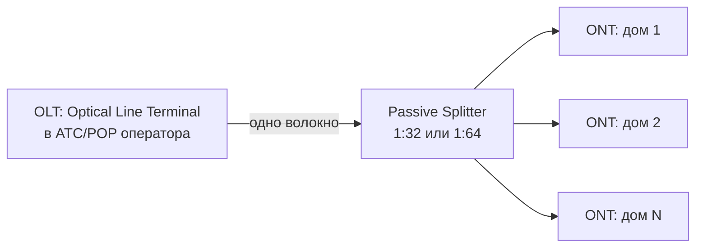

# FTTH и PON

## TL;DR
**FTTH** (Fiber to the Home) — оптоволокно прямо к абоненту, ультимативная «последняя миля». **PON** (Passive Optical Network) — наиболее распространённая архитектура: одно оптоволокно от станции расходится через **пассивный сплиттер** на 32-64 абонентов. **GPON** (2.5/1.25 Gbps), **XGS-PON** (10 Gbps симметрично) — стандарты. Пассивный — нет питания между станцией и абонентом → надёжно, дёшево.

## Какую проблему решает
ADSL (медь) ограничен расстоянием/скоростью. Кабельные сети (HFC) — shared. Хочется **большую полосу до конкретного дома** с гарантиями. FTTH-PON: оптика не требует питания посередине, сплиттер = просто кусок стекла, делящий свет на N путей. Развёртывание дорогое единожды, эксплуатация дёшевая.

## Как работает

**Архитектура PON:**

**Компоненты:**
- **OLT** (Optical Line Terminal) на станции.
- **Splitter** (1:32 или 1:64) — оптический делитель (passive).
- **ONT** (Optical Network Terminal) или **ONU** (Optical Network Unit) у абонента.

**Downstream (OLT → ONT):**
- Broadcast: один поток виден всем ONT.
- Каждый ONT **фильтрует** свои пакеты по идентификатору (PON ID) и ignore'ит чужие.
- Шифрование (AES) защищает от подслушивания соседей.

**Upstream (ONT → OLT):**
- TDMA: каждый ONT получает временной слот.
- OLT планирует grants: «ONT-3, передавай в окно T1-T2».
- Нет коллизий, контролируется централизованно.

**Скорости:**
| Стандарт | Downstream | Upstream | Год |
|---|---|---|---|
| GPON (G.984) | 2.488 Gbps | 1.244 Gbps | 2003 |
| XG-PON (G.987) | 10 Gbps | 2.5 Gbps | 2010 |
| **XGS-PON** | **10 Gbps** | **10 Gbps** | 2016 |
| 25G-PON | 25 Gbps | 10 Gbps | 2020 |
| 50G-PON | 50 Gbps | 25 Gbps | 2022 |

Скорости **shared** между N абонентами (32 или 64). На GPON 2.5 Gbps / 32 = ~78 Mbps **гарантированно** на абонента; больше при недогруженной соседней.

**Терминология:**
- **FTTH** — fiber до квартиры.
- **FTTB** (to building) — оптика до подъезда, далее медь по квартирам.
- **FTTC** (to curb) — оптика до street-cabinet, далее VDSL по медной паре.

## Пример
**Новостройка в Москве, 2026:**
- Провайдер тянет одно волокно от районного POP до дома.
- В подвале — splitter 1:64.
- В каждой квартире — ONT (часто маршрутизатор+ONT в одном).
- Тариф 500 Мбит/с симметрично — реально 95% времени держит, при пиковой нагрузке соседей может опуститься до 100 Мбит/с.

**В отличие от ADSL** — расстояние от станции до 20 км не влияет на скорость (оптика).

## Связи
- **Базируется на:** [[Оптоволокно]] (физика), [[Мультиплексирование]] (TDMA в upstream, broadcast в downstream).
- **Используется в:** [[Сети широкополосного доступа]] (один из вариантов).
- **Соседи по уровню:** [[ADSL]] (медь), [[DOCSIS]] (HFC), 5G FWA (радио).
- **Противопоставляется:** **active Ethernet FTTH** — point-to-point fiber на каждого абонента (без splitter, без TDMA). Дороже, но эксклюзивная полоса.

## Подводные камни
- **Shared upstream:** в час пик все 64 абонента могут быть active → upstream становится bottleneck.
- **ONT power loss:** при отключении электричества ONT не работает → нет интернета и (для VoIP) нет телефона. Battery backup в ONT.
- **Migration GPON → XGS-PON** — проблема: разные wavelengths можно совместить в том же fiber → постепенный upgrade.
- **PON неshredd-ed broadcast** — соседи теоретически могут подслушать, AES-encryption защищает; но без неё — проблема.

## Дальше читать
- [[Оптоволокно]] — физика.
- [[Сети широкополосного доступа]] — общая картина.
- Tanenbaum, гл. 2, §2.5.2 (стр. PDF 177–179).
