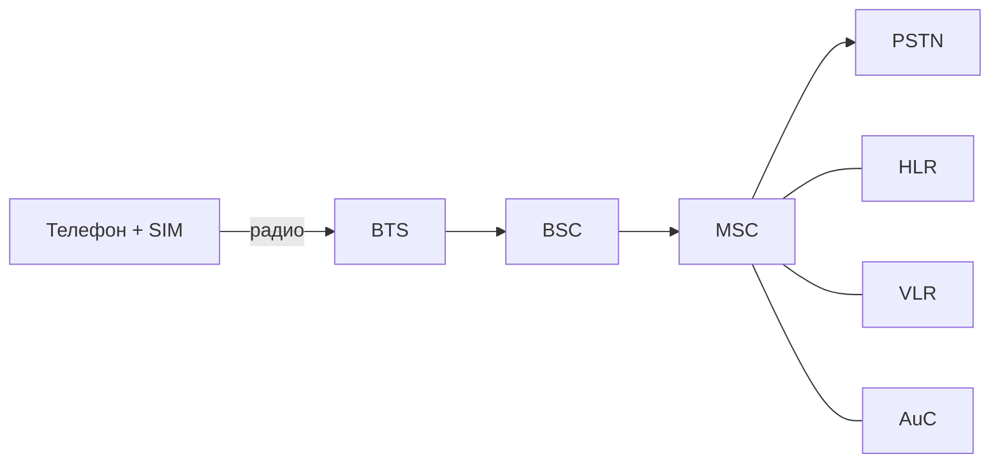

# GSM (Global System for Mobile Communications)

## TL;DR
Цифровой стандарт сотовой связи второго поколения (**2G**), разработанный в Европе в 1980-х и развёрнутый с 1991 г. Использует **FDMA + TDMA** в полосах 900/1800/1900 МГц. Главная особенность — **SIM-карта**: учётка абонента отделена от телефона. Стал глобальным стандартом, к 2010-м обслуживал ~80% мобильных абонентов мира.

## Какую проблему решает
1G (AMPS, NMT) был **аналоговым** и национально-фрагментированным: разные стандарты, плохая ёмкость, отсутствие шифрования и роуминга. Европейские операторы договорились создать **общий цифровой** стандарт — отсюда и название (изначально *Groupe Spéciale Mobile*). Цели: ёмкость, безопасность, роуминг, цифровая передача данных.

## Как работает

**Полосы:** GSM работает на нескольких частотах, включая **900, 1800 и 1900 МГц** (Tanenbaum, стр. PDF 197). Это позволяет обслуживать значительно больше пользователей, чем предыдущий AMPS.

**Доступ к среде (FDMA + TDMA):**
- Каждая полоса делится на **200-кГц-каналы** (FDMA).
- Каждый канал делится на **8 временных слотов** (TDMA, 4.615 мс кадр).
- Один пользователь занимает 1 слот в одном канале → **8 пользователей на 200 кГц**.

**Архитектура:**
- **MS** (Mobile Station) — телефон + SIM.
- **BTS** (Base Transceiver Station) — собственно базовая станция (антенна + радио).
- **BSC** (Base Station Controller) — управляет несколькими BTS, отвечает за радиоресурсы и handoff.
- **MSC** (Mobile Switching Center) — коммутирует звонки, соединяется с PSTN.
- **HLR** (Home Location Register) — база абонентов оператора.
- **VLR** (Visitor Location Register) — где сейчас находятся «гости» в этом MSC.
- **AuC** (Authentication Center) — секретные ключи для аутентификации.
- **EIR** (Equipment Identity Register) — IMEI, чёрные списки украденных телефонов.

**SIM-карта** хранит:
- IMSI (International Mobile Subscriber Identity) — уникальный ID абонента.
- Ki (секретный ключ) — для аутентификации; не покидает SIM.
- Контакты, SMS (исторически), записи.

При включении телефон отправляет IMSI/TMSI, MSC аутентифицирует через AuC: оператор шлёт случайный challenge → SIM считает ответ через Ki → совпало = ты тот, за кого себя выдаёшь.

**Шифрование:** GSM шифрует радио-канал алгоритмами A5/1 (Европа) или A5/2 (слабый, экспортный). Обе сегодня **взломаны**, но в 2G это всё, что есть.

**Скорости данных:**
- GSM (CSD) — 9.6 кбит/с.
- GPRS (2.5G) — до 80 кбит/с (пакетная передача).
- EDGE (2.75G) — до 384 кбит/с.

## Пример
**Звонок дома → друг в командировке за границей:**
1. Friend's phone в Турции включился, ищет соту.
2. Аутентификация через VLR Turkcell, обращение к HLR МТС → ОК.
3. Friend получает временный TMSI и приём звонков активен.
4. Ты звонишь его номер +7-9XX-...; MSC видит, что HLR говорит «он сейчас в Турции», переадресует звонок туда.
5. Голос идёт TDM-каналами через PSTN до Стамбула, дальше радио до телефона.

Биллинг: оба оператора фиксируют, расходы делят по соглашению о роуминге.

## Связи
- **Базируется на:** [[Сотовая сеть — соты и handoff]], [[Мультиплексирование]] (FDMA+TDMA).
- **Используется в:** [[Поколения сотовой связи 1G–5G]] — 2G ветвь.
- **Соседи по уровню:** CDMA-сеть IS-95 (cdmaOne) — параллельный 2G, использует DSSS вместо TDMA. UMTS (3G) — потомок GSM с CDMA-радио.
- **Противопоставляется:** AMPS (1G) — аналоговый, без шифрования, без роуминга в нашем смысле.

## Подводные камни
- Шифрование A5/1 уязвимо для офлайн-атак (rainbow tables); IMSI-catchers (Stingray) перехватывают разговоры в реальном времени.
- В 2010-х многие операторы начали отключать 2G в пользу 4G/5G — некоторые IoT-устройства, рассчитанные на GSM, перестали работать.
- IMEI (идентификатор телефона) и IMSI (идентификатор SIM) — разные сущности; путать их — типичная ошибка.

## Дальше читать
- [[Поколения сотовой связи 1G–5G]] — место GSM в эволюции.
- [[Сотовая сеть — соты и handoff]] — handoff в GSM конкретно.
- Tanenbaum, гл. 2, §2.6.4 (стр. PDF 196–200).
