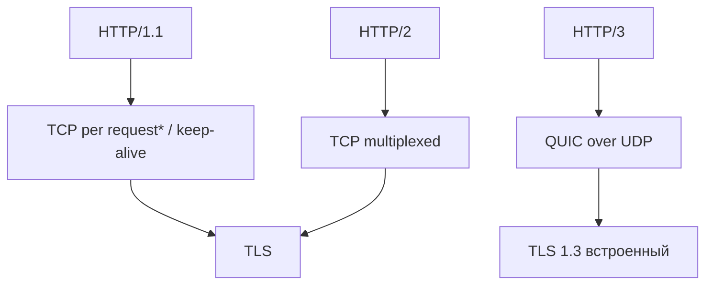

# HTTP/2 и HTTP/3

## TL;DR
**HTTP/2** (RFC 7540, 2015) — бинарный фрейминг, мультиплексирование streams в одном TCP-соединении, **HPACK** header compression, server push. Семантика та же, что у HTTP/1.1. **HTTP/3** (RFC 9114, 2022) — тот же HTTP, но поверх **[[QUIC]]** (UDP), без TCP HoL-blocking, 0-RTT handshake. Современный веб быстро перешёл: 2026 — большая часть трафика HTTP/2 или HTTP/3.

## Какую проблему решает
HTTP/1.1 тормозит:
- Headers повторяются (Cookies, User-Agent на каждом запросе) — overhead.
- Pipelining плохо работал из-за HoL blocking.
- Один запрос на одно TCP-соединение → много соединений per page → больше TCP+TLS overhead.

HTTP/2 решил большинство этого, но **TCP HoL** остался: один потерянный TCP-сегмент задерживает все мультиплексированные streams.

HTTP/3 решает это переходом на QUIC, где per-stream надёжность.

## Как работает

### HTTP/2
- **Бинарный фрейминг:** запросы/ответы — frames с типом и stream-id.
- **Multiplexing:** много логических streams в одном TCP-соединении. Каждый — независимая (на уровне HTTP) последовательность frames.
- **HPACK** ([[Сжатие заголовков]]): static + dynamic table + Huffman.
- **Server push** (deprecated в практике): сервер мог "толкать" связанные ресурсы заранее.
- **Stream priorities:** клиент намекает, что важнее.
- **Negotiation:** ALPN ("h2") в TLS handshake.

### HTTP/3
- Поверх **[[QUIC]]** (UDP).
- **QPACK** вместо HPACK (адаптировано под QUIC streams).
- **Per-stream надёжность** — потеря в одном stream не влияет на другие.
- **0-RTT** возможен для повторных подключений.
- **Negotiation:** Alt-Svc header или DNS HTTPS RR (RFC 9460).

### Сравнение

| | HTTP/1.1 | HTTP/2 | HTTP/3 |
|---|---|---|---|
| Encoding | text | binary frames | binary frames |
| Multiplex | нет | да | да + per-stream reliability |
| Headers | repetitive | HPACK | QPACK |
| Transport | TCP | TCP | QUIC (UDP) |
| Handshake (new) | TCP+TLS = 2-3 RTT | TCP+TLS = 2-3 RTT | QUIC = 1 RTT |
| Handshake (resume) | + | + | 0-RTT |
| HoL blocking | да | TCP-level | нет |

## Пример
- **Загрузка страницы 50 ресурсов:**
  - HTTP/1.1: 6 параллельных TCP-соединений → 9 раундов запросов.
  - HTTP/2: 1 TCP, мультиплексирование → 50 streams параллельно.
  - HTTP/3: 1 QUIC, без HoL → даже при потерях каждый stream независим.

- **YouTube, Facebook, Cloudflare-сайты** — HTTP/3 default.
- **Старые серверы / corporate firewalls** — fallback на HTTP/2 или /1.1.

## Связи
- **Базируется на:** [[HTTP]] (семантика), [[TCP]] (для /2), [[QUIC]] (для /3).
- **Используется в:** Google services, Cloudflare, Apple, многие современные CDN.
- **Соседи по уровню:** [[Сжатие заголовков]] (HPACK/QPACK).
- **Противопоставляется:** HTTP/1.1 — обратная совместимость, но медленнее.

## Подводные камни
- **HTTP/2 server push** в практике пользы дал мало → deprecated.
- **HTTP/3 требует UDP/443** — некоторые corporate networks блокируют → fallback.
- **Debugging** HTTP/2/3 сложнее, чем 1.1 (не текст). Wireshark + ssl-keylog для расшифровки.
- **Сертификаты** — те же, что у HTTPS.

## Дальше читать
- [[HTTP]] — семантика остаётся.
- [[QUIC]] — транспорт HTTP/3.
- [[Сжатие заголовков]] — HPACK/QPACK.
- Tanenbaum, гл. 7, §7.3.4 (стр. PDF 740–753).
