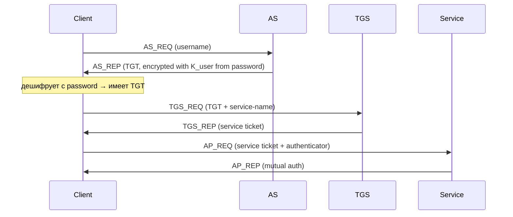

# Kerberos (MIT, 1988; RFC 4120)

## TL;DR
Сетевая аутентификация на **симметричных ключах** через **Trusted Third Party** — **KDC** (Key Distribution Center). Пользователь логинится один раз, KDC выдаёт **ticket-granting ticket (TGT)**, который потом позволяет получать **service tickets** для конкретных сервисов без повторного ввода пароля. Базис **Single Sign-On** в Windows-доменах (Active Directory).

## Какую проблему решает
Каждый сервис не должен хранить пароли пользователей или знать их. Нужен **trusted third party**, который один раз аутентифицирует → выдаёт «билеты» доступа. Также: пароль никогда не **передаётся** по сети (даже зашифрованным) — KDC и client делят его как pre-shared secret.

## Как работает

**3 главных компонента:**
- **KDC** — серверная часть, две роли:
  - **AS** (Authentication Server) — auth user, выдаёт TGT.
  - **TGS** (Ticket Granting Server) — выдаёт service tickets.
- **Client** — пользователь.
- **Service** — сервер, которому нужно убедиться в identity клиента.

**Flow (simplified):**

**Ticket** — encrypted-block from KDC к service, содержит client identity и session key. Service decrypts с своим pre-shared K_service.

**Session keys:**
- Между client ↔ TGS: для Subsequent service-ticket-requests.
- Между client ↔ service: для actual application-protocol.

**Realm:** административный домен Kerberos. Cross-realm trust возможен.

## Пример
**Login в Windows-домен:**
1. Введён password.
2. Background: AS-REQ к AD DC → TGT.
3. Открытие network-share: TGS-REQ → service ticket для `cifs/server.example.com`.
4. Подключение к share: AP-REQ → service authenticates client without re-asking password.
5. Тот же TGT для GUI, exchange, SQL Server, и т.д.

**Без Kerberos** каждое приложение имело бы свой login.

## Связи
- **Базируется на:** [[Симметричная vs асимметричная криптография]] (DES/AES между сторонами), [[Хеш-функции]] (для key derivation).
- **Используется в:** Microsoft Active Directory (default auth), MIT Kerberos, NFSv4, IPA в Linux.
- **Соседи по уровню:** **OAuth 2.0 / OpenID Connect** — современные web-SSO; **SAML** — enterprise SSO; **Kerberos vs OAuth:** разные миры.
- **Противопоставляется:** password-per-service — security/usability disaster.

## Подводные камни
- **Time-sync критичен:** tickets имеют timestamp. Drift > 5 минут → auth fails. NTP обязателен.
- **TGT compromise = катастрофа:** позволяет issue любых service tickets (Pass-the-Ticket, Golden Ticket attacks).
- **Не для public internet:** дизайн рассчитан на enterprise LAN. Через интернет нужен Kerberos-over-VPN или IPsec.
- **Krbtgt account** в AD — самый ценный, его password should rotate периодически.

## Дальше читать
- [[X.509 сертификаты]] — альтернативный auth механизм (asymmetric).
- Tanenbaum, гл. 8, §8.9.4 (стр. PDF 907–910).
