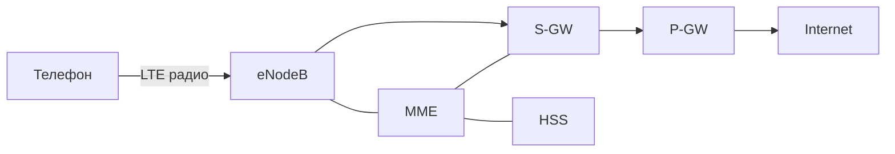

# LTE (Long Term Evolution)

## TL;DR
Стандарт **четвёртого поколения** сотовой связи (3GPP Release 8, 2009): **OFDMA** в downlink, **SC-FDMA** в uplink, **all-IP** ядро (Evolved Packet Core), плоская архитектура без BSC, голос как VoLTE поверх IP-данных. Пиковые скорости — 100 Мбит/с downlink / 50 Мбит/с uplink (LTE Release 8 по Tanenbaum, стр. 205); LTE-Advanced — до 1 Гбит/с.

## Какую проблему решает
3G (UMTS/CDMA2000) уже даёт мобильные данные, но архитектура унаследована от голосовой эры: BSC, циркуитная коммутация, ограниченная масштабируемость. С ростом смартфонов и видео операторам потребовалась **флэт-архитектура all-IP** с большей пропускной способностью и спектральной эффективностью. LTE — переписали стек с нуля под пакетную передачу.

## Как работает

**Радио:**
- **Downlink:** OFDMA (см. [[OFDM]]) — частоты разбиты на ресурсные блоки по 12 поднесущих × 7 OFDM-символов; каждый блок — 180 кГц × 0.5 мс, выдаётся пользователю по требованию.
- **Uplink:** SC-FDMA — DFT-предкодирование снижает PAPR, экономит батарею телефона.
- **Полосы:** от 1.4 до 20 МГц (в LTE-Advanced — агрегация до 100 МГц).
- **Модуляция:** до 64-QAM в LTE Release 8, до 256-QAM в LTE-Advanced Pro.
- **MIMO:** 2×2, 4×4, до 8×8 в LTE-Advanced.

**Архитектура — EPC (Evolved Packet Core):**

| Узел | Роль |
|---|---|
| **eNodeB** | базовая станция (объединяет функции BTS+BSC из 3G) |
| **MME** (Mobility Management Entity) | управление сессиями, аутентификация, mobility, выбор SGW |
| **S-GW** (Serving Gateway) | анкер пользовательского трафика, передача между eNodeB при handoff |
| **P-GW** (PDN Gateway) | выход в интернет, назначение IP, биллинг, QoS, DPI |
| **HSS** (Home Subscriber Server) | база абонентов, ключи (преемник HLR/AuC) |
| **PCRF** | политики QoS, тарификация |

**Bearer:** логический канал с QoS-параметрами. Default bearer — для интернета; dedicated bearer — для VoLTE (низкий jitter).

**VoLTE:** голос идёт как IP-пакеты с приоритетом по dedicated bearer. SIP-сигнализация через IMS-подсистему. Преемник CSFB (Circuit-Switched Fallback) — когда LTE-телефон падал на 3G ради звонка.

## Пример
- **Звонок по VoLTE:** Smartphone устанавливает SIP-сессию через IMS, RTP-медиа идёт через P-GW. Ты не замечаешь, потому что сетевой стек оператора маршрутизирует это с приоритетом. Качество — лучше 3G CSFB за счёт wideband-кодеков (AMR-WB, 16 кГц).
- **Handoff в LTE:** edge-of-cell измерение, MME согласует с целевой eNodeB, S-GW переключает анкер. Hard handoff (~100 мс), пакеты могут потеряться, но IP не разрывается.

## Связи
- **Базируется на:** [[OFDM]] (OFDMA — основа радио), [[Поколения сотовой связи 1G–5G]] (контекст в эволюции).
- **Используется в:** массовый мобильный интернет 2010–2020-х. 5G NR Non-Standalone использует ядро LTE EPC.
- **Соседи по уровню:** [[GSM]] (2G), UMTS (3G), 5G NR (новое поколение).
- **Противопоставляется:** 3G UMTS — иерархическая, голос-ориентированная; LTE — плоская, all-IP.

## Подводные камни
- «LTE = 4G» — упрощённо. LTE Release 8 формально **3.9G** по требованиям ITU IMT-Advanced. **4G** строгие требования начались с LTE-Advanced (Release 10).
- **VoLTE требует поддержки** на стороне оператора и аппарата. До массового VoLTE долго звонок «сваливался» на 3G/2G — CSFB.
- LTE-uplink использует SC-FDMA, не OFDMA — для энергии. Это часто опускают в кратких объяснениях.
- В 5G Non-Standalone телефон одновременно подключён к LTE eNodeB (для control plane) и 5G gNodeB (для данных) — гибридная конфигурация.

## Дальше читать
- [[Поколения сотовой связи 1G–5G]] — место в эволюции.
- [[OFDM]] — детали радио.
- [[GSM]] — для контраста с 2G-архитектурой.
- Tanenbaum, гл. 2, §2.6.6 (стр. PDF 204–206).
