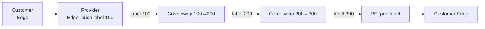

# MPLS — Multi-Protocol Label Switching

## TL;DR
Технология **label switching** между L2 и L3: пакет получает короткую **метку (label, 20 бит)** при входе в MPLS-домен; маршрутизаторы внутри домена пересылают **по метке**, не разбирая IP-заголовок. Результат: очень быстрая пересылка + поддержка **виртуальных каналов** (LSP), traffic engineering, VPN. Доминирует в магистралях провайдеров с конца 1990-х.

## Какую проблему решает
До MPLS: маршрутизаторы делали **longest-prefix lookup** в большой IP-таблице — медленно (тогдашнее железо). MPLS: один раз классифицировали на входе → дальше везде O(1)-lookup по метке. Также реализуются **виртуальные пути** для traffic engineering ([[Datagram subnet vs virtual-circuit subnet|virtual circuits]]) и **MPLS VPN** (один backbone — несколько изолированных клиентов).

## Как работает

**Label-стек** между L2 и L3:
```
+----------+------------+------------+----------+
| Ethernet | MPLS Label | (more...)  | IP/data  |
| header   | (4 байта)  |            |          |
+----------+------------+------------+----------+
```

**Структура label entry (4 байта):**
- **Label** — 20 бит.
- **EXP / Traffic Class** — 3 бита (для QoS, как DSCP).
- **S** — 1 бит «bottom of stack».
- **TTL** — 8 бит.

**Маршрутизаторы:**
- **LER** (Label Edge Router) — на границе домена; выполняет **push** (добавляет метку при входе) или **pop** (снимает на выходе).
- **LSR** (Label Switch Router) — внутри; читает только метку, делает **swap** на следующую и forward.

**LSP** (Label Switched Path) — путь через MPLS-домен с уникальным label на каждом hop'е.

**Установление LSP:**
- **LDP** (Label Distribution Protocol) — простой, по shortest path (на основе IGP).
- **RSVP-TE** — для traffic engineering, явное указание пути.
- **BGP** — для **MPLS-VPN** (RFC 4364).



## Пример
**Российский провайдер с MPLS-backbone:**
- Корп. клиент в Москве и Питере.
- Между ними MPLS-VPN (VRF на PE-роутерах).
- Пакет от Москвы → PE pushes 2 метки (для VPN-VRF + transport-LSP) → P-роутеры в core свопают только transport-метку → PE в Питере pops обе → пакет в офис.
- Снаружи это «прямая связь между офисами»; внутри — общий MPLS-backbone.

**MPLS-TE:** провайдер строит LSP «Москва → Питер через резерв 1 Гбит/с» с гарантированной полосой через RSVP-TE.

## Связи
- **Базируется на:** [[Сетевой уровень]] (живёт между L2 и L3 — иногда называют «L2.5»), [[Datagram subnet vs virtual-circuit subnet]] (виртуальные каналы).
- **Используется в:** магистрали всех Tier-1/2 провайдеров; **MPLS-VPN** (BGP/MPLS L3VPN, VPLS L2VPN); **MPLS-TE**.
- **Соседи по уровню:** **Segment Routing** (SR-MPLS, SRv6) — современная альтернатива с меньшим state в network'е.
- **Противопоставляется:** чистый IP-routing — гибче, но без TE и без сегрегации VPN из коробки.

## Подводные камни
- MPLS — **provider-only** технология. Конечный пользователь его не видит и не настраивает.
- **Multipath, ECMP** работают сложнее, чем в чистом IP — нужны hashing-механизмы.
- В дата-центрах MPLS постепенно вытесняется **VXLAN + EVPN** + IP routing — проще для конкретного use case.
- **PHP** (Penultimate Hop Popping) — оптимизация, snimaет верхнюю метку на предпоследнем hop'е, чтобы PE не делал двойную работу.

## Дальше читать
- [[Datagram subnet vs virtual-circuit subnet]] — концептуальный родитель.
- [[OSPF]], [[BGP]] — control plane MPLS.
- Tanenbaum, гл. 5, §5.7.5 (стр. PDF 535–538).
