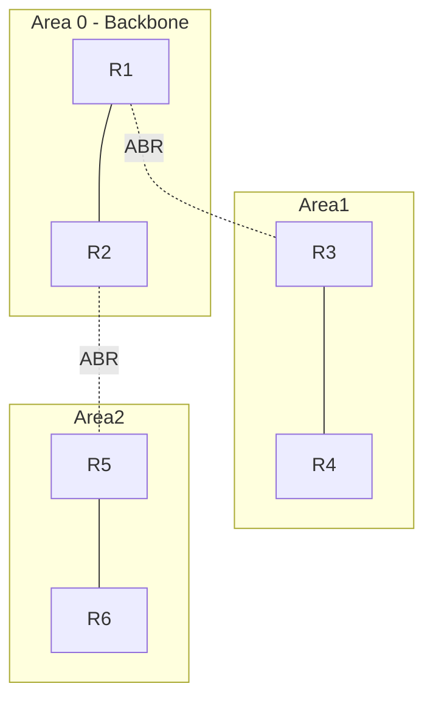

# OSPF — Open Shortest Path First (RFC 2328 для v2; RFC 5340 для v3)

## TL;DR
**Стандартный link-state IGP** (Interior Gateway Protocol) для маршрутизации **внутри** автономной системы. Каждый маршрутизатор flood'ит LSA (Link State Advertisements) — сосед, метрики, состояние; собирает полную топологию; локально запускает [[Алгоритм Дейкстры]] для shortest path. Поддерживает **areas** для иерархии. Открытый стандарт IETF (отсюда "Open"); конкурирует с проприетарным EIGRP (Cisco) и аналогичным IS-IS (часто в магистралях).

## Какую проблему решает
Маршрутизация **внутри AS** должна:
- Быстро сходиться при изменениях.
- Поддерживать загруженность тысяч маршрутизаторов.
- Иметь обоснованные метрики (не просто hop count).

[[Distance Vector Routing|RIP]] не справлялся (count-to-infinity, медленно). OSPF — link-state с иерархией.

## Как работает

**Структура:**
- **Area 0 (backbone)** — обязательная.
- **Areas 1, 2, …** — non-backbone, подключаются к area 0.
- **Маршрутизаторы:**
  - **Internal:** только в одной area.
  - **ABR** (Area Border Router): между area 0 и spokes.
  - **ASBR** (AS Boundary Router): на границе AS, redistribute из BGP/static.

**Типы LSA:**
- **Type 1 (Router LSA):** «вот мои соседи и их метрики» — flood внутри area.
- **Type 2 (Network LSA):** для broadcast/NBMA-сегментов — designated router описывает.
- **Type 3 (Summary LSA):** ABR суммирует прочие areas.
- **Type 5 (External LSA):** ASBR об импортированных маршрутах.

**Расчёт:**
- Внутри area — Дейкстра на полной local топологии.
- Между areas — через ABR, по summary LSA.

**Метрики:** "cost" — обратно пропорциональная скорости (default: 100/Mbps; 100 Мбит/с = 1, 10 Мбит/с = 10, 10 Гбит/с = 0.01 → но min 1).

**Adjacency:**
- HELLO-фреймы каждые 10 с (default).
- Соседи синхронизируют LSDB (Link State Database).
- В broadcast-сегменте (Ethernet) выбирается **DR** (Designated Router) и **BDR** (backup) — чтобы не all-to-all sync.

## Пример
**Корпоративная сеть с тремя офисами, OSPF:**
- Backbone area 0 — внутренняя магистраль.
- Area 10 — офис Москва.
- Area 20 — офис Питер.
- ABR в каждом офисе.
- Один линк падает в Москве → R3 видит, шлёт обновлённую LSA → flood в area 10 → пересчёт Дейкстры → новая таблица за ~1 секунду.

Без OSPF (статически): каждый маршрутизатор пришлось бы конфигурировать вручную при изменениях.

## Связи
- **Базируется на:** [[Link State Routing]] (теория), [[Алгоритм Дейкстры]] (расчёт), [[Иерархическая маршрутизация]] (areas).
- **Используется в:** enterprise-сети, провайдерские IGP внутри AS (часто IS-IS в крупных).
- **Соседи по уровню:** **IS-IS** (ISO 10589) — концептуально такой же, в крупных провайдерах часто предпочитают; **EIGRP** (Cisco) — DV-вариант.
- **Противопоставляется:** [[BGP]] — между AS; [[Distance Vector Routing]] (RIP) — упрощённый IGP.

## Подводные камни
- **Type 5 LSA flood'ятся через все areas** — много external маршрутов = нагрузка. **Stub areas** ограничивают.
- **OSPFv3 для IPv6** — отдельный стандарт, отличается от v2.
- **MTU mismatch** на adjacency-линке = adjacency не устанавливается. Распространённая ошибка конфигурации.
- DR/BDR в broadcast-сегменте — не «main + spare router», а оптимизация для синхронизации LSA.

## Дальше читать
- [[Link State Routing]] — теоретический фон.
- [[BGP]] — соседнее звено в иерархии.
- Tanenbaum, гл. 5, §5.7.6 (стр. PDF 538–544).
