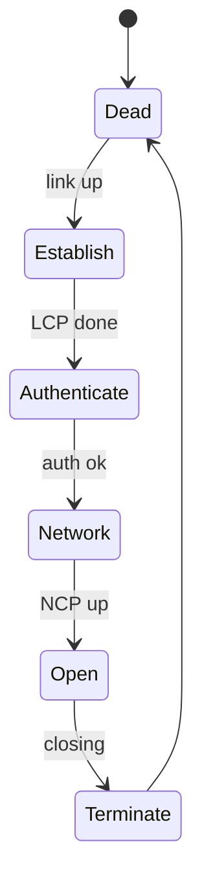

# PPP — Point-to-Point Protocol

## TL;DR
Канальный протокол для соединений «**точка-точка**» (RFC 1661, 1994): dial-up по телефонной паре, leased lines, поверх SONET, эмуляция через Ethernet (PPPoE) для DSL. Делает три вещи: **формирование фреймов** (HDLC-подобное), **установление соединения** (LCP — Link Control Protocol) и **переговоры о сетевом протоколе** (NCP — IPCP для IPv4 и т.д.). Также часто несёт **аутентификацию** (PAP, CHAP, EAP).

## Какую проблему решает
До PPP был **SLIP** (Serial Line IP, 1988) — примитивный: только framing, ни безопасности, ни IP-конфигурации, ни поддержки нескольких L3-протоколов. С эпохой dial-up и leased line требовалось:
- стандартный фрейминг для любого канала точка-точка,
- автоматическое получение IP-адреса от провайдера,
- аутентификация (логин-пароль),
- одновременная поддержка IPv4, IPv6, IPX и других L3.

PPP решил всё это и стал стандартом de facto.

## Как работает

**Структура фрейма:**
```
+-----+---------+---------+-----------+----------+-----+
|Flag | Address | Control | Protocol  | Payload  | FCS |
| 7E  |   FF    |   03    | 16 бит    | <= 1500  |     |
+-----+---------+---------+-----------+----------+-----+
```

- **Flag:** `0x7E` — границы фрейма; внутри — байтстаффинг (escape `0x7D`, XOR `0x20`).
- **Address `0xFF`, Control `0x03`** — фиксированные (наследие HDLC).
- **Protocol** — что в payload: `0x0021` IPv4, `0x0057` IPv6, `0x8021` IPCP (NCP для IPv4), `0xC021` LCP, и т.д.
- **FCS** — обычно CRC-16, иногда CRC-32.

**Жизненный цикл соединения:**

1. **LCP** (Link Control Protocol) — переговоры о параметрах линка: размер фрейма, аутентификация, опции. После успеха — линк «открыт».
2. **Аутентификация** — PAP (plain), CHAP (challenge-response), EAP (расширяемая, для 802.1X/Wi-Fi).
3. **NCP** (Network Control Protocol) — для каждого L3-протокола свой. **IPCP** для IPv4: получает IP-адрес от другой стороны. **IPv6CP** для IPv6.
4. **Передача данных** — обычные фреймы с payload.
5. **Закрытие** — LCP terminate.



## Пример

**Dial-up 1998:**
1. Модем дозвонился до RAS провайдера.
2. PPP LCP — согласовали MRU, аутентификацию (CHAP).
3. CHAP — провайдер шлёт challenge, клиент считает `MD5(id ‖ password ‖ challenge)` → провайдер проверяет тем же расчётом.
4. IPCP — провайдер выдал IP `194.85.127.34`, шлюз, DNS.
5. Линк рабочий. Браузер открывает Yandex.

**ADSL через PPPoE:** PPP бегает поверх Ethernet-фрейма (`EtherType 0x8864`). Сначала PPPoE Discovery — поиск концентратора, потом PPP-сессия как обычно. Провайдер берёт логин-пароль абонента и привязывает IP к нему.

**SONET-канал между маршрутизаторами:** PPP в HDLC-фрейминге с битстаффингом, без аутентификации — соединение между двумя точками одного оператора.

## Связи
- **Базируется на:** [[Канальный уровень]], [[Формирование фреймов]] (HDLC-derived с байтстаффингом), [[Битстаффинг]] (в HDLC-режиме SONET).
- **Используется в:** dial-up modems (исторически), DSL (PPPoE/PPPoA), SONET-каналы между маршрутизаторами провайдера, VPN-туннели (L2TP/PPP).
- **Соседи по уровню:** [[Ethernet — IEEE 802.3]] — для разделяемых сетей (PPP — для точка-точка).
- **Противопоставляется:** SLIP — устаревший предшественник без LCP/NCP.

## Подводные камни
- В Ethernet-LAN PPP сам по себе не нужен — нужен **PPPoE** для проводки PPP-семантики через Ethernet (для биллинга и аутентификации провайдера).
- **MTU PPPoE = 1492** (1500 Ethernet − 8 PPPoE header). Это часто причина проблем: ICMP-PMTU фильтруется, фрагментация ломается.
- PAP **передаёт пароль в открытом виде**. CHAP лучше; для Wi-Fi-эпохи EAP с TLS — современный выбор.
- В современных корпоративных сетях PPP уходит в прошлое — Ethernet в каждом дата-центре, IPsec для VPN. Но dial-up backup'ы и старые DSL ещё используют.

## Дальше читать
- [[Битстаффинг]] — детали HDLC-фрейминга PPP.
- [[Ethernet — IEEE 802.3]] — для контраста с разделяемыми сетями.
- Tanenbaum, гл. 3, §3.5.1 (стр. PDF 296–300).
