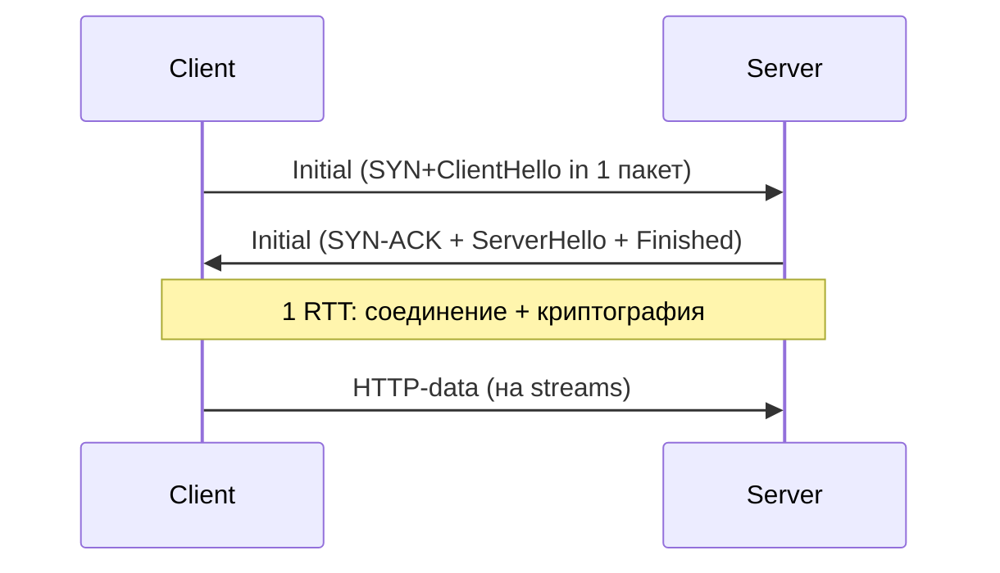

# QUIC (Quick UDP Internet Connections, RFC 9000)

## TL;DR
Современный транспортный протокол, разработанный Google (2012) и стандартизован IETF (2021). **Поверх UDP**, реализован в user-space приложения (не в ядре). Внутри — TCP-подобная надёжность + встроенное шифрование TLS 1.3 + **мультиплексирование streams** без **HoL blocking** (head-of-line — когда один потерянный пакет тормозит все остальные). Базис **HTTP/3**. Преимущества:
- **0-RTT** для повторных подключений (данные уходят в первом же пакете без отдельного «алло»).
- **Миграция соединения** при смене IP (Wi-Fi → 4G не разрывает).
- Быстрый деплой — не нужно обновлять ядро ОС.

## Какую проблему решает
TCP исправлять трудно — он в ядре ОС, deploy цикл = годы. Изменения должны быть совместимы с миллиардами middleboxes. Также:
- **HoL blocking** в HTTP/2: один потерянный TCP-сегмент задерживает все мультиплексированные streams.
- **Долгое handshake** (TCP + TLS = 2-3 RTT).
- **Connection rebinding** при смене сети (Wi-Fi → Cellular).

QUIC решает всё это: реализован в **user-space** (быстрая итерация), per-stream надёжность (нет HoL между streams), 0-RTT для repeat-clients, **Connection ID** для миграции.

## Как работает

**Стек:**
```
+----------+
| HTTP/3   |
+----------+
| QUIC     |
+----------+
| UDP      |
+----------+
| IP       |
+----------+
```

**Главные компоненты:**

1. **Streams:** многопоточность внутри одного соединения. Каждый stream имеет свой sliding window, потеря одного не блокирует другие.
2. **Connection ID:** соединение идентифицируется не 5-tuple, а CID. При смене IP клиента (Wi-Fi → 4G) пакеты с тем же CID продолжают сессию — TCP бы порвался.
3. **0-RTT handshake:** при повторном подключении клиент шлёт data **сразу** в первом пакете (через resumed key из прежней сессии). 1-RTT для нового, 0-RTT для повтора.
4. **Always encrypted:** QUIC = TLS 1.3 встроенный. Headers (кроме самого минимума) тоже шифруются.
5. **Congestion control:** built-in (NewReno, CUBIC, BBR — pluggable).
6. **Pacing, ECN, RACK** — современные best practices встроены.



## Пример
**Открытие YouTube в Chrome:**
- DNS → google.com.
- Chrome пробует QUIC на UDP/443 (signaled via Alt-Svc HTTP header).
- 1-RTT QUIC handshake (client→server: ClientHello+early-data; server: response).
- HTTP/3-запросы по multiple streams.
- Если QUIC заблокирован (corporate firewall) → fallback на TCP+HTTP/2.

**Migration:** клиент переключился с Wi-Fi на mobile → IP изменился → packets с тем же CID → server продолжает соединение.

## Связи
- **Базируется на:** [[UDP]] (transport), TLS 1.3 (crypto), идеи из [[TCP]] (надёжность, congestion control).
- **Используется в:** [[HTTP-2 и HTTP-3|HTTP/3]], Google services (YouTube, Search, Drive), Cloudflare, Apple iCloud.
- **Соседи по уровню:** [[TCP]] (предшественник).
- **Противопоставляется:** TCP+TLS — медленный handshake, HoL, не мигрирует.

## Подводные камни
- **CPU cost:** все в user-space → больше CPU, чем kernel TCP. Современные оптимизации (kernel-bypass, eBPF) сужают разрыв.
- **UDP throttling:** некоторые сети (corporate, low-end ISP) лимитируют UDP сильнее TCP — QUIC страдает.
- **Middlebox несовместимость:** старые firewall'ы видят UDP трафик и блокируют. Решено за счёт fallback в Chrome.
- **Encrypted headers** ломают **passive** observability в сетях (нет RTT-измерения сторонним наблюдателем) — спорно для операторов.

## См. также (прикладное)
RF-circumvention: QUIC — база для современных UDP-VPN.
- [[Hysteria-2]] — QUIC-VPN с Brutal-congestion и Salamander-обфускацией; маскируется под HTTP/3.
- [[QUIC и mKCP]] — сравнение UDP-туннелей в РФ-контексте.
- [[applied-rf-status]] — обзор.

## Дальше читать
- [[HTTP-2 и HTTP-3]] — главный потребитель.
- [[TCP]] — предшественник.
- Tanenbaum, гл. 6, §6.6.1 (стр. PDF 655).
