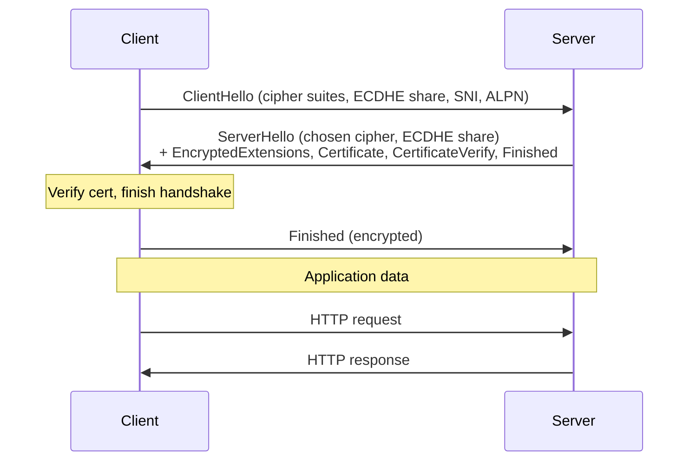

# TLS — рукопожатие (Transport Layer Security 1.3, RFC 8446)

## TL;DR
**Стандарт шифрования и аутентификации** соединений в интернете. Поверх TCP (или UDP в QUIC). **TLS 1.3** (2018): handshake за **1 RTT** (или **0-RTT** для resumed sessions); строгие cipher suites; всё **forward-secure** через ECDHE; old crypto (RSA key exchange, MD5, SHA-1, RC4, CBC) убран. Базис HTTPS, IMAPS, SMTPS, OpenVPN, многих API.

## Какую проблему решает
До TLS — Netscape SSL (1995) → SSL 2.0/3.0 → TLS 1.0/1.1/1.2 → TLS 1.3. Каждая итерация выпарывала уязвимости. **TLS 1.3 — кардинальное упрощение и securityy upgrade**: меньше mods, меньше шагов handshake, perfect forward secrecy by default.

## Как работает

### TLS 1.3 handshake — 1 RTT

**Key derivation:**
- Из ECDHE share → shared secret.
- HKDF (HMAC-based KDF) → handshake keys → application keys.
- Все application data — AEAD (AES-GCM, ChaCha20-Poly1305).

**Forward secrecy:**
- ECDHE — ephemeral keys per session.
- Если server's long-term private compromised позже — past sessions **не уязвимы**.

### 0-RTT (resumption)
- Если клиент уже подключался к этому серверу:
- Использует **PSK** (pre-shared key) из предыдущей сессии.
- Может слать **early data** (HTTP request) **в первом** пакете.
- Risk: **replay attacks** на early data — appliцация должна быть idempotent.

### Cipher suites в TLS 1.3
Минимальный набор:
- `TLS_AES_128_GCM_SHA256`
- `TLS_AES_256_GCM_SHA384`
- `TLS_CHACHA20_POLY1305_SHA256`

Никаких CBC, MD5, SHA-1, RC4, anonymous DH.

### Compared to TLS 1.2
| | TLS 1.2 | TLS 1.3 |
|---|---|---|
| Handshake RTT (new) | 2 | 1 |
| Handshake RTT (resumed) | 1 | 0 |
| FS by default | optional (DHE/ECDHE) | mandatory |
| Cipher suites | 30+ (many weak) | 5 strong |
| Removed | RSA key exchange, CBC, RC4, etc | — |

## Пример
**Открытие `https://wikipedia.org`:**
1. TCP-handshake (3-way).
2. ClientHello: «I support TLS 1.3, AES-GCM, my ECDHE share».
3. ServerHello + cert + Finished — все за 1 RTT.
4. Client verify cert (chain to Let's Encrypt → ISRG Root X1).
5. Encrypted application data: HTTP/2 (или HTTP/3 если на QUIC).

**Полный 1 RTT setup**: ~50-150 мс на типичном сайте (зависит от RTT).

## Связи
- **Базируется на:** [[Симметричная vs асимметричная криптография]] (гибрид), [[Диффи-Хеллман]] (ECDHE), [[X.509 сертификаты]] (auth), [[Хеш-функции]] (HMAC, HKDF).
- **Используется в:** [[HTTPS]], [[QUIC]] (TLS встроенный), VPN (OpenVPN), email (SMTPS, IMAPS), API.
- **Соседи по уровню:** **DTLS** (TLS over UDP) — для real-time; **mTLS** (mutual) — клиент тоже cert.
- **Противопоставляется:** plain TCP — без шифрования.

## Подводные камни
- **TLS 1.0/1.1 deprecated** — отключите. TLS 1.2 + 1.3 only.
- **Certificate validation** — без неё MITM. Пиннинг для critical apps.
- **0-RTT replay risks** — early data must be idempotent (GET ok, POST risky).
- **TLS interception** в corporate networks (MITM proxy с corp CA) — privacy/security trade-off.
- **TLS metadata not hidden:** SNI (host name) виден в plain text. **Encrypted ClientHello (ECH)** — recent ext fixes this.

## См. также (прикладное)
RF-circumvention: TLS-handshake — главный объект DPI-фильтрации в РФ.
- [[VLESS-Reality]] — маскирует свой ClientHello под trusted target-сайт + мимикрия [[uTLS]].
- [[XTLS-Vision]] — flow, убирающий «TLS-in-TLS»-аномалию (важно для obfuscated VPN-туннелей).
- [[ECH и ESNI]] — попытка скрыть SNI; **сломано** в РФ ТСПУ детектирует расширение.
- [[MTProxy и FakeTLS]] — мимикрия Telegram-handshake под TLS 1.3 ClientHello.
- [[SNI-фильтрация]], [[Active probing]], [[Session freezing]] — почему «обычный TLS-VPN» падает на whitelist-сетях РФ.
- [[applied-rf-status]] — обзор всех техник.

## Дальше читать
- [[HTTPS]] — главный потребитель.
- [[QUIC]] — TLS встроенный.
- [[X.509 сертификаты]] — auth.
- Tanenbaum, гл. 8, §8.12.3 (стр. PDF 931–935).
