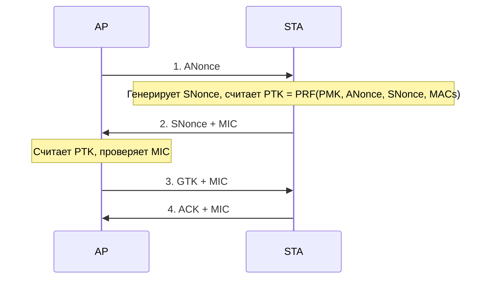

# WPA2 и WPA3 — Wi-Fi security

## TL;DR
**WPA2** (IEEE 802.11i, 2004): AES-CCMP шифрование, **4-way handshake** для derive PTK из PSK. Уязвимость: **KRACK** (2017), offline brute-force против PSK с захваченным handshake'ом. **WPA3** (2018): **SAE** (Simultaneous Authentication of Equals, dragonfly handshake) защищает от offline brute-force, **forward secrecy**, защита от MITM в открытых сетях (OWE).

## Какую проблему решает
WEP (1997) — катастрофически слабый, RC4 + короткие IV-ы. WPA (2003) — переходный. **WPA2** стал стандартом — устойчив, но не идеален: **PSK** offline-brute-forceable если plot захватил 4-way handshake. WPA3 закрыл эту брешь.

## Как работает

### WPA2 4-way handshake
После аутентификации (PSK или 802.1X EAP):

- **PMK** — Pairwise Master Key (от PSK или 802.1X).
- **PTK** — Pairwise Transient Key (для шифрования unicast).
- **GTK** — Group Temporal Key (для broadcast/multicast).
- **MIC** — Message Integrity Code.

**Encryption:** AES-128-CCMP (CCM mode of AES).

### KRACK (Key Reinstallation AttaCK, 2017)
- Replay step 3 → STA reinstalls GTK → resets nonce.
- Reuse nonce → **breaks AES-CCMP** confidentiality on some packets.
- Patched in OS/firmware (2017+). Hardware mitigation tricky.

### WPA3 (2018)
**Главные улучшения:**
- **SAE** (Simultaneous Authentication of Equals) — заменяет PSK. Symmetric, no offline brute force possible.
- **Forward secrecy** — каждое соединение имеет уникальные ключи. Compromise одного не raskрывает другие.
- **OWE** (Opportunistic Wireless Encryption) — encryption даже в open networks (без password).
- **192-bit security suite** — для enterprise (CNSA-aligned).

**SAE Dragonfly:** дискретный логарифм-based PAKE (Password-Authenticated Key Exchange). Атакующий, наблюдающий handshake, не может offline тестить пароли.

### Enterprise vs Personal

| | WPA2-Personal | WPA2-Enterprise | WPA3-Personal | WPA3-Enterprise |
|---|---|---|---|---|
| Authentication | PSK | 802.1X (EAP) | SAE | 802.1X |
| PMK derivation | PSK + SSID | per-user from RADIUS | SAE | per-user from RADIUS |
| Forward secrecy | нет | depends EAP | да | да |

## Пример
**Домашний Wi-Fi:**
- WPA2-PSK с длинным паролем (>20 символов) — практически безопасен.
- Современный роутер (2024+): WPA3-Personal с SAE.
- Если кто-то захватил 4-way handshake — пароль из 20 random chars нельзя crack'нуть.

**Корпоративный:**
- WPA2/3-Enterprise с EAP-TLS: client-cert + server-cert. Каждый user имеет свой cert; нет общего пароля → одного клиента compromise не открывает остальных.

## Связи
- **Базируется на:** [[Wi-Fi — обзор]], [[802.11 — Wi-Fi архитектура]], [[DES и AES]] (AES-CCMP/GCMP).
- **Используется в:** все современные Wi-Fi-сети.
- **Соседи по уровню:** **WPS** (Wi-Fi Protected Setup) — convenience, известно слабым (PIN brute-force, 2011). Disable.
- **Противопоставляется:** WEP, open Wi-Fi — не secure.

## Подводные камни
- **WPA2-PSK слабый password** — захват handshake + offline brute force. Длинный random PSK обязателен.
- **WPS** — disable, security risk.
- **Open Wi-Fi** в кафе — без VPN читается всем.
- **WPA3 backward-compat** в transition mode — может быть downgrade attack на WPA2-mode.

## Дальше читать
- [[Wi-Fi — обзор]] — общий контекст.
- [[802.11 — Wi-Fi архитектура]].
- Tanenbaum, гл. 8, §8.10.3 (стр. PDF 917–921).
