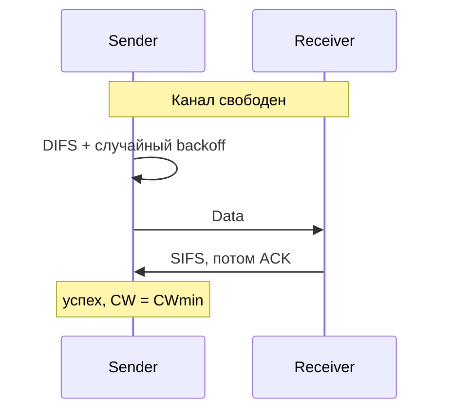

# 802.11 MAC — DCF (Distributed Coordination Function)

## TL;DR
**Базовый MAC-протокол Wi-Fi.** Распределённый — нет центрального арбитра, AP участвует наравне с клиентами. Реализует [[CSMA/CA]] + binary exponential backoff + явные ACK + опциональный [[RTS/CTS]] + виртуальный carrier sensing через [[NAV — Network Allocation Vector|NAV]]. Используется во всех 802.11-сетях по умолчанию.

## Какую проблему решает
В радиосреде нельзя detect коллизии (см. [[CSMA/CA]]). DCF делает три вещи:
1. **Минимизирует коллизии** через random backoff и приоритеты IFS.
2. **Подтверждает доставку** через явный ACK после каждого data-фрейма.
3. **Резервирует эфир** для длинных передач через NAV/RTS/CTS, обходя hidden terminal.

## Как работает

**Алгоритм передачи (упрощённо):**
1. Хочет передать → проверяет canal carrier sensing'ом.
2. Свободен ≥ **DIFS** (DCF Inter-Frame Space) → переходит к 4.
3. Занят → ждёт освобождения + DIFS.
4. **Random backoff:** выбирает число слотов из `[0, CW]`, обратный отсчёт.
5. На каждом свободном слоте: backoff−=1. Если канал занят — пауза, продолжит при освобождении.
6. backoff = 0 → передача data-фрейма.
7. Получатель через **SIFS** (Short IFS, < DIFS) шлёт **ACK**.
8. Не пришёл ACK → коллизия или ошибка → **CW удваивается** (binary exponential), повтор.
9. Успех → CW сбрасывается до **CWmin** (например, 16).

**Inter-frame spaces (приоритеты по кратчайшему):**
- **SIFS** ~10 мкс — для ACK, CTS, ответных фреймов.
- **PIFS** ~30 мкс — для PCF (если используется).
- **DIFS** ~50 мкс — для обычной DCF-передачи.
- **EIFS** — после ошибочного фрейма.

Чем короче IFS, тем выше приоритет — это даёт ACK'у право говорить «вне очереди».

**Виртуальный carrier sensing через NAV:**
- В заголовке каждого фрейма есть **Duration** — сколько мс ещё канал занят.
- Все, кто слышат фрейм, ставят свой NAV-таймер на это время и **молчат**.
- Это «виртуально» резервирует эфир, даже если узел физически не слышит передающего.

См. [[NAV — Network Allocation Vector]].

## Пример
**Семья из 4 устройств в одной BSS:**
- Все 4 хотят передать.
- Каждое выбрало backoff: 7, 12, 4, 9 слотов.
- Через 4 слота свободного эфира — устройство C начинает передачу.
- A, B, D приостанавливают свои счётчики на 3, 8, 5 (вычли по 4).
- C передало, ACK получен.
- Канал свободен → ещё DIFS → A продолжает (счётчик 3) → передаёт первым.
- И так далее.

Это даёт **fair share** в среднем, без центрального арбитра.

## Связи
- **Базируется на:** [[CSMA/CA]] (общая идея), [[802.11 — Wi-Fi архитектура]] (контекст).
- **Используется в:** все Wi-Fi-сети по умолчанию; [[NAV — Network Allocation Vector]], [[RTS/CTS]] — связанные механизмы.
- **Соседи по уровню:** **EDCA** (Enhanced DCF) — расширение для QoS/WMM; **HCCA** — централизованный гибрид (редко); **OFDMA** в Wi-Fi 6 — AP назначает RU, частично заменяя DCF.
- **Противопоставляется:** [[CSMA/CD]] (Ethernet) — там можно detect, у Wi-Fi только avoidance.

## Подводные камни
- **Производительность падает с числом узлов** — больше backoff'ов, больше холостых слотов. На 50+ устройствах одна AP «вязнет».
- DCF справедливо к **узлам**, но не к **скоростям**: медленный клиент держит канал дольше → быстрые ждут. «Performance anomaly» Wi-Fi.
- В Wi-Fi 6 (OFDMA + multi-user) AP может явно расписать клиентам ресурсные единицы, минуя contention. Это уже не чистый DCF, а гибрид.

## Дальше читать
- [[NAV — Network Allocation Vector]], [[RTS/CTS]] — поверх DCF.
- [[Hidden terminal problem]] — что DCF не решает напрямую.
- Tanenbaum, гл. 4, §4.4.3 (стр. PDF 364–371).
