# ALOHA

## TL;DR
Первый протокол **случайного доступа**: «**говори когда хочешь, при коллизии — повтори через случайное время**» — как в шумной комнате: говори, услышал что перебили — повтори через случайную паузу. Изобретён Норманом Абрамсоном на Гавайях в 1970 для радиосети между островами. Pure ALOHA даёт **максимум 18.4%** утилизации канала (т.е. 82% времени уходит на коллизии и тишину); **Slotted ALOHA** (передавать можно только в начале временного слота) удваивает её до **36.8%**. Прародитель CSMA, Ethernet и Wi-Fi.

## Какую проблему решает
До ALOHA казалось, что на разделяемом канале без жёсткого центрального арбитра работать невозможно — коллизии всё уничтожат. Абрамсон показал: **простейшая** идея (передаёшь, если поломалось — повторяешь) **работает**, если нагрузка не слишком велика. Это перевернуло представление о возможных архитектурах MAC.

## Как работает

### Pure ALOHA
1. Есть данные → **сразу** передавай.
2. Передача длится T.
3. Слушай через `2T` (round-trip): подтверждение пришло?
4. Нет → ждать **случайное** время → повторить с шага 1.

**Расчёт пропускной способности:**
Фрейм безопасен, если в окно длиной **2T** (T до старта + T текущей передачи) никто другой не начнёт.

Что значат буквы:
- **G** — среднее число попыток передачи за время одного фрейма (включая повторы).
- **S** — доля времени, занятая **успешными** передачами (полезная пропускная способность).
- **Пуассоновский поток** = попытки независимы и распределены равномерно во времени, как звонки в колл-центр.

При пуассоновском потоке с интенсивностью **G** фреймов за T:
$$ S = G \cdot e^{-2G} $$

Максимум: G = 0.5 → **S_max = 1/(2e) ≈ 18.4%**.

### Slotted ALOHA (Roberts, 1972)
1. Время делится на слоты длительностью T.
2. Передача может начинаться **только в начале слота**.
3. Если коллизия — ждём и повторяем в случайном будущем слоте.

Уязвимое окно теперь только **T** (один слот), не 2T:
$$ S = G \cdot e^{-G} $$

Максимум: G = 1 → **S_max = 1/e ≈ 36.8%** — вдвое лучше.

```mermaid
gantt
  title Pure ALOHA: уязвимое окно 2T
  dateFormat ss
  section Пользователь A
  Передача :a, 02, 1
  section Пользователь B (коллизия)
  Конфликт :crit, 01, 1
  section Пользователь C (коллизия)
  Конфликт :crit, 02.5, 1
```

## Пример
- **ALOHANet (1970):** беспроводная сеть на Гавайях между университетскими кампусами. Малая нагрузка → ALOHA отлично работала.
- **Slotted ALOHA до сих пор:** механизм random access в **GSM/LTE/5G** для **первоначального запроса** к базовой станции (RACH — Random Access Channel). Когда телефон впервые «подходит» к BS — он ещё не знает, как с ней говорить, и шлёт preamble на slotted-ALOHA-канале.
- **Cable upstream (DOCSIS):** запросы пропускной способности к CMTS — slotted ALOHA на минислотах.

## Связи
- **Базируется на:** [[Проблема распределения канала]] (динамическое решение).
- **Используется в:** RACH в LTE/5G, DOCSIS upstream — современные потомки.
- **Соседи по уровню:** [[CSMA]] — следующая ступень, добавляет «послушать перед отправкой».
- **Противопоставляется:** [[Bit-map и token-passing]] — координированный доступ без коллизий.

## Подводные камни
- 18% / 36% — **теоретические** пределы при пуассоновском трафике. На практике хуже из-за реалистичных распределений.
- ALOHA **не масштабируется** на загруженный канал: при росте нагрузки G успешных передач S = G·e^(−2G) **падает экспоненциально** при G > 0.5 — пик утилизации сменяется коллапсом.
- Современные системы (Ethernet, Wi-Fi) не используют чистую ALOHA, но **наследуют идею**: «попробуй, при коллизии повтори» — это базис всех random-access протоколов.

## Дальше читать
- [[CSMA]] — добавление carrier sense.
- [[CSMA/CD]], [[CSMA/CA]] — современные потомки.
- Tanenbaum, гл. 4, §4.2.1 (стр. PDF 317–321).
