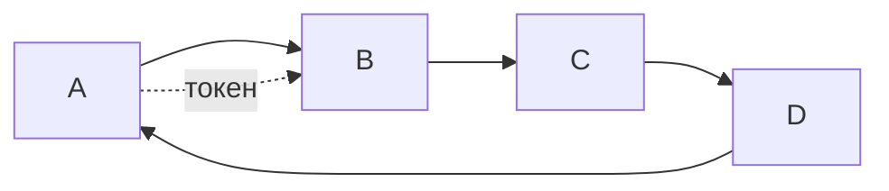

# Bit-map и token-passing (безконфликтные протоколы)

## TL;DR
Семейство MAC-протоколов **без коллизий**: право говорить передаётся явно. **Bit-map**: каждый узел в свой временной слот сообщает «хочу/не хочу», потом все, кто хотел, передают по очереди. **Token-passing**: по сети бегает «жетон» (token), узел держит право говорить, пока у него токен. Устаревшие, но дают предсказуемую задержку и 100% утилизацию при высокой нагрузке.

## Какую проблему решает
Random-access протоколы (ALOHA, CSMA) при перегрузке деградируют: коллизий всё больше, эффективность падает. Безконфликтные протоколы по сути **формализуют очередь**, гарантируя:
- **0 коллизий** даже при максимальной нагрузке;
- **детерминированная задержка** — каждый узел получит право говорить за известное время;
- **100% утилизация** канала при высокой нагрузке.

Цена: даже при низкой нагрузке надо «обходить очередь», что добавляет задержку.

## Как работает

### Bit-map (basic bit-map protocol)
- Время делится на **circles** (циклы).
- Цикл начинается **резервационным окном** из N мини-слотов (по узлу на слот).
- Узел, у которого есть данные, шлёт «1» в свой мини-слот.
- После окна резервации все, кто заявился, передают **по очереди**.

**Эффективность:** при низкой нагрузке тратятся пустые мини-слоты (overhead); при высокой — все они полезны → утилизация → 100%.

### Token Passing (Token Ring, FDDI)
- Узлы соединены в **логическое кольцо**.
- По кольцу циркулирует короткий специальный фрейм — **токен**.
- Узел с токеном получает право передать **один фрейм** (или ограниченное окно), потом передаёт токен следующему.
- Если у узла нет данных, токен просто проходит мимо.

**Применения:**
- **IBM Token Ring** (1985, IEEE 802.5): первая массовая сеть с детерминированным MAC.
- **FDDI** (Fiber Distributed Data Interface, 1990s): два встречных кольца на оптике, до 100 Мбит/с — magstrale между LAN.
- **Industrial / fieldbus**: PROFIBUS, Modbus с token-passing — где предсказуемость критична.
- **DOCSIS upstream** использует **запрос-предоставление** через CMTS — родственная по идее модель.

## Пример
- **Token Ring 16 Мбит/с в банке (1990-е):** надёжная LAN с предсказуемой задержкой; голос/видеоконференции работали лучше, чем на Ethernet с коллизиями.
- **FDDI как backbone между Ethernet'ами:** надёжный двухкольцевой backup; при обрыве одного кольца сеть автоматически переключалась на резервное.
- **CAN bus в автомобиле:** не классический token, но похожая идея — неконфликтное распределение через приоритеты в фрейме.

## Связи
- **Базируется на:** [[Проблема распределения канала]] (безконфликтное решение).
- **Используется в:** Token Ring (устарел), FDDI (нишево), industrial-сети, DOCSIS (по идее).
- **Соседи по уровню:** [[ALOHA]], [[CSMA/CD]] — random-access альтернативы.
- **Противопоставляется:** именно random-access. Token-passing — детерминированный, CSMA — статистический.

## Подводные камни
- Потеря токена **парализует сеть**. В Token Ring/FDDI был сложный механизм мониторинга и регенерации токена.
- Token-passing **проигрывает Ethernet** на массовом рынке: дороже, сложнее, инерция «всё уже на Ethernet'е». К 2000-м IBM свернула Token Ring.
- **Идея жива** в специализированных областях (industrial control, real-time), но в офисных сетях её вытеснил switched Ethernet с QoS.

## Дальше читать
- [[ALOHA]], [[CSMA/CD]] — конкуренты от random-access лагеря.
- Tanenbaum, гл. 4, §4.2.3, §4.2.4 (стр. PDF 325–333).
