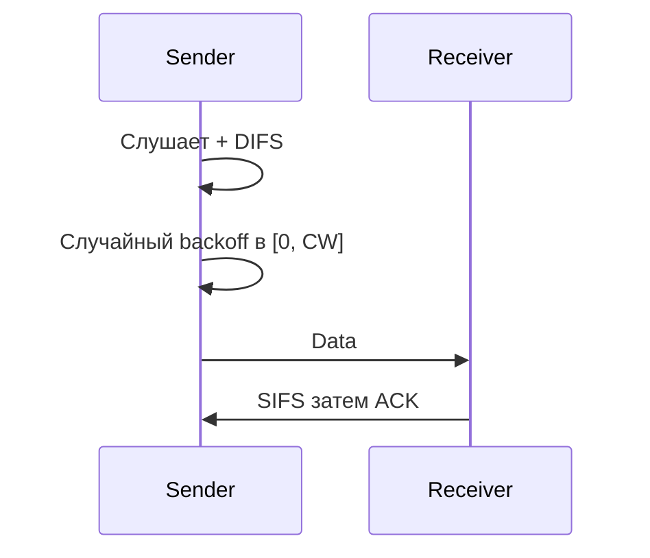

# CSMA/CA — Carrier Sense Multiple Access with Collision Avoidance

## TL;DR
Беспроводной аналог [[CSMA/CD]]. Антенна **не может** слушать собственную передачу (мощность своего сигнала перебивает любой входящий) → коллизию обнаружить **во время передачи нельзя**. Решение: **избегать** коллизий заранее. Узел перед отправкой ждёт, пока канал свободен, плюс **случайный backoff в окне contention window**. Получатель явно подтверждает (ACK). Основа Wi-Fi (802.11 DCF).

## Какую проблему решает
В радиосреде CSMA/CD не работает: антенна заглушает себя. Если просто использовать CSMA, при малейшей конкуренции два узла, дождавшихся освобождения, начнут одновременно — коллизия. Нам нужно сделать так, чтобы **с высокой вероятностью** только один из конкурирующих узлов начал в каждое мгновение.

CSMA/CA добавляет **случайный backoff даже в первой попытке** — не «как только свободно», а «свободно + случайные K слотов». Это разносит старты во времени.

## Как работает

**Алгоритм (упрощённо, 802.11 DCF):**
1. Хочет передавать → слушает канал.
2. Канал занят? Жди до конца + DIFS (DCF Inter-Frame Space).
3. Канал свободен ≥ DIFS → выбирает **случайное число backoff-слотов** из текущего contention window `[0, CW]`.
4. На каждом свободном слоте: backoff−=1. Если канал занят — пауза, но счётчик **не сбрасывается** (важно: накапливаются «очки за ожидание»).
5. backoff = 0 → передача.
6. Получил ACK → ОК. Не получил → коллизия, **CW удваивается** (binary exponential), повтор.

**Inter-frame spaces** (приоритеты по времени):
- **SIFS** (Short IFS, ~10 мкс) — самый короткий, для ACK/CTS.
- **PIFS** — для PCF (центральная координация).
- **DIFS** — для обычного DCF.

Чем короче IFS, тем выше приоритет.

**Виртуальный carrier sensing:** [[NAV — Network Allocation Vector|NAV]] — узлы хранят, на какое время канал «зарезервирован» из заголовков чужих фреймов. См. [[RTS/CTS]] — явная резервация для длинных передач.

## Пример
**Дом с 3 устройствами на одной AP:**
- Все три держат CW = 16 (начальное).
- Все хотят передать — каждое выбрало backoff: 4, 8, 12.
- Через 4 слота тишины узел A передаёт; B и C приостановили счётчики на 4 и 8.
- A передаёт, A получил ACK → CW сбрасывается до 16.
- Канал освободился — B и C продолжают: ещё 4 слота → B передаёт. И т.д.

При **коллизии** (2 узла выбрали один backoff): CW удваивается у обоих → меньше шанс повторить.

## Связи
- **Базируется на:** [[CSMA]] (общая идея), [[Подуровень MAC]].
- **Используется в:** [[802.11 — Wi-Fi архитектура]] (DCF), [[802.11 MAC — DCF]] — конкретная реализация; вместе с [[NAV — Network Allocation Vector]] и [[RTS/CTS]].
- **Соседи по уровню:** [[CSMA/CD]] — для проводов.
- **Противопоставляется:** CSMA/CD — там detection во время передачи; CA — только avoidance до старта.

## Подводные камни
- CSMA/CA **не устраняет** коллизии полностью, лишь сильно снижает их вероятность.
- Производительность падает при росте N узлов: CW увеличивается → больше холостых слотов backoff'а. На 50+ устройствах в одной соте Wi-Fi становится «вязким».
- **Hidden terminal problem** ([[Hidden terminal problem]]) — фундаментальная слабость только carrier sensing'а в радио. RTS/CTS — частичное решение, но overhead.
- В Wi-Fi 6 (OFDMA) AP может **назначать** ресурсные единицы абонентам — это уже не чистый CSMA/CA, а гибрид с центральной координацией.

## Дальше читать
- [[802.11 MAC — DCF]] — детали Wi-Fi.
- [[RTS/CTS]], [[NAV — Network Allocation Vector]].
- Tanenbaum, гл. 4, §4.4.3 (стр. PDF 364–371).
