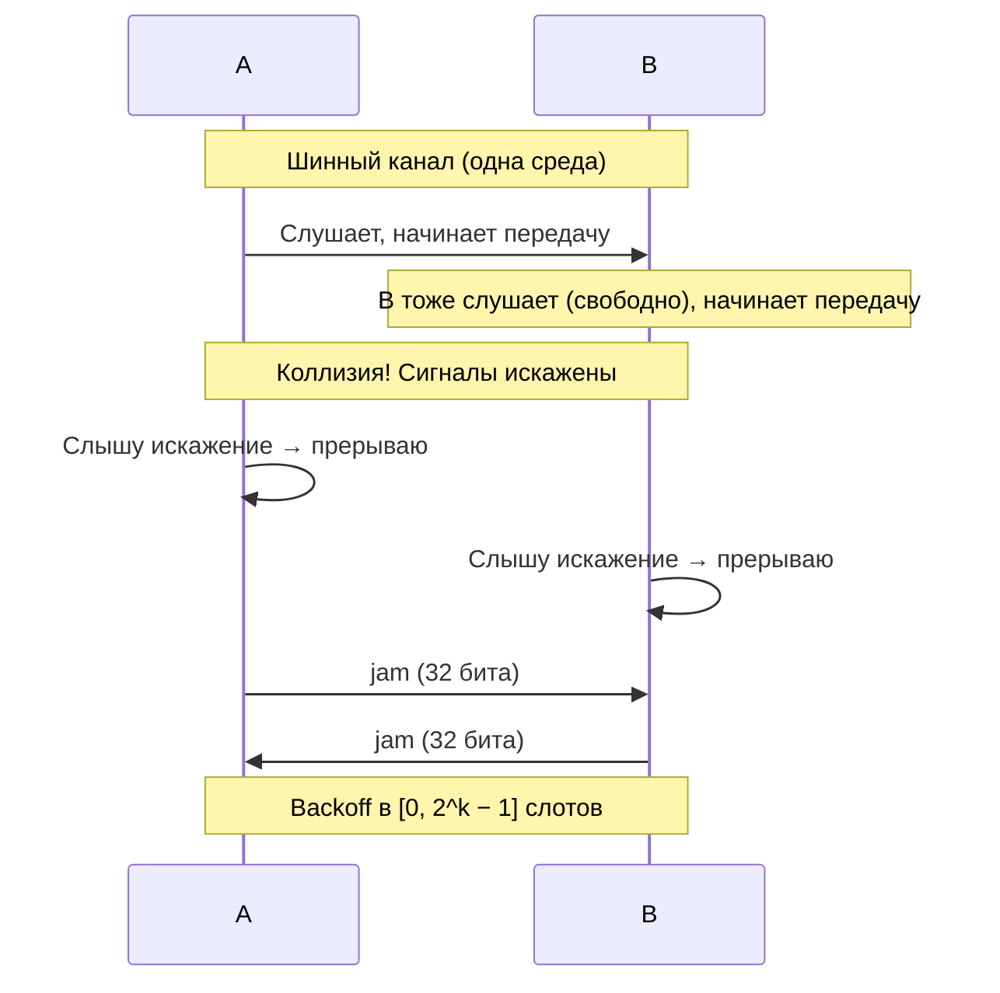

# CSMA/CD — Carrier Sense Multiple Access with Collision Detection

## TL;DR
Расширение [[CSMA]]: узел не только слушает перед отправкой, но и **продолжает слушать во время отправки**. Услышал, что свой сигнал «искажён» (значит, кто-то ещё передаёт) → **немедленно прерывает** передачу, шлёт **jam-сигнал** (32 бита одинаковых) и уходит в **binary exponential backoff**. Это основа классического Ethernet (10BASE5/2/T до switched).

## Какую проблему решает
В чистом CSMA коллизия **не обнаруживается** до конца передачи (пока не пришёл ACK или таймаут). Передавать всю длинную дату «впустую» — расход полосы. CSMA/CD: как только узнал, что коллизия — **прекрати**. Время впустую сокращается до длительности одного «window of vulnerability» — пропагационного слота 2τ.

## Как работает

**Алгоритм:**
1. Слушай канал.
2. Свободен → начни передачу.
3. **Во время передачи продолжай слушать.**
4. Услышал коллизию → прерви, отправь jam (32 бита), беги в backoff.
5. **Binary exponential backoff:** после k-й коллизии жди случайное число слотов в `[0, 2^k − 1]`. Максимум k=10 (далее не растёт), после 16 попыток — отказ.

**Slot time:** `2τ` — время round-trip распространения сигнала по самому длинному кабелю (τ — propagation delay, время прохождения сигнала между концами). Это **уязвимое окно**: коллизия может быть обнаружена в течение `2τ` после старта.

**Минимальный размер фрейма:** должен быть ≥ `2τ × bitrate`. Расчёт для 10BASE-5:
- Кабель до 2.5 км + повторители → τ ≈ 25.6 мкс → 2τ ≈ 51.2 мкс.
- 10 Мбит/с × 51.2 мкс = **512 бит** = **64 байта**.

Отсюда минимальная длина Ethernet-фрейма **64 байта** (= DST 6 + SRC 6 + Type 2 + Payload ≥ 46 + CRC 4). Если фрейм короче — добавляются **padding-байты**.

**Binary exponential backoff (BEB):**
- После **i**-й коллизии: жди случайное число слотов из `[0, 2^i − 1]`.
- При i=1 → диапазон `{0, 1}`; при i=2 → `{0,1,2,3}`; и так до i=10 → `{0,…,1023}`.
- При **i ≥ 10** диапазон не растёт (cap на 1023).
- После **16** попыток — отказ передачи, ошибка наверх.

Идея: при первых попытках ожидание короткое (мало конкурентов), при множественных коллизиях — длинное (много конкурентов, нужно их разнести во времени). Экспонента — компромисс между задержкой и эффективностью при росте нагрузки.

## Пример
**10BASE-T Ethernet с 10 узлами на хабе:**
- Хаб = регенератор; в L2-смысле всё ещё **одна общая среда**.
- При попытке двух узлов передать одновременно — оба слышат коллизию через ~10 мкс (2τ для длины 100 м).
- Прерывают, jam, **backoff: A выбрал 0, B выбрал 1**. A передаёт сразу, B ждёт один slot time → передаёт следом без коллизии.
- При второй коллизии диапазон `{0,1,2,3}` — вероятность повторной коллизии падает.

**Современный switched Ethernet:** CSMA/CD **не используется** — каждый порт это отдельная двухточечная линия в полудуплексе или **полнодуплексе** (одновременно шлём и получаем). В full-duplex Ethernet CSMA/CD просто отключён.

## Связи
- **Базируется на:** [[CSMA]] — добавляет collision detection.
- **Используется в:** [[Ethernet — IEEE 802.3]] — классический; в современном switched Ethernet **не активен**.
- **Соседи по уровню:** [[CSMA/CA]] — radio-аналог (нельзя detect, можно только avoid).
- **Противопоставляется:** [[CSMA/CA]] — без detection, c more cautious avoidance.

## Подводные камни
- В радио CSMA/CD **невозможен**: антенна не может слушать сама себя во время передачи (мощность собственного сигнала на много порядков выше входящего). Поэтому Wi-Fi использует CA, не CD.
- Минимальный размер фрейма — **физическое требование** для надёжной детекции коллизий, не «фантазия дизайнеров». При увеличении скорости (Fast/Gigabit) минимальный фрейм надо удлинять или укорачивать кабель — Gigabit Ethernet добавил carrier extension для совместимости.
- Современный коммутируемый Ethernet **не сталкивается с коллизиями** — поэтому CSMA/CD сейчас — историческая концепция, важная для понимания эволюции.

## Дальше читать
- [[Ethernet — IEEE 802.3]] — главный потребитель CSMA/CD.
- [[CSMA/CA]] — для радио.
- Tanenbaum, гл. 4, §4.3.2 (стр. PDF 338–342).
