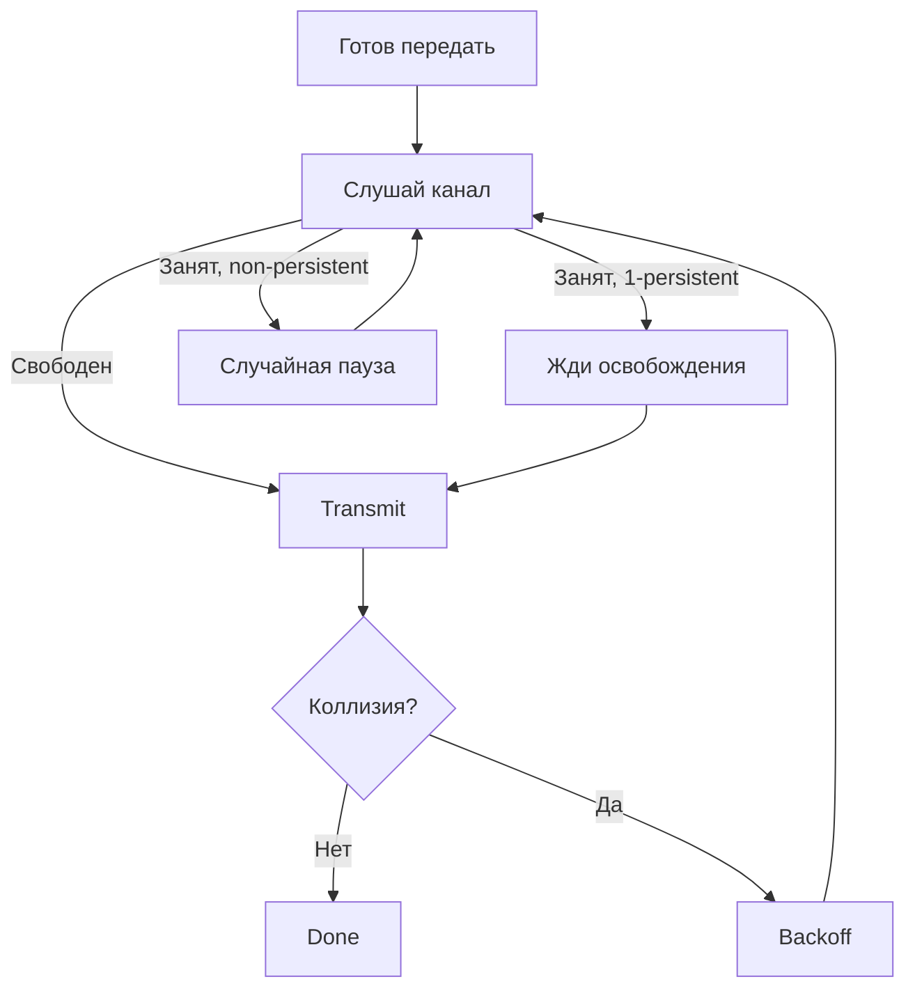

# CSMA — Carrier Sense Multiple Access

## TL;DR
Развитие [[ALOHA]]: **«послушай, прежде чем говорить»**. Если несущая занята — жди; если свободна — передавай. Три варианта по стратегии ожидания: **1-persistent** (как только свободно, начинай), **non-persistent** (свободно? проверь снова через случайный интервал), **p-persistent** (после слота свободно — передавай с вероятностью p, иначе жди слот). Утилизация значительно выше ALOHA при низкой/средней нагрузке.

## Какую проблему решает
ALOHA «слепо» начинает передачу, не зная, занят ли канал. Это даёт коллизии даже при низкой нагрузке. Если узлы могут **слушать** канал (carrier sensing), большинство коллизий можно избежать: видишь, что кто-то говорит — подожди.

Базовая идея простая, но варианты различаются стратегией: **что делать, если канал занят**.

## Как работает

### 1-persistent CSMA
1. Слушай канал.
2. Свободен → передавай **немедленно**.
3. Занят → продолжай слушать; как только освободится — передавай.
4. Коллизия → backoff (как в ALOHA), повтори.

**Проблема:** если двое ждут конца текущей передачи, оба начнут одновременно → коллизия гарантирована.

### Non-persistent CSMA
1. Слушай канал.
2. Свободен → передавай.
3. Занят → жди **случайное** время, потом снова слушай (не караулишь освобождения).

**Плюс:** избегает «толпы у двери» — двое не начнут синхронно. **Минус:** если канал в среднем свободный, передача задерживается без нужды.

### p-persistent CSMA (для slotted каналов)
1. Слушай канал.
2. Свободен → передавай с вероятностью **p**; иначе жди до следующего слота, повтори.
3. Занят → жди до конца текущей передачи, повтори.

Параметр p позволяет настроить компромисс: маленькое p — мало коллизий, но больше задержка; большое p — наоборот.

## Пример
- **Классический Ethernet:** 1-persistent CSMA + Collision Detection = [[CSMA/CD]]. После коллизии — binary exponential backoff.
- **Wi-Fi:** не CSMA (только), а CSMA/CA — добавлено избегание коллизий через random backoff **перед** передачей.
- **Старые модемные сети:** Tanenbaum описывает применение non-persistent на радиоканалах ALOHANet-эпохи.

## Связи
- **Базируется на:** [[ALOHA]] (random-access идея); [[Проблема распределения канала]].
- **Используется в:** [[CSMA/CD]] (Ethernet), [[CSMA/CA]] (Wi-Fi) — все продолжения.
- **Соседи по уровню:** [[Bit-map и token-passing]] — альтернатива без contention.
- **Противопоставляется:** ALOHA — там carrier sensing вообще нет.

## Подводные камни
- Carrier sensing **не гарантирует** отсутствие коллизий — сигнал распространяется не мгновенно. Если узел A начал, а B послушал до того, как сигнал A дошёл до него — B тоже передаст. Это окно уязвимости равно **propagation delay (τ)**.
- В радиосредах carrier sensing **сложнее** — узел может слышать одни передачи и не слышать другие (см. [[Hidden terminal problem]]).
- p-persistent работает только в slotted-системах. Для непрерывных используются 1- или non-persistent варианты.

## Дальше читать
- [[CSMA/CD]] — добавление обнаружения коллизий.
- [[CSMA/CA]] — модификация для радио.
- Tanenbaum, гл. 4, §4.2.2 (стр. PDF 321–325).
