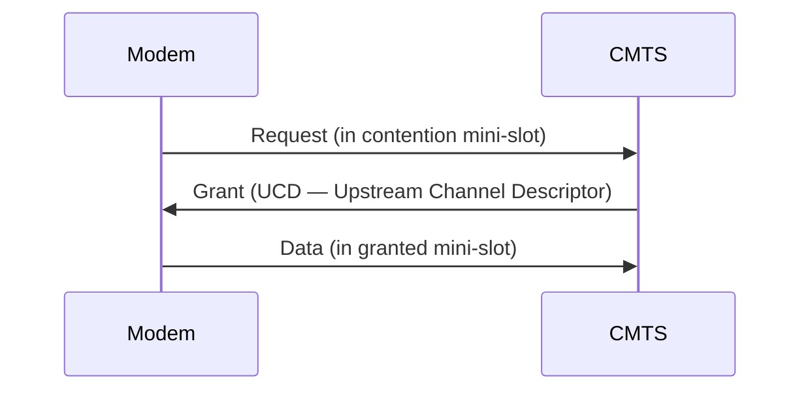

# DOCSIS MAC — ranging, мини-слоты, service flows

## TL;DR
DOCSIS — это не только физика QAM, но и сложный MAC-подуровень для **shared upstream**. Главные элементы: **ranging** (синхронизация cable modem с CMTS — кто, на какой задержке), **mini-slots** (~6.25 мкс), **request-grant** (modem просит upstream-полосу, CMTS даёт), **service flows** (QoS-классы). Без MAC-координации сотни modem'ов столкнулись бы при отправке.

## Какую проблему решает
HFC-coax — общая среда, как в classic Ethernet. Но modems **не слышат друг друга** (передачи смешиваются на CMTS). [[CSMA/CD]] не работает. Нужна **централизованная** координация — CMTS планирует, кто говорит когда.

## Как работает

### Ranging (пристрелка)
- При включении modem не знает, на какой задержке от CMTS.
- Ranging slot — широкое окно, modem шлёт preamble с малой мощностью.
- CMTS измеряет timing, возвращает корректировку.
- Modem подстраивается → точно попадает в свои slots в дальнейшем.
- Periodic re-ranging каждые ~10-30 секунд для drift compensation.

### Mini-slots
- Upstream channel поделён на короткие слоты (~6.25 мкс).
- Каждый mini-slot может быть:
  - **Contention slot** (Slotted ALOHA — для requests).
  - **Granted slot** (CMTS назначил конкретному modem'у).
  - **Reserved** (для ranging, и т.д.).

### Request-Grant flow
1. Modem хочет послать data → шлёт **request** в contention-slot (Slotted ALOHA).
2. Если коллизия — backoff + retry.
3. Если CMTS получил request — выделяет **grant** в будущем upstream slot.
4. Modem передаёт data в grant-slot — гарантированно без коллизий.

### Service flows
- Logical pipes между modem и CMTS.
- Каждый имеет **QoS class**: best-effort, real-time-VoIP, non-real-time.
- DOCSIS поддерживает несколько SF на modem — голос + интернет + IPTV одновременно.

### DOCSIS 3.1 LLD (Low-Latency DOCSIS)
- Добавляет low-latency queue для real-time apps.
- Active Queue Management (PIE).
- Цель — gaming/voIP over DOCSIS с задержками <10 мс.

## Пример
**Cable modem стартует:**
1. Tune to downstream channel (CMTS broadcasts).
2. Get UCD (parameters of upstream).
3. **Initial ranging** — широкое окно, modem пробует.
4. CMTS учит timing, sends ranging response.
5. Modem registers, gets MAC address binding, encryption keys.
6. Готов к user traffic.

**В типичный busy-период:**
- 200 modem'ов на одном узле HFC.
- Все хотят upload одновременно (Zoom call, etc.).
- CMTS делит mini-slots — каждый modem получает справедливую долю.
- Если кто-то платит за higher-tier — больше grants.

## Связи
- **Базируется на:** [[DOCSIS]] (физика), [[HFC — гибридная сеть]], [[Подуровень MAC]].
- **Используется в:** все HFC-cable-сети по всему миру.
- **Соседи по уровню:** [[ALOHA]] (slotted ALOHA для requests), GPON ranging (родственная идея в оптике).
- **Противопоставляется:** Ethernet (полнодуплекс на каждом порту, no MAC-arbitrage), passive PON (TDMA с polling).

## Подводные камни
- **Distance-related** ranging имеет ограничение ~25 км — после этого RTT слишком велик для эффективной upstream.
- **Contention-slot collisions** при большом N → request-fail → retry → больше latency.
- **Mini-slot duration** — trade-off между efficiency (short slot = больше overhead) и flexibility.
- **DOCSIS asymmetric** by default — upstream меньше downstream. На современных требованиях upload (cloud, video calls) это становится проблемой → DOCSIS 4.0 даёт симметричное.

## Дальше читать
- [[DOCSIS]] — физика и общий контекст.
- [[HFC — гибридная сеть]] — среда.
- Tanenbaum, гл. 4, §4.6 (стр. PDF 384–386).
