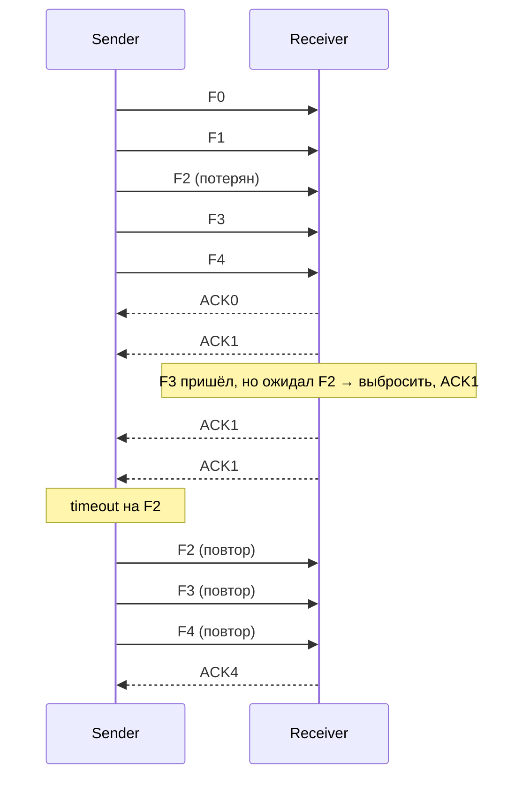

# Go-Back-N (GBN)

## TL;DR
Скользящее окно с окном **отправителя > 1** и окном **получателя = 1**. Получатель принимает только **в порядке**: пришёл фрейм не тот, что ждёт — отбрасывает. При потере фрейма N отправитель **повторяет N и все следующие** (отсюда название «вернись на N»). Прост в реализации; неэффективен при частых потерях.

## Какую проблему решает
[[Stop-and-Wait]] катастрофически неэффективен на больших RTT. Чтобы держать много фреймов в полёте, нужно [[Скользящее окно]]. Самая простая реализация — Go-Back-N: получатель не буферизует, что упрощает его до предела. Цена — при потере одного фрейма теряется и повторно передаётся всё, что было отправлено после него.

## Как работает

**Кумулятивный ACK:** `ACK(N)` означает **«всё до N включительно получено»**. Это дешевле, чем отдельный ACK на каждый фрейм (ср. cumulative vs selective).

**Отправитель:**
- Окно W фреймов с номерами `[base, base+W)`.
- Шлёт все W фреймов, не дожидаясь.
- Запускает один таймер на самый старый неподтверждённый (`base`).
- Получает кумулятивный ACK N → сдвигает base до N+1, перезапускает таймер.
- **Timeout** на base → отправитель повторяет **все** фреймы в окне `[base, next)`.

**Получатель:**
- Хранит **expected** — следующий ожидаемый seq.
- Получает фрейм:
  - seq = expected → принять, передать вверх, ACK(expected), expected++.
  - seq ≠ expected → **выбросить**, повторить ACK(expected − 1).

## Пример
**Канал 100 Мбит/с, RTT 100 мс, потери p=5%:**
- [[Bandwidth-Delay Product|BDP]] = 10 Мбит = ~830 фреймов по 1500 байт.
- При потере одного фрейма приходится повторить **все** последующие в окне (≈830 фреймов).
- Грубая оценка goodput: `(1−p)/(1+p·W) ≈ 0.95 / 42 ≈ 2.3%` от 100 Мбит/с → ~**2.3 Мбит/с**.
- Тот же канал с [[Selective Repeat]] → ~**95 Мбит/с**. Разница в 40 раз — на этом базируется выбор протоколов современным TCP.

**Аналогия:** диктовка по телефону. Если слушатель не расслышал слово N — «переспроси с N» — диктующий повторяет от N до конца. Бессмысленно, если слушатель помнит, что было после, но протокол прост.

**Кумулятивный ACK:** на каждый фрейм нет отдельного ACK; ACK означает «всё до N включительно». Это экономит трафик в обратном направлении.

## Связи
- **Базируется на:** [[Скользящее окно]] (общий фреймворк), [[ARQ]].
- **Используется в:** старые HDLC-реализации; концептуально — простой TCP без SACK.
- **Соседи по уровню:** [[Selective Repeat]] — окно получателя > 1, повтор только потерянного. Сложнее, эффективнее.
- **Противопоставляется:** [[Stop-and-Wait]] — окно отправителя = 1, отстаёт по эффективности.

## Подводные камни
- При **высоких потерях** Go-Back-N деградирует к Stop-and-Wait по сути. Поэтому современный TCP предпочитает Selective Repeat (через SACK).
- Один таймер на всё окно — простая реализация, но грубая. Реальный TCP использует более тонкие механизмы (отдельные таймеры, fast retransmit на 3 dup-ACK).
- В реальных сетях ошибки редки, но **пакетные потери при перегрузке** обычны — Go-Back-N в этих условиях кладёт сеть на лопатки.

## Дальше читать
- [[Selective Repeat]] — следующая ступень эффективности.
- [[TCP]] — практическая комбинация GBN-идеи + SACK + congestion control.
- Tanenbaum, гл. 3, §3.4 (стр. PDF 280–292).
