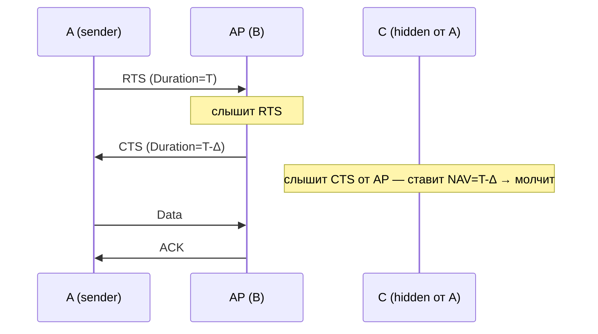

# RTS/CTS — Request to Send / Clear to Send

## TL;DR
Опциональный механизм 802.11 для борьбы с [[Hidden terminal problem|hidden terminal]]: перед длинной передачей отправитель шлёт **короткий RTS** на AP. AP отвечает **коротким CTS**, который слышат **все** в радиусе AP — включая узлы, не слышащие отправителя. Они ставят NAV-таймер и молчат. Так эфир «виртуально» резервируется.

## Какую проблему решает
Carrier sensing работает только для тех, кто слышит передачу. Если два узла слышат AP, но не слышат друг друга, они столкнутся у AP — это [[Hidden terminal problem]]. RTS/CTS решает, заставляя **все** окружающие узлы молчать через явное оповещение от AP.

Стоимость — overhead 2 коротких фреймов перед каждой длинной передачей. Поэтому RTS/CTS включается **только для фреймов больше определённого порога** (RTS Threshold, по умолчанию 2347 байт — что почти отключает его).

## Как работает

**Шаги:**
1. Отправитель A хочет передать длинный фрейм клиенту B (часто — AP).
2. A шлёт **RTS** (Request to Send) — короткий фрейм с **Duration** = время на CTS + Data + ACK.
3. Если канал свободен, B шлёт **CTS** (Clear to Send) с обновлённым Duration.
4. Все, кто слышат RTS или CTS, ставят NAV на указанное время → молчат.
5. A передаёт data; B шлёт ACK.

Узел **C, не слышащий A**, всё равно слышит **CTS от AP** → знает, что эфир занят, не передаёт → коллизии нет.

## Пример
**Большая комната, hidden terminal сценарий:**
- A и C на разных краях, слышат AP, не слышат друг друга.
- Без RTS/CTS — постоянные коллизии у AP.
- С RTS/CTS — A шлёт RTS, AP отвечает CTS. C слышит CTS → молчит. Коллизий нет.

**Когда отключают RTS/CTS:**
- Малые фреймы — overhead RTS+CTS превышает выгоду.
- Закрытые домашние сети, где hidden terminal маловероятен.

**Параметр RTS Threshold:** размер фрейма, выше которого RTS/CTS включается. Обычно 2347 (max MTU 802.11) — RTS/CTS фактически отключён по умолчанию. Можно понизить до ~500 в сетях с hidden terminal.

## Связи
- **Базируется на:** [[802.11 MAC — DCF]] (живёт внутри DCF), [[Hidden terminal problem]] (решает её).
- **Используется в:** [[802.11 — Wi-Fi архитектура]] (опционально), [[NAV — Network Allocation Vector]] (механизм виртуального резервирования).
- **Соседи по уровню:** [[CSMA/CA]] — основа MAC, RTS/CTS — расширение.
- **Противопоставляется:** «обычная» CSMA/CA без RTS/CTS — проще, но не справляется с hidden terminal.

## Подводные камни
- RTS/CTS **усугубляет** [[Exposed terminal problem]]: явное резервирование охватывает большее пространство, чем нужно.
- Сами RTS-фреймы могут сталкиваться с другими RTS, но они **короткие** — потеря дешевле, чем коллизия больших data.
- RTS/CTS не помогает при **очень большом числе узлов** — растёт время на резервирование.
- В Wi-Fi 6 OFDMA позволяет AP вещать нескольким клиентам параллельно, что снижает потребность в RTS/CTS для координации.

## Дальше читать
- [[Hidden terminal problem]] — мотивация.
- [[NAV — Network Allocation Vector]] — что именно ставится при RTS/CTS.
- Tanenbaum, гл. 4, §4.4.3 (стр. PDF 366).
