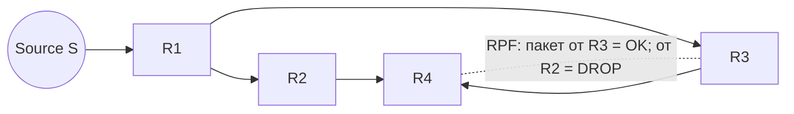

# Reverse Path Forwarding (RPF)

## TL;DR
Эффективный broadcast/multicast-алгоритм (Dalal-Metcalfe, 1978). Маршрутизатор пересылает пакет **только если** он пришёл с интерфейса, **обратного к источнику** по таблице unicast-маршрутизации (т.е. по интерфейсу, через который шёл бы ответный пакет). Дубликаты на других портах — отбрасываются. Без знания дерева, только по существующей unicast-таблице. Базис PIM-DM и других multicast-протоколов.

## Какую проблему решает
[[Лавинная маршрутизация|Простой flooding]] требует sequence numbers/TTL для защиты от петель и дублей. Хочется проще: **использовать уже существующую** unicast-маршрутизацию для определения «куда дальше». RPF делает это: «если пакет от источника S пришёл с интерфейса, ведущего к S — это «правильное направление», forward. Иначе drop».

## Как работает

**Базовая проверка RPF:**
1. Пакет от источника S пришёл на интерфейс P.
2. Маршрутизатор смотрит в свою unicast-таблицу: «как я бы ответил S?»
3. Если ответ через тот же P → **PASS**. Forward пакет на все остальные интерфейсы (broadcast); или согласно multicast-tree (multicast).
4. Если ответ через другой Q → **DROP**. Это либо петля, либо дубликат.

**Идея за этим:** оптимальный путь от S к R по unicast-routing есть **зеркало** оптимального пути от R к S (sink tree принцип). Если пакет пришёл «с правильной стороны», он по shortest path; иначе — это копия, прошедшая дольше.

**Tanenbaum (стр. 439–440)** даёт пример: при flooding'е без RPF в сети получается ~23 пакета на сообщение, при RPF — только 14, и без петель.

## Пример
**PIM-DM (Protocol Independent Multicast — Dense Mode):**
- Маршрутизатор получает multicast-пакет от source.
- Проверяет RPF: пришёл с правильной стороны?
- Если да — forward на все остальные multicast-enabled интерфейсы.
- Если нет — drop.
- Узлы без подписчиков шлют **prune** обратно → дерево обрезается.

**В современных сетях:**
- **uRPF** (Unicast RPF) — расширение для антиспуфинга: дропать пакет, если источник «не в той стороне» по unicast routing'у. Защита от подмены IP.

## Связи
- **Базируется на:** [[Лавинная маршрутизация]] (улучшенный вариант), unicast-routing-таблица (как источник знаний).
- **Используется в:** [[Multicast routing]], [[Multicast Internet|PIM-DM/SM]], **uRPF** (security).
- **Соседи по уровню:** **Source-based tree** в multicast — практическая реализация RPF-идеи.
- **Противопоставляется:** простой flooding с TTL — менее эффективен, **multidestination routing** — другая broadcast-стратегия (с битмапой получателей).

## Подводные камни
- **Asymmetric routing:** если путь A→B ≠ B→A (BGP-политики), RPF может ломаться. Решения — **loose RPF** (проверять только наличие маршрута, не интерфейс).
- **uRPF** в strict mode на edge-роутере провайдера — мощный антиспуфинг, но требует симметричной маршрутизации с клиентом.
- В IPv4 multicast `224.0.0.0/4` RPF check встроен в PIM по умолчанию.

## Дальше читать
- [[Multicast routing]] — главный контекст применения.
- [[Лавинная маршрутизация]] — корень от которого RPF улучшение.
- Tanenbaum, гл. 5, §5.2.7 (стр. PDF 439–441).
