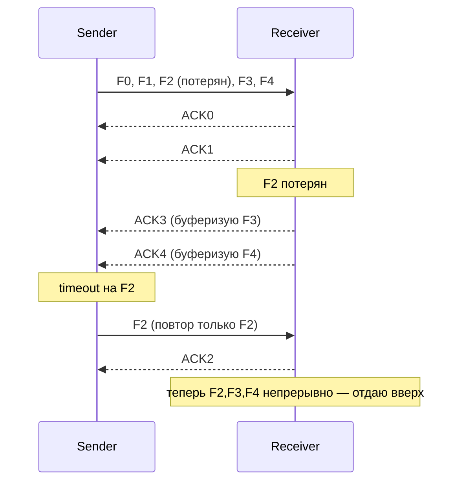

# Selective Repeat

## TL;DR
Скользящее окно с окнами **>1 у обеих сторон**: отправитель шлёт много, **получатель буферизует фреймы, пришедшие не по порядку**. Когда потерянный фрейм приходит повторно — receiver складывает буфер в правильный порядок и отдаёт вверх. Повтор только **самого потерянного фрейма**, а не всего окна. Эффективнее [[Go-Back-N]] при потерях, но сложнее в реализации.

## Какую проблему решает
В [[Go-Back-N]] потеря одного фрейма требует переотправки **всех** последующих — расход полосы при ошибках. На каналах с потерями (Wi-Fi, мобильная сеть, лоссистый интернет) это слишком дорого.

Selective Repeat решает: повторяем **только** потерянный, остальные уже у получателя в буфере. На приёмнике немного больше работы, но утилизация канала намного лучше.

## Как работает

**Отправитель:**
- Окно W фреймов.
- Шлёт все, не дожидаясь.
- **Отдельный таймер на каждый фрейм** (или эквивалент).
- Получил ACK на конкретный фрейм → пометил как ACK'нутый.
- Timeout на фрейм N → повторить **только N**.
- Окно сдвигается, когда **base** ACK'нут.

**Получатель:**
- Буфер на W фреймов.
- Получил seq в окне → положил в буфер, отправил ACK для этого seq.
- Получил seq < окна (старый) → дубликат, ACK повторно (отправитель ACK потерял).
- Получил seq > окна (слишком далеко) → выбросить.
- Когда **base** буфера заполнен → передать его и все **последующие непрерывные** вверх; сдвинуть окно.

## Пример
**Канал 100 Мбит/с, RTT 100 мс, потери 5%:**
- При потере одного фрейма повторяется только он.
- Остальные ~830 фреймов BDP в полёте — не теряются.
- Утилизация ~95% против ~10% у Go-Back-N в таких условиях.

**В TCP:** **SACK** (Selective Acknowledgement, RFC 2018) — расширение TCP, добавляющее selective ACK поверх кумулятивного. Получатель сообщает «у меня дыры в [a..b], [c..d]», отправитель шлёт только их. Это превращает классический TCP (Go-Back-N-like) в нечто близкое к Selective Repeat.

## Связи
- **Базируется на:** [[Скользящее окно]] (общий фреймворк), [[ARQ]].
- **Используется в:** [[TCP]] (через SACK), некоторые промышленные протоколы; концептуально — более продвинутый случай sliding window.
- **Соседи по уровню:** [[Go-Back-N]] — простая альтернатива; для высоких потерь SR предпочтительнее.
- **Противопоставляется:** [[Stop-and-Wait]] (W=1) и Go-Back-N (W получателя = 1).

## Подводные камни
- **Буфер на стороне получателя** — расход памяти. На высоких BDP (скажем, десятки гигабайт BDP в высокоскоростных сетях) это серьёзно.
- **Размер окна и нумерация:** для SR нужно W ≤ N/2 (где N — циклическая нумерация). Иначе старый дубликат можно принять за новый. У Go-Back-N — W ≤ N−1.
- **NAK vs Timeout:** SR может явно слать NAK на пропущенные seq → быстрее повтор, чем по таймеру. Tanenbaum в §3.4.2 даёт протокол 6 (selective repeat, стр. 292) с NAK-механикой и no_nak-флагом для подавления дубликатов.
- В реальном TCP «pure SR» не бывает — это всегда **гибрид cumulative + selective**: основа кумулятивная, поверх есть SACK-блоки.

## Дальше читать
- [[Go-Back-N]] — базовая альтернатива.
- [[TCP]] — SACK как практическая реализация SR-идеи.
- Tanenbaum, гл. 3, §3.4 (стр. PDF 280–296).
