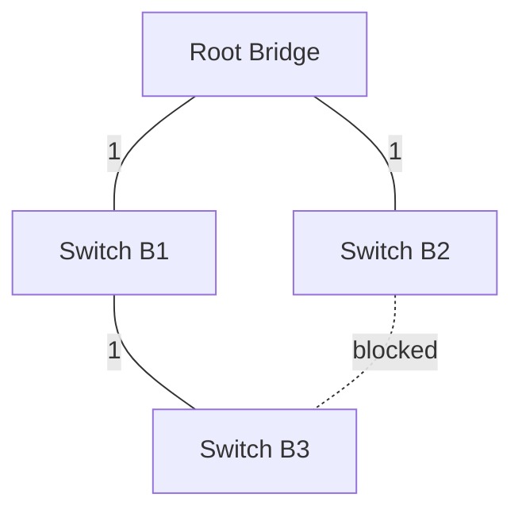

# Spanning Tree Protocol — STP (IEEE 802.1D)

## TL;DR
Распределённый алгоритм, превращающий **физическое mesh** из bridge'ей/switch'ей в **логическое дерево**: блокирует «лишние» линки так, чтобы не было петель. Без STP единый broadcast уходит в бесконечный цикл, заваливая сеть. Изобретён Радией Перлман (1985), стандартизован IEEE 802.1D. Современные варианты: RSTP (быстрее), MSTP (per-VLAN trees).

## Какую проблему решает
Petли в Ethernet-топологии — катастрофа:
1. **Broadcast storm:** один ARP-запрос идёт в петлю, флудится бесконечно, забивает всю сеть.
2. **MAC table flapping:** один и тот же MAC виден на разных портах попеременно — таблица постоянно обновляется, фреймы идут не туда.

С другой стороны, петли **физически нужны** для отказоустойчивости: если один кабель оборвался, должен быть резервный путь. STP решает эту дилемму: **держит резервные линки активными**, но **временно блокирует** их, если есть основной путь.

## Как работает

**Идея:** сеть из switch'ей — это граф. STP строит **минимальное остовное дерево** (spanning tree), корнем которого выбран один switch. Все «лишние» линки переводятся в **blocking** state — они не пересылают фреймы, но мониторят сеть.

**Шаги (упрощённо):**

| Роль порта | Кто выбирает | Критерий | Аналогия (карта дорог) |
|---|---|---|---|
| **Root bridge** | сеть в целом | минимальный bridge ID (priority + MAC) | «столица» дерева |
| **Root port** | каждый non-root switch | минимальная стоимость пути до root | «дорога к столице» — твой выход в магистраль |
| **Designated port** | каждый сегмент LAN | минимальная стоимость пути от сегмента к root | «единственный официальный въезд в район из столицы» |
| **Blocking** | все остальные | — | резерв, не несёт data-фреймов |

1. **Выбор root bridge:** switch'и обмениваются BPDU с bridge ID = (priority 16 бит + MAC 48 бит). Выигрывает наименьший. Например: Sw1 priority=4096+MAC=…01, Sw2 priority=32768, Sw3=32768 → Sw1 становится root.
2. **Root port на каждом non-root:** порт с min path cost к root. Стоимость зависит от скорости (1 Гбит/с = 4 в short-format).
3. **Designated port на каждом сегменте:** один switch отвечает за этот сегмент. По min cost; при равенстве — по меньшему bridge ID.
4. **Все остальные порты** → **blocking state** (не пересылают, только мониторят BPDU).
5. При изменениях (отказ линка) STP пересчитывает топологию через ~30–50 секунд (классический STP).

**RSTP** (802.1w) — Rapid STP, реконвергенция за <1 секунды через прямые ACK-механизмы.

## Пример
**Дата-центр с резервными линками:**
- Каждый ToR-switch подключён к 2 spine-switch'ам.
- Между spine'ами есть линки.
- STP: один из spine — root; ToR'ы пересылают трафик через **активный** root port; резервный линк blocked.
- Сбой основного линка → ToR через 1–2 секунды (RSTP) переключается на резервный.

## Связи
- **Базируется на:** [[Мост и обучающийся мост]] (защищает от петель в bridge-сети), [[Коммутируемый Ethernet]] (контекст применения).
- **Используется в:** все enterprise/DC-сети с резервными линками; [[VLAN — IEEE 802.1Q]] (MSTP — per-VLAN деревья).
- **Соседи по уровню:** [[Алгоритм Дейкстры]] — родственная идея shortest-path; STP даёт **дерево**, Дейкстра — **пути**.
- **Противопоставляется:** **TRILL/SPB** — современные L2-протоколы с активными равноправными путями (без блокировки), используют link-state. В DC многие ушли на L3-маршрутизацию (ECMP), оставив STP только на edge.

## Подводные камни
- Классический STP **медленный** — 30–50 с реконвергенция. RSTP/MSTP для современных сетей.
- В большой L2-сети STP **блокирует половину потенциальной пропускной способности** (резервные линки простаивают). Поэтому DC переходят на L3 ECMP или L2 fabric (VXLAN + EVPN).
- **MSTP** (Multiple STP, 802.1s) позволяет per-VLAN деревья — разные корни для разных VLAN'ов, балансировка нагрузки.
- Без BPDU Guard на пользовательских портах злоумышленник может стать root и переадресовать трафик.

## Дальше читать
- [[Мост и обучающийся мост]] — на чём STP работает.
- [[VLAN — IEEE 802.1Q]] — связка с MSTP.
- Tanenbaum, гл. 4, §4.7.3 (стр. PDF 391–394).
