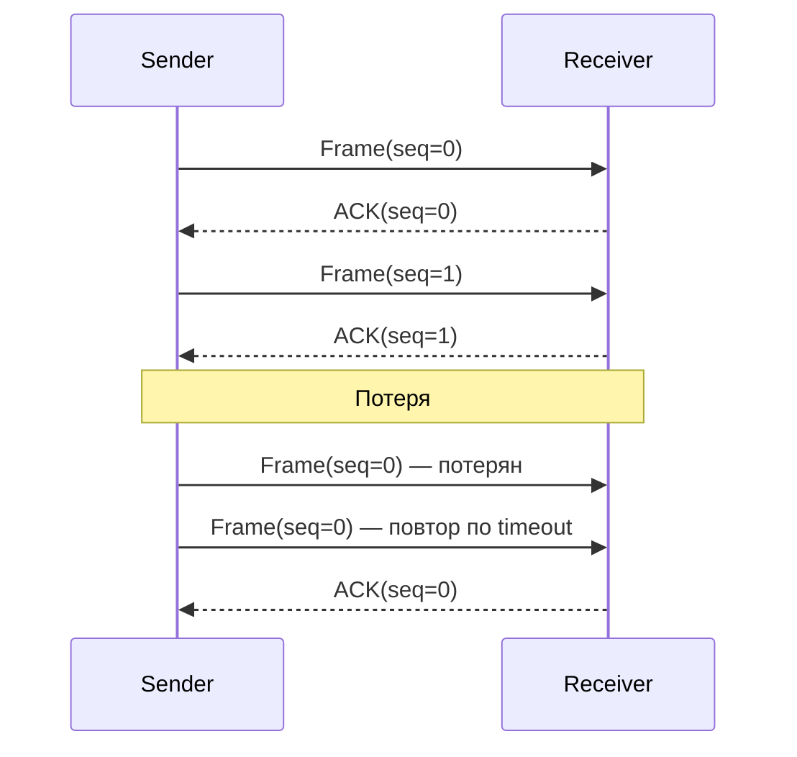

# Stop-and-Wait

## TL;DR
Простейший ARQ-протокол: отправитель посылает **один** фрейм и ждёт **подтверждение (ACK)**. Получил ACK → шлёт следующий. Не получил за timeout → шлёт тот же фрейм заново. Каждый фрейм нумеруется одним битом (0/1) — этого достаточно, чтобы отличить дубликат от нового. Прост, но катастрофически неэффективен на длинных каналах.

## Какую проблему решает
Канал может терять фреймы. Без надёжности приложение получает данные с дырами. Самый простой способ это исправить — повторять, пока не подтвердят. Stop-and-Wait — минимальная реализация: посылаем, ждём ACK, повторяем при потере. Понятен и хорошо иллюстрирует принципы ARQ.

## Как работает

**Отправитель:**
1. Отправить фрейм с seq=0.
2. Запустить timer.
3. Ждать ACK или timeout:
   - ACK с правильным номером → seq = 1 − seq, перейти к 1 со следующим пакетом.
   - Timeout → повторить тот же фрейм.

**Получатель:**
1. Ждать фрейм.
2. Получил с seq=N:
   - Если N = ожидаемое → передать данные вверх; послать ACK; ожидать seq = 1 − N.
   - Если N = старое → дубликат; **выбросить**, но всё равно послать ACK (отправитель ACK потерял).

**Зачем нумерация:** если получатель ACK потерян, отправитель повторит фрейм. Без seq получатель не отличит «новый» от «дубликата» и передаст данные вверх дважды.

## Пример

**Расчёт эффективности:**
- Канал 1 Гбит/с, RTT = 50 мс (через интернет).
- Фрейм 1500 байт = 12 000 бит.
- Время передачи фрейма: 12 000 / 1e9 = 0.012 мс.
- Время в одном раунде: tx + RTT = ~50.012 мс.
- Эффективная скорость: 12 000 / 50e-3 = **240 кбит/с** — 0.024% от ёмкости канала.

**Stop-and-Wait абсолютно не масштабируется** на современные каналы. Его роль — учебная: демонстрация ARQ-принципа.

**Реальные применения:**
- Старые модемы на коротких каналах с малой задержкой.
- BSD-протоколы вроде XMODEM (1977).
- В обучении — отправная точка перед скользящим окном.

## Связи
- **Базируется на:** [[ARQ]] (общий принцип повтора).
- **Используется в:** учебные курсы; простейшие embedded-протоколы; XMODEM/Kermit.
- **Соседи по уровню:** [[Скользящее окно]] — обобщение «много фреймов в полёте».
- **Противопоставляется:** [[Go-Back-N]] и [[Selective Repeat]] — окно > 1, эффективны на современных каналах.

## Подводные камни
- Эффективность падает с ростом RTT. На спутниковом канале (GEO RTT 270 мс) Stop-and-Wait даёт **в десятки раз меньше** теоретической ёмкости.
- Bandwidth-Delay Product (BDP) = ёмкость × RTT. Stop-and-Wait использует только 1 фрейм за один BDP — эффективная утилизация ≈ Frame_size / BDP.
- Используется как **базовый случай** скользящего окна с размером 1.

## Дальше читать
- [[Скользящее окно]] — обобщение.
- [[Go-Back-N]], [[Selective Repeat]] — практичные ARQ.
- Tanenbaum, гл. 3, §3.3.3 (стр. PDF 271–277).
