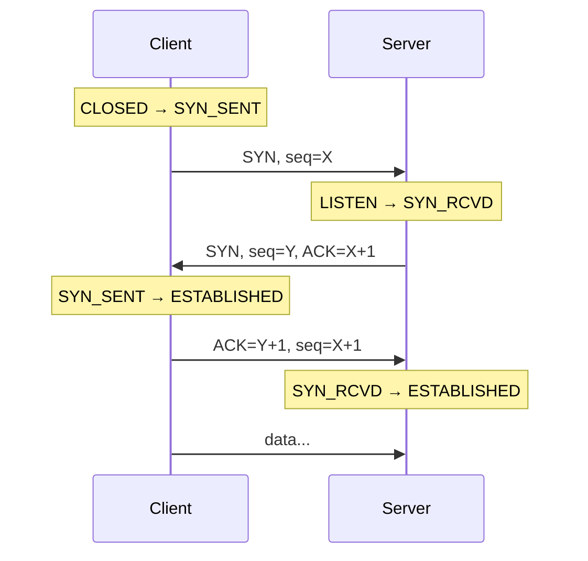

# Three-way handshake

## TL;DR
Установление TCP-соединения через **три сообщения**: **SYN** (клиент → сервер: «начнём с seq X»), **SYN-ACK** (сервер → клиент: «принял, мой seq Y, подтверждаю X+1»), **ACK** (клиент → сервер: «подтверждаю Y+1»). После этих трёх — соединение установлено, можно слать данные. Защита от **старых дубликатов** SYN, синхронизация sequence numbers с обеих сторон.

## Какую проблему решает
Просто «послал данные → получил ответ» — небезопасно: что если в сети валяется **старый дубликат SYN** (после рестарта или сетевого глюка)? Получатель примет его за новое соединение и обработает старые данные. Three-way handshake защищает: обе стороны выбирают **новые произвольные** ISN (Initial Sequence Number) и обмениваются ими — нельзя «подделать» рукопожатие старым SYN.

## Как работает

**Шаги:**

**Что несут seq:**
- ISN выбираются **произвольно** обоими (исторически — на основе времени; современно — псевдослучайно для защиты от blind injection).
- В SYN-сегменте seq=ISN; первая полезная байта будет seq=ISN+1.
- Получатель подтверждает «следующий ожидаемый seq» (ACK = X+1, не X).

## Пример
**`telnet google.com 443`:**
1. Ноут шлёт SYN на 142.250.180.78:443, src port ephemeral, ISN=12345.
2. Google отвечает SYN-ACK: ISN=98765, ACK=12346.
3. Ноут шлёт ACK=98766. Соединение ESTABLISHED.

В Wireshark — три первых сегмента, флаги `[SYN]`, `[SYN, ACK]`, `[ACK]`.

**TCP Fast Open (RFC 7413):** оптимизация — данные могут идти в SYN, экономится 1 RTT. Используется в HTTPS/QUIC-эпохах.

## Связи
- **Базируется на:** [[TCP]] (это его mehanism); [[ARQ]] (общая идея seq).
- **Используется в:** все TCP-соединения; [[Разрыв соединения]] — пара (только она 4-фазовая, не 3).
- **Соседи по уровню:** QUIC handshake — за 0-1 RTT с криптографией; традиционный TCP — 1 RTT минимум.
- **Противопоставляется:** UDP — без рукопожатия.

## Подводные камни
- **SYN flood DDoS:** атакующий шлёт миллионы SYN, не отвечает на SYN-ACK → у сервера копятся SYN_RCVD-state. Защита — **SYN cookies**: сервер не хранит state, кодирует ISN-Y так, чтобы по ACK можно было восстановить.
- **TIME_WAIT** после закрытия (не handshake'а) — ~60-120 с, защита от поздних дублей. На сервере могут копиться, исчерпывая порты.
- **MTU + SYN:** опции (MSS, window scale, SACK permitted) идут в SYN. Если SYN дропается, согласование размеров не происходит.

## Дальше читать
- [[TCP]] — общий контекст.
- [[Разрыв соединения]] — обратная процедура.
- [[TCP — состояния]] — конечный автомат.
- Tanenbaum, гл. 6, §6.2.2; §6.5.5 (стр. PDF 580–586, 631–633).
