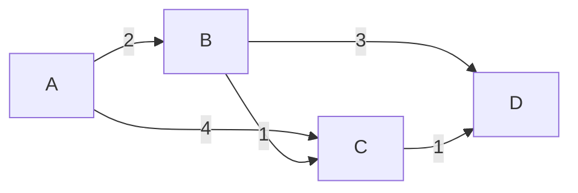

# Алгоритм Дейкстры (1959)

## TL;DR
Алгоритм поиска кратчайших путей от одного источника ко всем остальным узлам в графе с **неотрицательными** весами. Жадный: на каждом шаге берётся ближайший непосещённый узел. Сложность O(V²) или O((V+E) log V) с min-heap. Основа [[Link State Routing]] и протокола [[OSPF]].

## Какую проблему решает
Маршрутизатору нужно знать кратчайший путь до **любого** destination. Дейкстра даёт этот путь от источника ко всем — за один прогон.

## Как работает

**Идея:**
- Поддерживаем множество «решённых» узлов (расстояние известно).
- На каждом шаге берём узел с наименьшим текущим расстоянием → объявляем решённым.
- Релаксируем рёбра: для каждого соседа решённого узла обновляем расстояние, если через него короче.
- Повторяем, пока все не решены.

**Псевдокод:**
```
dist[src] = 0; dist[other] = ∞
Q = все узлы
while Q не пуст:
  u = узел из Q с min dist[u]
  Q = Q \ {u}
  for v in соседи(u):
    alt = dist[u] + вес(u, v)
    if alt < dist[v]:
      dist[v] = alt
      prev[v] = u  # для восстановления пути
```

**Важно:** работает **только** при неотрицательных весах. С отрицательными — использовать Bellman-Ford.



От A: dist[A]=0, [B]=2, [C]=3 (через B), [D]=4 (через C).

## Пример
**OSPF area:** маршрутизатор узнал топологию (через LSA-flood), запускает Дейкстру на ней с собой как источником → получает next-hop ко всем другим маршрутизаторам в area. Затем на основе этих путей формирует таблицу маршрутизации.

## Связи
- **Базируется на:** [[Принцип оптимальности маршрутизации]] (даёт sink tree); теория графов.
- **Используется в:** [[Link State Routing]], [[OSPF]], IS-IS, MPLS-TE, Google Maps routing.
- **Соседи по уровню:** Bellman-Ford ([[Distance Vector Routing]]) — другой подход; A* — Дейкстра + эвристика.
- **Противопоставляется:** Distance Vector — distributed без знания топологии; Дейкстра — на полном графе.

## Подводные камни
- Не работает с **отрицательными** весами. Для асимметричных метрик можно подобрать положительные эквиваленты.
- На очень больших графах (миллионы узлов) — медленно. В интернете **иерархическая** маршрутизация: Дейкстра внутри AS (area), BGP между AS.
- Приоритетная очередь (min-heap) превращает O(V²) в O((V+E) log V) — критично для маршрутизаторов с тысячами узлов.

## Дальше читать
- [[Link State Routing]] — главный пользователь.
- [[OSPF]] — конкретный протокол.
- Tanenbaum, гл. 5, §5.2.2 (стр. PDF 423–425).
