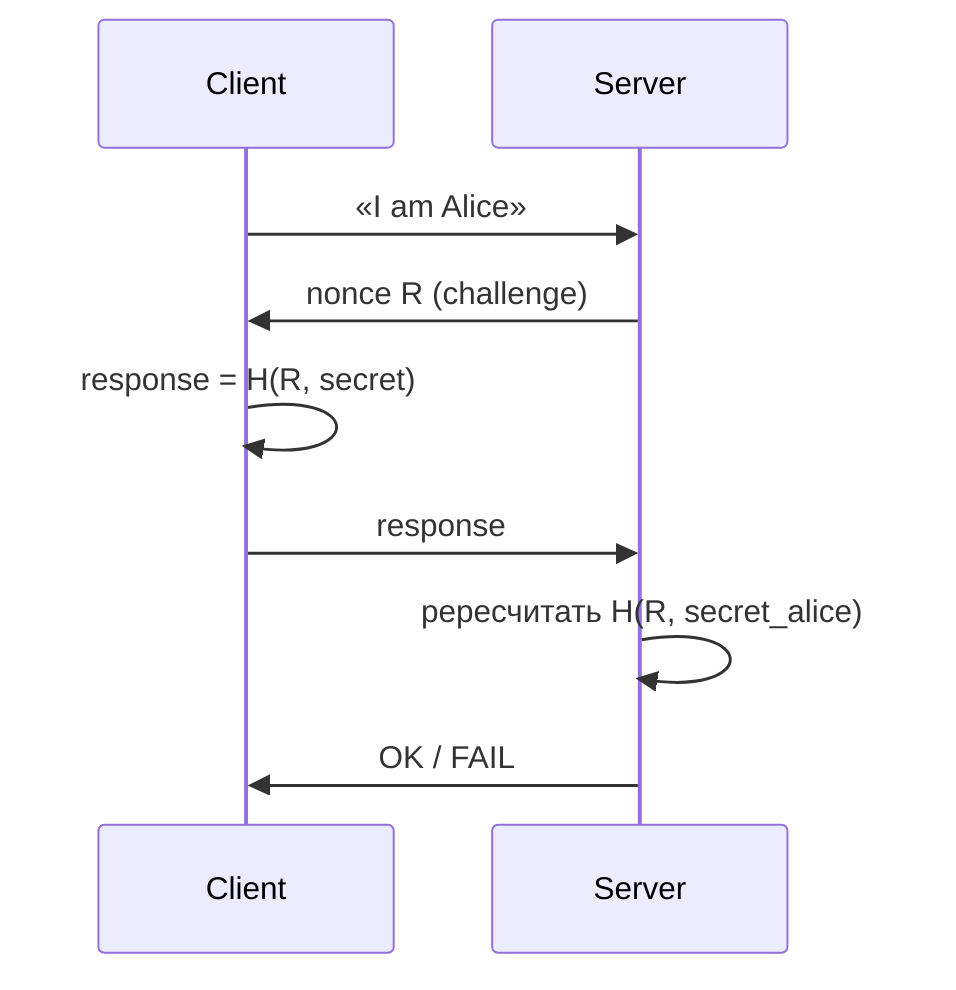
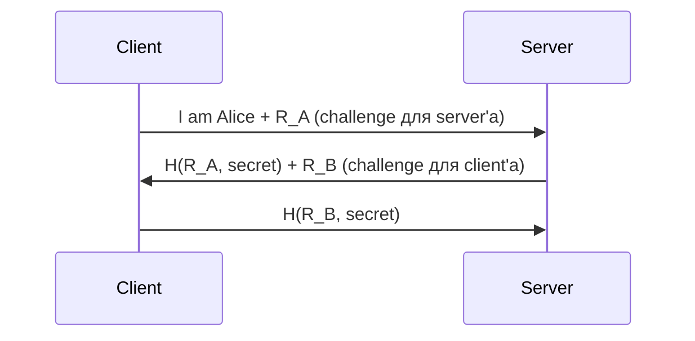

# Аутентификация — challenge-response

## TL;DR
**Базовый протокол** для аутентификации без передачи секрета по сети. Сервер шлёт **challenge** (случайное число, nonce); клиент **доказывает знание секрета**, отправляя **функцию** от challenge и секрета (HMAC, шифр). Сервер пересчитывает и сравнивает. Защищён от **passive eavesdropping**, но требует careful design против reflection attacks, replay, MITM. CHAP, NTLM, Kerberos AS-REQ — конкретные реализации.

## Какую проблему решает
Простой password-auth: «я Алиса, мой пароль X» — пароль уходит по сети, любой подслушивающий копирует. Challenge-response: пароль **никогда не передаётся**; сервер просто проверяет, что клиент **знает** его.

## Как работает

**Базовый flow:**

**Mutual authentication** (обе стороны проверяют друг друга):

**Защита от replay:**
- **Nonce** — random, ни разу не повторяется.
- **Timestamp** — challenge содержит время, окно maybe 5 минут.
- **Sequence number** — монотонно растущий counter.

**Защита от reflection attack:**
- Атакующий шлёт challenge сервера обратно ему же → сервер аутентифицирует... сам себя.
- Решение: **разные форматы** challenge'ей в разных направлениях, или **identifiers** в challenge.

## Конкретные протоколы

### CHAP (Challenge Handshake Authentication Protocol, RFC 1994)
- Используется в PPP, RADIUS.
- 3-way: server шлёт challenge → client `MD5(id || password || challenge)` → server проверяет.
- Pre-shared password между client и server.

### NTLM (Microsoft)
- 3-way challenge-response для Windows-доменов.
- Множество известных слабостей (relay attacks); постепенно заменяется Kerberos.

### Kerberos AS-REQ
- Client → KDC: «I am Alice», (timestamp encrypted с password-derived key).
- KDC: decrypt → проверяет timestamp → возвращает TGT.
- Не классический challenge-response, но похожая идея.

### TLS 1.3 client cert
- Server шлёт CertificateRequest.
- Client отвечает CertificateVerify = signature над transcript hash.
- Использует asymmetric crypto (RSA/ECDSA), не shared secret.

## Пример
**WPA2-PSK 4-way handshake** ([[WPA2 и WPA3]]):
- AP шлёт ANonce.
- STA шлёт SNonce + MIC = HMAC(PTK, ...).
- AP проверяет.
- AP шлёт GTK (group key).
- STA финализирует.

Это challenge-response (с обеих сторон), плюс key derivation.

## Связи
- **Базируется на:** [[Симметричная vs асимметричная криптография]] (shared secret или asymmetric key), [[Хеш-функции]] (HMAC обычно).
- **Используется в:** [[Kerberos]], [[TLS — рукопожатие]] (client auth), [[WPA2 и WPA3]] (4-way), CHAP в PPP, NTLM.
- **Соседи по уровню:** **PAKE** (Password-Authenticated Key Exchange) — extension с защитой от offline-attack: SRP, OPAQUE, SAE (в WPA3).
- **Противопоставляется:** plain password — пароль уходит по сети.

## Подводные камни
- **Offline brute-force:** если challenge и response пойманы, атакующий может попробовать все возможные секреты офлайн (если секрет — слабый пароль). PAKE-протоколы (SAE в WPA3) защищают.
- **Replay** без nonce — атакующий может переиграть captured response. Nonce обязателен.
- **MITM:** если канал не authenticated, MITM может подменить challenge → серверу нужно знать, что MITM-protection обеспечена другим механизмом (TLS, IPsec).

## Дальше читать
- [[Kerberos]] — реальное применение.
- [[TLS — рукопожатие]] — современный подход.
- Tanenbaum, гл. 8, §8.9.1 (стр. PDF 896–901).
