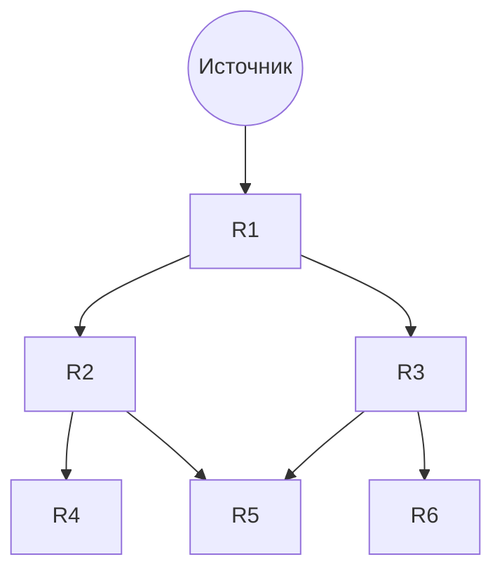

# Лавинная маршрутизация (flooding)

## TL;DR
Каждый маршрутизатор пересылает **каждый** входящий пакет во **все** свои порты, кроме того, откуда пришёл. Без таблиц, без знания топологии — пакет «затопляет» сеть и гарантированно доходит до получателя (если путь существует). Защита от бесконечного размножения — TTL или sequence number. Используется в [[Link State Routing]] для распространения LSA.

## Какую проблему решает
Самый простой и надёжный способ доставки в сетях с динамической топологией: не нужно строить и поддерживать таблицы. Особенно полезен:
- При **первоначальном bootstrap'е** сети.
- Для **broadcast** информации, которую должны получить **все** (LSA, multicast).
- В **mobile ad-hoc** сетях, где топология постоянно меняется.

Цена — экспоненциальное умножение пакетов без защиты.

## Как работает

**Базовый алгоритм:** при получении пакета на порту P отправить копии во все остальные порты.

**Защита от размножения:**
- **Hop counter / TTL:** каждый раз уменьшается, пакет с 0 выбрасывается.
- **Sequence number:** маршрутизатор хранит, какие seq уже видел от этого источника; дубли отбрасывает.
- **Selective flooding:** вместо всех портов — только в нужном направлении (например, юг для пакета на юг).

(пакет от Src размножается на каждом маршрутизаторе во все порты)

## Пример
- **OSPF:** при изменении топологии маршрутизатор шлёт LSA (Link State Advertisement) **flooding'ом** во все интерфейсы. Sequence number защищает от дублей. Через ~1 секунду каждый маршрутизатор в области имеет актуальную топологию.
- **Mobile ad-hoc сети** (DSR, AODV): запрос «как дойти до X» может идти flooding'ом для discovery.
- **Initial broadcast** в новой L2-сети: ARP, DHCP-discovery — упрощённый flooding (broadcast).

## Связи
- **Базируется на:** [[Сетевой уровень]] (использование на L3); работает и на L2 (broadcast).
- **Используется в:** [[Link State Routing]] (LSA-распространение), [[Multicast routing]] (RPF-flooding).
- **Соседи по уровню:** [[Алгоритм Дейкстры]] и [[Distance Vector Routing]] — основанные на таблицах, противоположные подходы.
- **Противопоставляется:** методы с предварительным построением маршрутов — flooding не нуждается в подготовке, но дороже по полосе.

## Подводные камни
- Без защиты — **экспоненциальный взрыв** пакетов и broadcast-storm.
- TTL — грубая защита: пакет может умереть, не дойдя до получателя в большой сети.
- На современных сетях flooding почти не используется как **основной** метод маршрутизации; только как **служебный** инструмент.

## Дальше читать
- [[Link State Routing]] — главный потребитель flooding для LSA.
- Tanenbaum, гл. 5, §5.2.3 (стр. PDF 425–427).
