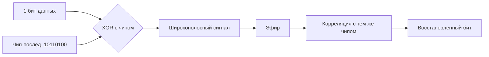

# Расширение спектра — DSSS (Direct Sequence Spread Spectrum)

## TL;DR
Каждый передаваемый бит **умножается** на быструю псевдослучайную **чип-последовательность**, которая «размазывает» сигнал по широкой полосе с низкой плотностью энергии. Приёмник, знающий ту же последовательность, восстанавливает бит коррелированием. Узкополосная помеха выглядит для DSSS-приёмника как незначительный шум, а сигнал DSSS — как фоновый шум для других приёмников.

## Какую проблему решает
То же, что и FHSS: устойчивость к помехам и подслушиванию в общей среде. DSSS делает это **без скачков частоты** — всегда сидит на широкой полосе, но с низкой энергией на единицу частоты.

Бонус: при правильно подобранных чип-последовательностях множество DSSS-передатчиков могут вещать **одновременно на одной частоте** — приёмник «слышит» только своего по корреляции. Это основа CDMA-сотовой связи.

## Как работает

1. **Чип-последовательность:** короткий PRNG-код длины L (например, L=11 для 802.11b).
2. **Расширение:** каждый бит данных XORится с L чипами → передаётся L-битная последовательность.
3. **На приёме:** входящий поток умножается на ту же чип-последовательность; корреляция всплеском показывает «1», отсутствие — «0».
4. **Helping factor (gain):** отношение L называется processing gain. Помеха ослабляется в G раз.

## Пример
- **802.11b (1999):** DSSS, 11-чиповая последовательность Баркера на 2.4 ГГц, скорость 1–11 Mbps.
- **GPS:** каждый спутник вещает свой DSSS-код на L1=1.575 ГГц; приёмник коррелирует и слышит всех одновременно.
- **CDMA-сотовая связь (2G в США, 3G UMTS):** разные пользователи имеют разные чип-последовательности — все вещают на одной частоте.

## Связи
- **Базируется на:** [[Спектр электромагнитных волн]] (использует широкую полосу), PRNG для чипов.
- **Используется в:** GPS, CDMA, исторически 802.11b. Современный Wi-Fi (a/g/n/ac/ax) — OFDM, не DSSS.
- **Соседи по уровню:** [[Расширение спектра — FHSS]] (другой принцип расширения), [[Сверхширокополосная связь]] (UWB — ещё шире).
- **Противопоставляется:** узкополосная передача — высокая плотность энергии, узкая полоса; DSSS — наоборот.

## Подводные камни
- DSSS требует точной синхронизации с чип-последовательностью, иначе всё рассыпается.
- Множество DSSS-кодов на одной частоте увеличивают **общий шум**: чем больше пользователей, тем хуже SNR — отсюда емкостные ограничения CDMA.
- 802.11b с DSSS дал максимум 11 Mbps; чтобы выйти на 54 Mbps (802.11a/g) пришлось перейти на OFDM.

## Дальше читать
- [[Расширение спектра — FHSS]] — соперник по идеям.
- [[GSM]] — TDMA-альтернатива; в 3G CDMA победил.
- [[OFDM]] — что заменило DSSS в современном Wi-Fi.
- Tanenbaum, гл. 2, §2.2.3 (стр. PDF 136–137).
