# Расширение спектра — FHSS (Frequency Hopping Spread Spectrum)

## TL;DR
Передатчик и приёмник синхронно **прыгают** между десятками частот по заранее согласованной псевдослучайной последовательности. На каждой частоте сидят считанные миллисекунды. Узкополосная помеха задевает лишь несколько прыжков — данные восстанавливаются. Подслушать разговор без знания последовательности — почти невозможно.

## Какую проблему решает
В нелицензируемой полосе (например, 2.4 ГГц) много помех: микроволновки, другие Wi-Fi, Bluetooth-устройства. Если фиксированно сидеть на одной частоте — попался под помеху, всё пропало. FHSS «размазывает» передачу по всему диапазону так, чтобы ни одна узкополосная помеха не уничтожила всю коммуникацию.

Изобретена в 1942 г. актрисой Хеди Ламарр и композитором Джорджем Антейлом для радиоуправляемых торпед — чтобы немцы не могли заглушить сигнал.

## Как работает
1. **Псевдослучайная последовательность** частот, известная обеим сторонам (генератор PRNG с общим seed).
2. **Синхронизация:** передатчик и приёмник переключаются на следующую частоту в один момент времени (типично 1600 раз/с в Bluetooth).
3. **Дуэль с помехой:**
   - Помеха попадает на одну частоту → теряем 1 прыжок.
   - На остальных 78 (Bluetooth) — связь.
4. **Защита:** если злоумышленник не знает последовательность, он не может ни заглушить, ни подслушать.

```mermaid
gantt
  dateFormat ss
  axisFormat %S
  Hop1 :a1, 00, 1
  Hop2 :a2, after a1, 1
  Hop3 :a3, after a2, 1
  Hop4 :a4, after a3, 1
  Помеха на f3 : crit, 02, 1
```

(грубая иллюстрация; на самом деле прыжки гораздо быстрее)

## Пример
- **Bluetooth:** 79 каналов в полосе 2.4 ГГц, 1600 прыжков/с (BR/EDR). BLE — адаптивный hopping, обходит занятые каналы.
- **Военные радиостанции:** прыгают по сотням частот в КВ/УКВ, защита от радиоразведки.
- **Старые беспроводные телефоны** на 900 МГц.

## Связи
- **Базируется на:** [[Спектр электромагнитных волн]] (используют ISM-полосу), общий PRNG-секрет.
- **Используется в:** [[Bluetooth]] (классический BR/EDR).
- **Соседи по уровню:** [[Расширение спектра — DSSS]] (другой подход к расширению), [[OFDM]] (третий).
- **Противопоставляется:** узкополосная фиксированная передача — простая, но уязвима к помехам и подслушиванию.

## Подводные камни
- Bluetooth и Wi-Fi сосуществуют в 2.4 ГГц — Bluetooth прыгает, Wi-Fi сидит на канале; AFH (Adaptive Frequency Hopping) исключает «занятые» Wi-Fi частоты.
- Скорость FHSS ограничена временем на прыжок и шириной канала — не подходит для гигабит.
- Современные стандарты Wi-Fi не используют FHSS, перешли на OFDM.

## Дальше читать
- [[Расширение спектра — DSSS]] — другой подход.
- [[Bluetooth]] — главный пользователь FHSS сейчас.
- Tanenbaum, гл. 2, §2.2.2 (стр. PDF 135–136).
