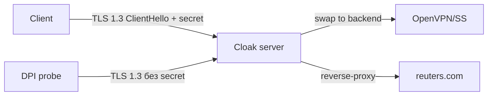

# Cloak

## TL;DR
**Pluggable transport** — обёртка для OpenVPN/Shadowsocks/любого TCP-прокси, маскирующая трафик под обычный HTTPS-веб с **TLS 1.3 ClientHello** под Chrome/Firefox-fingerprint. Сервер по специальным полям ClientHello отличает «своих» от случайных гостей; «чужие» перенаправляются на **decoy-сайт** (любой реальный URL, например, новостной портал) — DPI и active-probe видят настоящий веб-сервер. Используется в [[AmneziaVPN]] как один из доступных транспортов.

## Какую проблему решает
OpenVPN и Shadowsocks имеют узнаваемые «отпечатки» (TLS-handshake, byte-pattern, длины пакетов). DPI ловит их и блокирует. Cloak оборачивает сессию в **настоящий TLS 1.3** с правдоподобным ClientHello → DPI видит обычный визит к веб-серверу. На уровне сетевой видимости пользователь как будто открыл сайт, а не VPN.

## Как работает
1. **Клиент** генерирует TLS 1.3 ClientHello под видом Chrome/Firefox (uTLS-подобная техника, см. [[uTLS]]) и встраивает в random-поле криптомаркер по shared secret.
2. **Сервер** (Cloak proxy) читает ClientHello, проверяет маркер:
   - совпадает → переключает соединение в proxy-режим, заворачивает на backend OpenVPN/Shadowsocks;
   - не совпадает → проксирует к **decoy-сайту** (RedirAddr в конфиге); responder видит обычный сайт.
3. Active-probe DPI получает легитимный веб-ответ — сервер выглядит как обычный HTTPS-хост.

## Где ломается / почему может не работать
- **Один TCP-коннект на сессию** — длинные сессии могут попасть под [[Session freezing]] в РФ-2025+. Реальные жалобы: Cloak хорошо работает за пределами whitelist-режима, на mobile-РФ — частично.
- **Decoy-сайт** должен быть на TLS 1.3 + ALPN `h2`/`http/1.1`; иначе fingerprint не совпадёт. Аналогично логике [[VLESS-Reality]], только без перенаправления настоящего handshake.
- В режиме AmneziaVPN deploy «в один клик» Cloak ставится поверх OpenVPN; для production-нагрузки проще использовать VLESS+Reality.

## Минимальный пошаговый сценарий
- Установить **AmneziaVPN-сервер** через клиент → выбрать «OpenVPN over Cloak».
- Указать decoy-redirect (по умолчанию — нейтральный сайт).
- Клиент сам получит ck-конфиг и подключится.
- Альтернатива — поставить упстрим Cloak (`cbeuw/Cloak` GitHub) вручную:
  - `ck-server` слушает на 443/TCP, проксирует на OpenVPN на 1194;
  - `ck-client` оборачивает локальный OpenVPN-конфиг.

## Что нужно
- Сервер: VPS вне РФ (или внутри для cascade), порт 443/TCP свободен.
- TLS-decoy-сайт (любой реальный URL).
- Для AmneziaVPN-сценария — нечего настраивать вручную.

## Связи
- **Базируется на:** [[TLS — рукопожатие]] (1.3), [[uTLS]] (fingerprint mimicry).
- **Используется в:** [[AmneziaVPN]] (OpenVPN-over-Cloak; Shadowsocks-over-Cloak).
- **Соседи по уровню:** [[VLESS-Reality]] — близкая идея, но **VLESS** проксирует handshake к настоящему target-серверу; Cloak имеет свой TLS-stack и decoy для probe'а.
- **Противопоставляется:** **vanilla OpenVPN** — fingerprint детектируется DPI; **Shadowsocks без plugin** — pattern узнаётся по статистике пакетов.

## Подводные камни
- Разные релизы Cloak несовместимы между собой — клиент и сервер должны быть на одной версии.
- Decoy-сайт должен быть **доступен** из РФ; если decoy сам заблокирован — вся маскировка ломается.
- Cloak считается **«старшим»** — на 2026 г. большинство современных гайдов рекомендуют сразу [[VLESS-Reality]]; Cloak остаётся актуальным внутри AmneziaVPN-стека и в legacy-конфигах.

## Источники
- Habr: [Современные технологии обхода блокировок: V2Ray, XRay, XTLS, Hysteria, Cloak и все-все-все](https://habr.com/ru/articles/727868/) — обзор Cloak в контексте альтернатив.
- Habr: [Проксируем OpenVPN с помощью Cloak](https://habr.com/ru/articles/758570/) — практический setup на OpenWRT.
- Habr: [Маскировка трафика OpenVPN при помощи обфускации](https://habr.com/ru/articles/712082/) — место Cloak в семействе плагинов.
- Repo: github.com/cbeuw/Cloak — справочная реализация.
