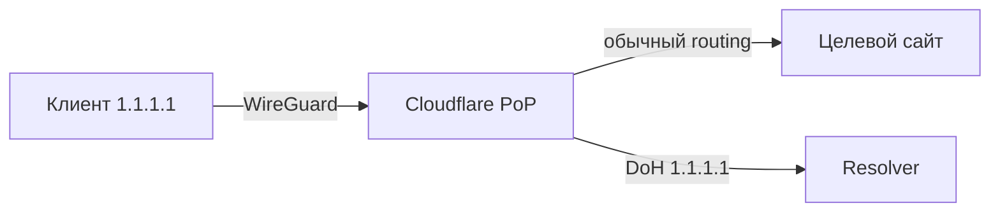

# Cloudflare WARP

## TL;DR
Бесплатный публичный VPN-туннель Cloudflare на **WireGuard** (точнее, **BoringTun** — Rust-реализация WG в userspace), доступный из приложения **1.1.1.1**. Из коробки даёт зашифрованный канал до ближайшего Cloudflare-PoP, на пути обходит часть DPI и SNI-фильтрации. **WARP+** (платный) — premium-trasse через сеть Cloudflare с приоритетом. В РФ-2025+ работает **частично**: AS Cloudflare (13335) попадает в коллатеральные блокировки whitelist-операторов, поэтому соединение нестабильное и часто пропадает.

## Какую проблему решает
Пользователю нужен **простой VPN без настройки сервера**: установил приложение → включил → шифрованный туннель к Cloudflare. WARP не позиционируется как полноценный «гео-VPN» — выходные узлы те же, что и геолокационно ближайшие, и от блокировок по геолокации не спасает. Зато:
- DNS-leak protection через **1.1.1.1** (DoH/DoT);
- защита от провайдерского MITM;
- маскировка реального IP перед целевыми сайтами.

## Как работает
- Клиент 1.1.1.1 поднимает локальный **WireGuard-tunnel** до ближайшего Cloudflare-PoP.
- Внутри туннеля — обычный IP-роутинг к интернету через Cloudflare.
- DNS-запросы идут на 1.1.1.1 поверх **DoH** (через тот же туннель).
- WARP+ платит за «Argo Smart Routing» внутри Cloudflare — выбор лучшего пути между PoP'ами.

## Где ломается / почему может не работать
- **РФ-AS-whitelist (src-09):** AS 13335 (Cloudflare) попадает в коллатеральный blacklist; коннект к WARP-эндпоинтам нестабильный.
- **DPI:** WireGuard-handshake имеет узнаваемый pattern; в РФ vanilla WG ловится так же, как [[AmneziaWG|обычный WireGuard]] — отсюда нужны замены ([[AmneziaWG]] решает).
- **Mobile-операторы РФ:** в whitelist-режиме WARP-эндпоинты обычно недоступны → подключение не устанавливается.
- На **домашнем интернете** часто ещё работает (на 2026-05-02), но статус «нестабильно».

## Минимальный пошаговый сценарий
1. Установить приложение **1.1.1.1: Faster Internet** (App Store / Google Play; Linux/Windows/macOS — `cloudflare-warp` CLI).
2. Включить переключатель WARP.
3. Опционально — купить WARP+ или активировать через MASQUE-токен.
4. Проверить через `https://www.cloudflare.com/cdn-cgi/trace` — должно быть `warp=on`.

## Что нужно
- Приложение **1.1.1.1** (Cloudflare).
- Доступ к Cloudflare-AS из вашей сети (на 2026 — лотерея).

## Связи
- **Базируется на:** WireGuard (BoringTun — userspace WG); [[Encrypted DNS — DoH-DoT|DoH/DoT]] на 1.1.1.1.
- **Используется в:** упрощённый «privacy-VPN» для не-технических пользователей; иногда — как часть playbook'а ([[PB3 — 4-уровневая архитектура за 265₽]] упоминает WARP в составе резерва).
- **Соседи по уровню:** [[CDN-фронтинг]] (тот же Cloudflare как обёртка), [[AmneziaWG]] (обфусцированный WG для РФ).
- **Противопоставляется:** self-hosted VPN ([[AmneziaVPN]], [[VLESS-Reality]]) — больше контроля и стабильности, но требует VPS.

## Подводные камни
- WARP **НЕ обещает** обход геоблокировок целевых сайтов — Cloudflare маршрутизирует через ближайшую страну. Для гео-обхода нужны WARP+ с **virtual location** или классический VPN.
- В РФ WARP **не считается надёжным** транспортом — годится разве что как fallback к основной цепочке.
- Cloudflare — корпорация США, vendor-lock-in: при глобальном блоке AS 13335 (что уже происходило в 2025) WARP падает целиком.
- Существуют скрипты «извлечения» WARP-WireGuard-конфига для использования в сторонних клиентах ([[AmneziaVPN]], wgcf-tool). Это серая зона ToS, но технически работает.

## Источники
- src-08 — Habr 799751 (упоминает WARP как один из вариантов).
- Habr: [Personal proxy for dummies: VPS, 3X-UI, Reality/CDN and Warp](https://habr.com/en/articles/990542/) — Warp как часть гибридной схемы.
- Habr news: [В Cloudflare пояснили, как в РФ ограничивают трафик до их сетей](https://habr.com/ru/news/922532/) — статус AS 13335 в РФ.
