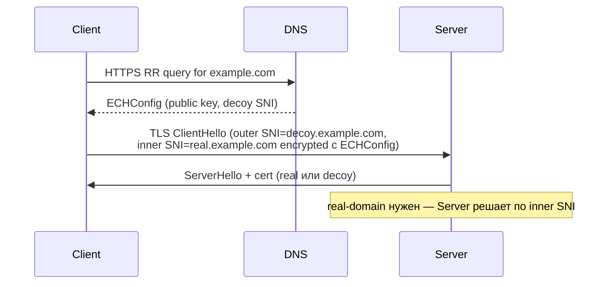

# ECH и ESNI

## TL;DR
**ECH** (Encrypted ClientHello, RFC 9460+) и его предшественник **ESNI** скрывают **SNI** в TLS-handshake — DPI больше не видит, к какому домену идёт соединение. **Теоретически решает** SNI-фильтрацию. **Практически в РФ-2026 заблокирован**: src-01 явно помечает ECH/ESNI как «не работающие способы». Российские DPI **дропают TLS-handshake с ECH-extension** или режут TLS-fingerprint c этим extension'ом.

## Какую проблему решает
До ECH: SNI = открытый текст в первых байтах TLS → DPI читает домен → блокирует. ECH шифрует SNI публичным ключом сервера, лежащим в DNS (HTTPS RR-record, RFC 9460).

## Как работает

Внешне DPI видит SNI=decoy (один из «innocuous» доменов в HTTPS RR), не real.

## Где ломается / почему может не работать
- **Россия (src-01, src-06):** ТСПУ детектирует **TLS-extension с ECH** и дропает соединение.
- **DNS HTTPS-RR резолвинг** требует DoH/DoT — иначе ECHConfig резолвится в открытом DNS, всё равно палится.
- **Cloudflare включил ECH** для своих клиентов (2023+); другие CDN — частично; собственные серверы — редко.
- **Russian DPI ML-classifier** натренирован на ECH-extension; обнаружение мгновенное.

**Status:** на 2026-05-02 — **broken** в РФ. Был **partial** до 2025; декабрь 2025 (src-06) уже не работает массово. Для не-РФ юрисдикций — рабочая защита SNI.

## Минимальный пошаговый сценарий (теоретический, для не-РФ)
1. Сервер: TLS-server с ECHConfig.
2. Опубликовать `_https.example.com` HTTPS RR в DNS.
3. DoH-resolver на клиенте.
4. Современный браузер (Firefox 118+, Chrome) сам подхватит ECH.

## Что нужно
- Server: nginx/openssl с поддержкой ECH (≥OpenSSL 3.x, экспериментально).
- DNS-провайдер с поддержкой HTTPS RR.
- Клиент: Firefox с `network.dns.echconfig.enabled=true`.

## Связи
- **Базируется на:** [[TLS — рукопожатие]] (расширяет), [[DNS]] / [[DNS — типы записей]] (HTTPS RR), [[DNS — приватность и ODNS]] (DoH для разрешения ECHConfig).
- **Противопоставляется:** [[VLESS-Reality]] — Reality маскируется (handshake к target); ECH прячет SNI в decoy.
- **Status note:** в РФ — broken; в большинстве остальных юрисдикций — privacy-improvement.

## Источники
- src-01 (явно «не работает»), src-06 (упоминается, но не как основной метод).
