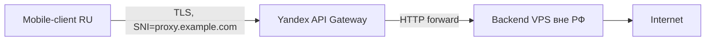

# PB1 — Yandex API Gateway фронтинг

## TL;DR
Mobile-whitelist обход через российский cloud. **Yandex Cloud** (AS 13238) — в whitelist оператора, поэтому первый hop попадает; дальше Yandex транзитно ходит куда надо.

## Архитектура


## Шаги

### 1. Подготовка
- Купить домен (`example.com`).
- Завести аккаунт **Yandex Cloud** + привязать карту.
- Завести аккаунт **Cloudflare** (free).
- Купить **VPS вне РФ** (Hetzner, OVH, DigitalOcean) — backend.

### 2. Backend (VPS вне РФ)
Поднять обычный Xray-сервер с VLESS-Reality (см. [[PB7 — basic VLESS-Reality с нуля]]) или классический VLESS+TLS на 443.

### 3. DNS и сертификат
- Перевести NS-записи `example.com` на Cloudflare.
- В **Yandex Certificate Manager** заказать **Let's Encrypt-сертификат** на `proxy.example.com` (DNS-01 challenge через Cloudflare API).

### 4. API Gateway
Создать в Yandex Cloud API Gateway с **OpenAPI-спецификацией**:
```yaml
openapi: 3.0.0
info: { title: proxy, version: '1' }
paths:
  /{proxy+}:
    x-yc-apigateway-any-method:
      x-yc-apigateway-integration:
        type: http
        url: "https://your-backend-ip-or-domain/{proxy}"
        method: ANY
```

Привязать к шлюзу:
- Custom-domain: `proxy.example.com`.
- Сертификат: тот, что заказали в шаге 3.

### 5. CNAME
В Cloudflare:
```
proxy.example.com  CNAME  d5d7-xxxx.apigw.yandexcloud.net
```

### 6. Клиент
В Hiddify/Nekobox создать VLESS-link, где `address=proxy.example.com`, `port=443`, `sni=proxy.example.com`.

## Проверка
```bash
# С mobile-устройства (whitelist):
curl https://proxy.example.com/test -m 10
```
Если 200/404 от backend → работает.

## Где ломается
- Yandex может детектировать abuse-pattern (long-lived connections с binary payload не похожи на API).
- Бесплатный/cheap-tier у Yandex имеет лимиты на трафик и RPS.
- При жёсткой L7-фильтрации (whitelist для конкретных доменов внутри Yandex) техника ломается.
- Юридический риск: оплата с РФ-карты + привязка к Яндекс-аккаунту → высокая trace-ability.

## Связи
- **Технический фундамент:** [[Yandex API Gateway фронтинг]], [[CDN-фронтинг]].
- **Альтернативы:** [[PB2 — vnext-цепочка через РФ-мост]] (через РФ-VPS вместо API Gateway).

## Источники
- src-01.
