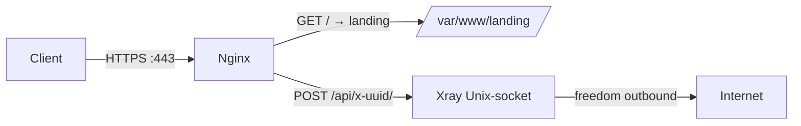

# PB11 — Self-Steal-only на одном внешнем VPS (без cascade)

## TL;DR
Лёгкий вариант [[PB5 — РФ-каскад с xHTTP+packet-up]] **без** РФ-моста: один внешний VPS со своим доменом, Nginx + Let's Encrypt + Xray на Unix-socket. Подходит для **домашнего интернета без whitelist-режима** (большинство проводных провайдеров РФ-2026 на 2026-05-02). Дешевле каскада (~$3-5/мес против ~₽500), но **не работает на mobile-whitelist** — для этого см. [[PB5]].

## Когда брать
- Домашний интернет, **whitelist неактивен** ([[PB4 — диагностика whitelist]] показал что прямые подключения проходят).
- Хочется **больше устойчивости**, чем у голого [[PB7 — basic VLESS-Reality с нуля]] — но без сложности cascade.
- Хочется обойти **active probing**: чужой target в Reality всегда риск, свой домен с landing-страницей выглядит «реальнее».

## Архитектура


## Шаги

### 1. Купить VPS вне РФ + домен
- VPS: 1 vCPU/1 GB/25 GB; Hetzner CX11 (~3€), Vultr ($5).
- Домен: любой регистратор (~$10/год). Лучше **не**-`.ru`, но и не «свежий» (cert-transparency покажет VPN-домен сразу). Подержать домен **2-4 недели** с реальным контентом до использования.
- DNS: `A example.com → SERVER-IP`, TTL 300.

### 2. Подготовить landing
```bash
sudo apt update && sudo apt install -y nginx certbot python3-certbot-nginx
mkdir -p /var/www/landing
# Положить туда что-то реальное: open-source landing (gohugo/jekyll-сайт),
# или статический блог. Можно сгенерировать AI-контент по нейтральной теме.
```

### 3. Получить Let's Encrypt-сертификат
```bash
certbot --nginx -d example.com -m admin@example.com --agree-tos
# Auto-renew уже в systemd-таймере certbot.timer.
```

### 4. Установить Xray
```bash
bash -c "$(curl -L https://github.com/XTLS/Xray-install/raw/main/install-release.sh)" @ install
xray uuid                                 # → UUID
xray x25519                               # не нужен здесь, но пригодится
```

### 5. Конфиг `/usr/local/etc/xray/config.json`
Xray слушает Unix-socket, **не** TCP — внешний сканер не увидит:
```json
{
  "inbounds": [{
    "listen": "/var/run/xray.sock,0666",
    "protocol": "vless",
    "settings": {
      "clients": [{ "id": "UUID-CLIENT", "flow": "" }],
      "decryption": "none"
    },
    "streamSettings": {
      "network": "xhttp",
      "xhttpSettings": {
        "mode": "packet-up",
        "path": "/api/x-aaa-bbb-ccc"
      }
    },
    "sniffing": { "enabled": true, "destOverride": ["http", "tls"] }
  }],
  "outbounds": [
    { "protocol": "freedom", "tag": "direct" },
    { "protocol": "blackhole", "tag": "blocked" }
  ]
}
```
**Важно:** Xray ≥ v25.12.8 для поддержки xHTTP packet-up (см. [[xHTTP]]).

### 6. Nginx-конфиг `/etc/nginx/sites-available/example.com`
```nginx
server {
  listen 443 ssl http2;
  server_name example.com;
  ssl_certificate     /etc/letsencrypt/live/example.com/fullchain.pem;
  ssl_certificate_key /etc/letsencrypt/live/example.com/privkey.pem;
  ssl_protocols TLSv1.3;

  root /var/www/landing;
  index index.html;

  location /api/x-aaa-bbb-ccc/ {
    proxy_pass http://unix:/var/run/xray.sock:;
    proxy_http_version 1.1;
    proxy_set_header Upgrade $http_upgrade;
    proxy_set_header Connection "upgrade";
    proxy_set_header Host $host;
    proxy_buffering off;
    proxy_request_buffering off;
    proxy_read_timeout 300s;
  }

  location / { try_files $uri $uri/ =404; }
}
server { listen 80; server_name example.com; return 301 https://$host$request_uri; }
```
```bash
ln -s /etc/nginx/sites-available/example.com /etc/nginx/sites-enabled/
nginx -t && systemctl reload nginx
systemctl enable --now xray
```

### 7. Собрать клиент-link
```
vless://UUID-CLIENT@example.com:443?security=tls&encryption=none&type=xhttp&path=%2Fapi%2Fx-aaa-bbb-ccc&host=example.com&sni=example.com&fp=chrome&mode=packet-up#MyServer
```

### 8. Клиент
- Hiddify-Next / Nekoray / v2rayNG / Streisand. Импорт link'а или QR.

## Проверка
- `curl https://example.com/` от внешнего наблюдателя → отдаёт landing, не 502.
- `curl -I https://example.com/api/x-aaa-bbb-ccc/` без auth → 404 или Bad Request (нормально).
- В клиенте: `https://ifconfig.me` → IP сервера; `https://www.dnsleaktest.com/` → нет утечек.
- Через **2-4 недели** проверить cert-transparency-логи: если домен светится только в VPN-контексте — переименовать.

## Где ломается
- **Whitelist-провайдер.** Mobile-РФ режет всё кроме trusted-AS — этот рецепт **не пройдёт**, нужен [[PB5 — РФ-каскад с xHTTP+packet-up]] или [[PB1 — Yandex API Gateway фронтинг]].
- **Domain reputation.** Свежий домен + только VPN-трафик = подозрительно. Решение: реальный landing, поисковая индексация, медленный rollout.
- **CT-logs.** Cert-Transparency публично логирует все LE-сертификаты — атакующий может найти твой VPN-домен. Это unavoidable для self-issued LE; альтернатива — wildcard-cert на «материнский» домен.
- **Single-IP weakness.** Когда оператор build'ит «профиль IP» — тот же IP делает только **входящий TLS** + только **исходящий** к разным destinations. Лечится через [[PB6 — Nginx+LE с разделением IP]] (два IP).
- **Active probing на /api/-path** не пройдёт без UUID — но если path обнаружат через timing-side-channel, IP попадёт в blacklist.

## Связи
- **Технический фундамент:** [[Self-Steal — свой домен]], [[xHTTP]], [[X.509 сертификаты]] (LE), [[VLESS-Reality]] (концептуальный родитель).
- **Расширения:** [[PB6 — Nginx+LE с разделением IP]] (анти-profile-IP), [[PB5 — РФ-каскад с xHTTP+packet-up]] (с РФ-мостом для whitelist).
- **Альтернативы:** [[PB7 — basic VLESS-Reality с нуля]] — проще, но чужой target менее устойчив к active probing.

## Источники
- src-06 (Self-Steal как ключевая техника постwhitelist-эпохи).
- Habr: [Эпоха «белых списков»: почему ваши конфиги в декабре 2025 года начали превращаться в тыкву](https://habr.com/ru/articles/979128/) — Self-Steal-домен, нестандартные порты, xHTTP.
- Habr: [Обход блокировок: настройка сервера XRay для Shadowsocks-2022 и VLESS с XTLS-Vision, Websockets и фейковым веб-сайтом](https://habr.com/ru/articles/728836/) — каноничный self-steal с фейковым сайтом.
