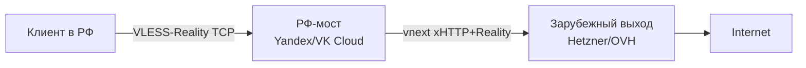

# PB2 — vnext-цепочка через РФ-мост

## TL;DR
**2-уровневая цепочка**: РФ-VPS (мост) + зарубежный (выход). Клиент шлёт VLESS-Reality на мост; мост через **vnext outbound** на xHTTP+Reality пересылает в Европу. DPI видит только короткие сессии «клиент → РФ-мост», что обходит [[Session freezing]].

## Архитектура


## Шаги

### 1. Зарубежный выход
- VPS вне РФ (Hetzner, OVH, DigitalOcean, etc.).
- Установить **Xray-core ≥ v25.12.8**.
- Поднять VLESS+xHTTP+Reality (см. [[PB7 — basic VLESS-Reality с нуля]]).

### 2. РФ-мост
- VPS в whitelist-AS:
  - **Yandex Cloud** (AS 13238) — preemptible-VM от ~150₽/мес.
  - **VK Cloud** — аналогично.
  - **EDGE** (DiNet) — cheaper.
- Установить Xray-core (та же версия).

### 3. Конфиг моста (`/usr/local/etc/xray/config.json`)
```json
{
  "inbounds": [{
    "port": 443, "protocol": "vless",
    "settings": { "clients": [{ "id": "UUID-CLIENT", "flow": "xtls-rprx-vision" }] },
    "streamSettings": {
      "network": "tcp", "security": "reality",
      "realitySettings": {
        "dest": "yandex.ru:443",
        "serverNames": ["yandex.ru"],
        "privateKey": "BRIDGE_PRIV", "shortIds": ["abc"]
      }
    }
  }],
  "outbounds": [
    { "tag": "direct", "protocol": "freedom" },
    {
      "tag": "to-exit", "protocol": "vless",
      "settings": {
        "vnext": [{
          "address": "exit-server.com", "port": 443,
          "users": [{ "id": "UUID-VNEXT" }]
        }]
      },
      "streamSettings": {
        "network": "xhttp",
        "xhttpSettings": { "mode": "packet-up", "path": "/vnext" },
        "security": "reality",
        "realitySettings": { "publicKey": "EXIT_PUB", "fingerprint": "chrome" }
      }
    }
  ],
  "routing": {
    "rules": [
      { "type": "field", "domain": ["geosite:category-ru"], "outboundTag": "direct" },
      { "type": "field", "ip": ["geoip:ru"], "outboundTag": "direct" },
      { "type": "field", "outboundTag": "to-exit" }
    ]
  }
}
```

### 4. Клиент
VLESS-link на **мост** (`address=bridge-ru-ip`).

## Проверка
- `curl --interface tun0 https://ifconfig.me` → должен показать IP **зарубежного выхода**, не моста.
- `curl --interface tun0 https://yandex.ru` → должен идти **DIRECT**, не через выход (если split routing настроен).

## Где ломается
- РФ-VPS должен быть в whitelist-AS — проверить через `whois` и cheburcheck.ru.
- Yandex/VK могут детектировать abuse-pattern long-lived xHTTP-traffic.
- При сбое моста или выхода — цепочка рвётся.
- Двойной cost (2 VPS).

## Связи
- **Технический фундамент:** [[vnext-цепочка]], [[VLESS-Reality]], [[xHTTP]], [[Split routing]].
- **Альтернативы:** [[PB1 — Yandex API Gateway фронтинг]] (cloud вместо VPS), [[PB3 — 4-уровневая архитектура за 265₽]] (более fault-tolerant).

## Источники
- src-02.
