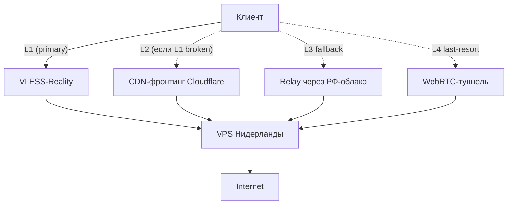

# PB3 — 4-уровневая архитектура за 265₽/мес

## TL;DR
**Resilient** многоуровневая VPN-архитектура с резервными каналами. Если уровень 1 ломается — переключение на 2, и т.д. Стоимость по src-03 — ~265₽/мес.

## Архитектура (4 уровня)


## Шаги

### 1. Базовый VPS-выход
- VPS в Нидерландах (Hetzner CX11 ~3€/мес).
- Свой домен (~$10/год = ~70₽/мес).
- Setup: 3X-UI + Xray-core.

### 2. Уровень 1: VLESS-Reality (primary)
В 3X-UI создать inbound:
- VLESS + Reality, dest=microsoft.com (или другой популярный TLS-сайт).
- **flow:** xtls-rprx-vision.
- Subscription URL для клиента.

### 3. Уровень 2: CDN-фронтинг
- Перевести домен в Cloudflare.
- Включить «оранжевую тучу» для `proxy.example.com` → CNAME на VPS.
- В 3X-UI ещё один inbound: VLESS + websocket + path=/secret-path/, TLS-сертификат от Cloudflare-CA.
- Клиент: link с address=proxy.example.com, sni=proxy.example.com.

### 4. Уровень 3: Relay через РФ-облако
- Аналогично [[PB1 — Yandex API Gateway фронтинг]] или [[PB2 — vnext-цепочка через РФ-мост]].
- VPS в Yandex Cloud (preemptible) с vnext-outbound на основной exit.

### 5. Уровень 4: WebRTC-туннель
- Поднять **coturn** на отдельном VPS (вне РФ).
- Custom-WebRTC-клиент (например, **olcRTC**) для туннеля через DataChannel.

### 6. Клиент с автоматическим failover
- В Hiddify/Sing-box настроить multi-outbound с **urltest** или **fallback**:
  ```yaml
  outbounds:
    - { tag: "auto", type: selector,
        outbounds: ["L1-Reality", "L2-CDN", "L3-RU-relay", "L4-WebRTC"],
        default: "L1-Reality" }
  ```
- При timeout L1 → автоматически на L2.

## Проверка
- Симулировать блокировку L1: `iptables -A OUTPUT -d microsoft.com -j DROP` на клиенте.
- Хиддифай должен переключиться на L2.

## Где ломается
- **Cloudflare AS 13335 в blacklist** РФ-DPI (src-09) → L2 ненадёжен.
- **Yandex Cloud abuse detection** → L3 может банить аккаунт.
- **WebRTC требует** signaling-сервера (тоже точка отказа).
- **Сложность** конфигурации — для технически подкованных пользователей.

## Цена (по src-03)
| Уровень | Сервис | ₽/мес |
|---|---|---|
| Базовый VPS | Hetzner CX11 | ~250 |
| Домен | NameSilo | ~70/12 = ~6 |
| Yandex Cloud (preemptible) | EDGE | ~10 |
| Cloudflare | Free tier | 0 |
| **Итого** | | **~265** |

## Связи
- **Технический фундамент:** [[VLESS-Reality]], [[CDN-фронтинг]], [[Yandex API Gateway фронтинг]], [[WebRTC-туннель]], [[Split routing]].
- **Альтернативы:** [[PB2 — vnext-цепочка через РФ-мост]] (только L1+L3).

## Источники
- src-03.
