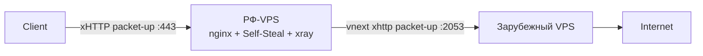

# PB5 — РФ-каскад с xHTTP+packet-up

## TL;DR
Эволюция [[PB2 — vnext-цепочка через РФ-мост]] на декабрь 2025 (src-06): добавляется **Self-Steal** (свой домен с реальным сайтом) на РФ-входе + **xHTTP+packet-up** transport между нодами для устойчивости к [[Session freezing]] и нестандартные порты для маскировки.

## Архитектура


## Шаги

### 1. Подготовка
- РФ-VPS в whitelist-AS (Yandex/VK/DiNet/EDGE).
- Зарубежный VPS (Hetzner, OVH).
- 2 домена (или один с двумя поддоменами): `bridge.example.com`, `exit.example.com`.

### 2. Зарубежный exit
- Xray-core ≥ v25.12.8.
- **inbound:** VLESS + xHTTP packet-up, security=Reality (dest=популярный TLS-сайт), port **2053** (нестандартный).
- Конфиг см. в [[PB7 — basic VLESS-Reality с нуля]] с заменой transport на xhttp.

### 3. РФ-мост (Self-Steal)
**Nginx:**
```nginx
server {
  listen 443 ssl http2;
  server_name bridge.example.com;
  ssl_certificate /etc/letsencrypt/live/bridge.example.com/fullchain.pem;
  ssl_certificate_key /etc/letsencrypt/live/bridge.example.com/privkey.pem;

  location / {
    root /var/www/html;  # реальный landing-page
    try_files $uri $uri/ /index.html;
  }

  location /vpn-x-uuid/ {
    proxy_pass http://unix:/var/run/xray.sock:;
    proxy_http_version 1.1;
    proxy_set_header Upgrade $http_upgrade;
    proxy_set_header Connection "upgrade";
  }
}
```

**Xray-config (мост):**
```json
{
  "inbounds": [{
    "listen": "/var/run/xray.sock",
    "protocol": "vless",
    "settings": { "clients": [{ "id": "UUID-CLIENT" }], "decryption": "none" },
    "streamSettings": {
      "network": "xhttp",
      "xhttpSettings": { "mode": "packet-up", "path": "/vpn-x-uuid" }
    }
  }],
  "outbounds": [{
    "tag": "to-exit", "protocol": "vless",
    "settings": {
      "vnext": [{
        "address": "exit.example.com", "port": 2053,
        "users": [{ "id": "UUID-VNEXT" }]
      }]
    },
    "streamSettings": {
      "network": "xhttp",
      "xhttpSettings": { "mode": "packet-up", "path": "/exit" },
      "security": "reality",
      "realitySettings": { "publicKey": "EXIT_PUB", "fingerprint": "chrome" }
    }
  }]
}
```

### 4. Self-Steal landing
- В `/var/www/html` положить **innocuous landing-page** (открытый клон какого-то open-source проекта).
- Active probing на `https://bridge.example.com/` → отдаётся реальный сайт.
- На path `/vpn-x-uuid/` — VPN.

### 5. Клиент
VLESS-link с:
- `address=bridge.example.com`, `port=443`.
- `path=/vpn-x-uuid`, `mode=packet-up`.
- `host=bridge.example.com`.

## Проверка
- `curl https://bridge.example.com/` → вернёт landing-page.
- `curl https://bridge.example.com/random-non-existent` → 404 от nginx.
- VPN-клиент → должен работать через `/vpn-x-uuid/`.

## Где ломается
- РФ-VPS должен иметь стабильный whitelist-AS.
- РКН может **точечно** заблокировать конкретные домены даже в whitelist-AS.
- Self-Steal требует **поддерживать** реальный сайт (Cert-renew, видимость для ботов).

## Связи
- **Технический фундамент:** [[xHTTP]], [[Self-Steal — свой домен]], [[VLESS-Reality]], [[vnext-цепочка]].
- **Эволюция:** [[PB2 — vnext-цепочка через РФ-мост]] (более простой вариант).

## Источники
- src-06.
