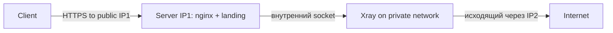

# PB6 — Nginx+LE с разделением входящий/исходящий через разные IP

## TL;DR
По src-07: ключ устойчивости — **легитимный профиль IP**: реальный сайт с трафиком от ботов, no «странного» исходящего, **разные IP** для входящего VPN-трафика и исходящего наружу. ТСПУ строит «профиль» каждого IP — нужно, чтобы профиль выглядел как обычный веб-сервер, не как VPN-relay.

## Концепция «профиля IP»
- Если IP только **получает** входящий TLS-трафик (без исходящих исходящих connections к разным destinations) → выглядит как VPN-сервер.
- Если IP **только** делает исходящие connections (без входящих) → выглядит как браузер/scraper.
- Идеал: и то, и другое в **легитимных** пропорциях.

## Архитектура


## Шаги

### 1. VPS с двумя public IP
Большинство провайдеров позволяют купить **secondary IPv4**:
- Hetzner, OVH, Vultr, DigitalOcean — обычно ~$1/мес.
- **IP1** — для входящего HTTPS (DNS показывает на него).
- **IP2** — для исходящего трафика VPN.

```bash
# /etc/network/interfaces или netplan:
auto eth0:1
iface eth0:1 inet static
  address IP2/32
  gateway ...
```

### 2. Nginx на IP1 (входной)
```nginx
server {
  listen IP1:443 ssl;
  server_name myproxy.example.com;
  ssl_certificate /etc/letsencrypt/live/myproxy.example.com/fullchain.pem;
  ssl_certificate_key /etc/letsencrypt/live/myproxy.example.com/privkey.pem;

  location / { root /var/www/landing; }  # реальный сайт
  location /api/uuid-secret/ {
    proxy_pass http://unix:/var/run/xray.sock:;
    # ...
  }
}
```

### 3. Xray (внутренний)
```json
{
  "inbounds": [{
    "listen": "/var/run/xray.sock",
    "protocol": "vless",
    ...
  }],
  "outbounds": [{
    "protocol": "freedom",
    "settings": { "domainStrategy": "UseIPv4" },
    "sendThrough": "IP2"  // явно указываем outbound IP
  }]
}
```

`sendThrough` в outbound заставляет исходящий socket использовать IP2.

### 4. Легитимный сайт на IP1
- Реальный landing (open-source clone).
- Submit в **Google Search Console** для индексации.
- Опционально: добавить **Cloudflare-Argo Tunnel** для часть трафика реальный.

### 5. Не часто менять IP
- src-07: «не часто менять адреса». Если IP свежий, без истории → подозрительно.
- Подержать IP **месяц-два** с реальным контентом перед использованием для VPN.

## Проверка
- `whois IP1` → должен показывать «обычный hosting».
- `traceroute` от клиента → стандартные пути.
- `curl https://myproxy.example.com/` → landing с реальным контентом.

## Где ломается
- **Цена двух IP** растёт.
- **Provider** может отказать в secondary IP без обоснования.
- Профайл IP**1** ещё может быть классифицирован если **долговременные** TLS-сессии слишком характерны для VPN.

## Связи
- **Технический фундамент:** [[Self-Steal — свой домен]], [[X.509 сертификаты]] (Let's Encrypt), [[VLESS-Reality]].
- **Соседи по уровню:** [[PB5 — РФ-каскад с xHTTP+packet-up]] (тоже Self-Steal-подход).

## Источники
- src-07.
