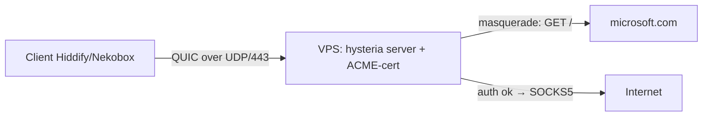

# PB9 — Hysteria-2 / QUIC-VPN с нуля

## TL;DR
Полный setup **Hysteria 2** (QUIC-VPN, маскируется под HTTP/3) на VPS вне РФ: Linux + ACME-cert от Let's Encrypt + masquerade-режим + клиент Hiddify/Nekobox. По сравнению с TCP-каналами (VLESS-Reality) Hysteria сильнее на **lossy mobile-канале** благодаря **Brutal-congestion-control**, но в РФ-2026 на mobile-whitelist UDP/443 часто фильтруется → status `partial`. См. [[QUIC и mKCP]] про QUIC-туннели в целом.

## Когда брать
- Lossy mobile / спутник / Wi-Fi с потерями ≥3% — TCP-каналы заметно деградируют, QUIC даёт +30-50% throughput.
- Стабильный домашний интернет вне whitelist-режима — отлично работает на UDP/443.
- **Не брать**, если оператор лимитирует UDP-throughput или whitelist-режим режет всё кроме TCP/443 в нужные AS.

## Архитектура


## Шаги

### 1. Купить VPS вне РФ
- 1 vCPU, 1 GB RAM, 25 GB disk.
- Public IPv4. **UDP/443 не должен быть зарезан** (некоторые провайдеры блокируют UDP).
- Hetzner / OVH / Vultr — обычно UDP-friendly.

### 2. Зарегистрировать домен
Нужен **реальный домен** (`example.com`) с A-записью на IP сервера — ACME должен пройти HTTP-01-валидацию.
- DNS: `A example.com → SERVER-IP`, TTL 300.
- Открыть `:80/tcp` и `:443/udp` в firewall — TCP/80 для ACME-challenge, UDP/443 — для Hysteria.

### 3. Установить Hysteria 2
Официальный install-script (по гайду Habr-1008554):
```bash
sudo apt update && sudo apt full-upgrade -y
bash <(curl -fsSL https://get.hy2.sh/)
systemctl status hysteria-server
```

### 4. Сконфигурировать `/etc/hysteria/config.yaml`
Минимальная рабочая конфигурация с masquerade под `microsoft.com`:
```yaml
listen: :443

acme:
  domains:
    - example.com
  email: admin@example.com
  ca: letsencrypt           # обязательно для РФ-доменов

auth:
  type: password
  password: GENERATED-LONG-RANDOM-STRING

masquerade:
  type: proxy
  proxy:
    url: https://www.microsoft.com
    rewriteHost: true

bandwidth:
  up: 200 mbps
  down: 200 mbps
```
Важно: **пробелы**, не табы. Опечатки YAML — главный источник «непонятных ошибок» (Habr-1008554, Habr-990176).

### 5. Перезапустить и проверить cert
```bash
systemctl restart hysteria-server
journalctl -u hysteria-server -f
# В логах должно быть: "tls: loaded certificate" — ACME отработал.
curl -I https://example.com  # должен вернуть страницу microsoft.com (masquerade)
```

### 6. Собрать клиент-link
```
hysteria2://GENERATED-LONG-RANDOM-STRING@example.com:443/?sni=example.com#MyHy2
```

### 7. Установить клиент
- **Desktop:** Hiddify-Next, Nekoray (Windows/macOS/Linux).
- **Android:** NekoBox для Android, v2rayNG (с Hysteria2-плагином), Hiddify.
- **iOS:** Streisand, FoxRay, v2raytun, Happ.

Импорт link'а — клиент сам поднимет QUIC-сессию к UDP/443.

### 8. (Опционально) Port-hopping
Если оператор блокирует *конкретно* UDP/443:
```yaml
listen: :443,20000-20100
```
+ iptables-правило, разворачивающее весь UDP-диапазон в один порт. Клиент в link-парам `mport=20000-20100`.

## Проверка
- `curl -I https://example.com` от внешнего наблюдателя → выдаёт masquerade (microsoft.com).
- В клиенте: `https://ifconfig.me` → IP сервера.
- `https://browserleaks.com/webrtc` — нет утечек реального IP.

## Где ломается
- **UDP-блокировка / throttling.** Mobile-whitelist в РФ-2026 часто режет UDP за пределами Yandex/VK-AS — на mobile может вообще не доходить ([[Белые списки]]). Решение — port-hopping или fallback на TCP-канал ([[PB7 — basic VLESS-Reality с нуля]]).
- **Brutal-congestion-control узнаваем.** Постоянный высокий throughput не похож на «обычный» браузер; ML-классификатор ТСПУ может отметить. Снизить `bandwidth: up/down` под реалистичные значения (50-100 Mbps).
- **Salamander-обфускация ломает HTTP/3-совместимость** — при active probing сервер «молчит» на нормальный QUIC-init, что само по себе подозрительно. Использовать masquerade-режим, а не Salamander, везде где можно.
- **ACME failure:** если TCP/80 закрыт или DNS не указывает на сервер — `tls: failed to obtain certificate`. Проверить `dig example.com` и `iptables -L`.
- **NAT-timeout** на UDP короткий (30 с) — нужен `quic.maxIdleTimeout: 30s` keep-alive.

## Связи
- **Технический фундамент:** [[QUIC и mKCP]], [[QUIC]], [[X.509 сертификаты]] (ACME/LE).
- **Альтернативы:** [[PB7 — basic VLESS-Reality с нуля]] (TCP-канал, надёжнее на whitelist), Tuic (другой QUIC-VPN).
- **Расширения:** комбинировать с [[Self-Steal — свой домен]] — masquerade-proxy на свой landing вместо microsoft.com.

## Источники
- src-08 (общий обзор протоколов 2024).
- Habr: [Hysteria 2: протокол, который притворяется HTTP/3 и почти не врёт](https://habr.com/ru/articles/1008554/) — детали обфускации, brutal, masquerade vs salamander.
- Habr: [Установка и настройка Hysteria](https://habr.com/en/articles/990176/) — пошаговый install + ACME + минимальный YAML.
