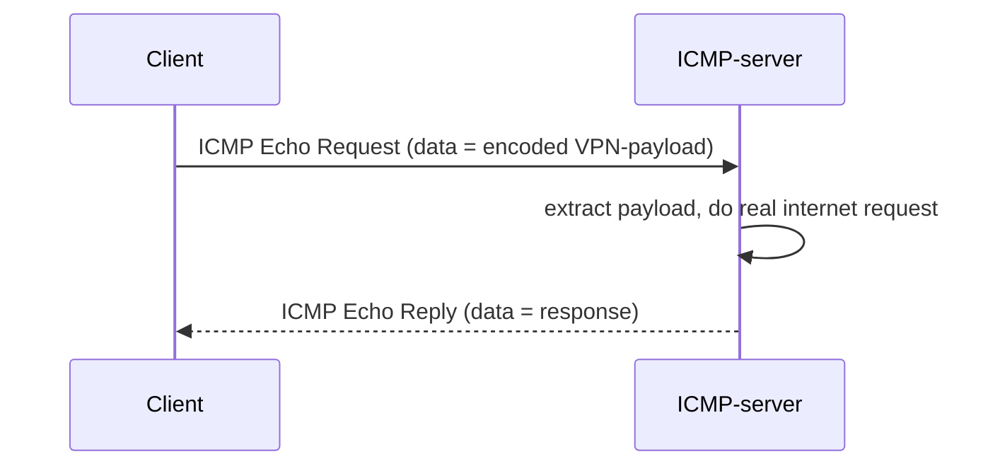

# PingTunnel — ICMP-туннель

## TL;DR
Прячет VPN-payload в **ICMP Echo Request/Reply** (то самое, что использует `ping`). DPI редко блокирует ICMP — это сломало бы диагностику сети. **Очень узкая полоса** (нет официальных «больших» полей в ICMP), мало пригодно для bulk-traffic, но работает там, где ничего больше не работает (firewalled corporate-сеть, restrictive whitelist).

## Какую проблему решает
**Last-resort transport:** в максимально ограниченных сетях ICMP остаётся пропускаемым. Если TCP/UDP/DNS все заблокированы — ICMP последняя надежда.

## Как работает



**Реализации:**
- **PingTunnel** (Daniel Stødle, ~2005) — оригинальная C-implementation.
- **icmptunnel** (DhavalKapil) — современный fork.

## Где ломается / почему может не работать
- **Производительность:** ICMP даёт ~10-50 KB/s — мучительно медленно.
- **Latency:** обычно ICMP-rate-limited на провайдере — короткие burst'ы, longer pauses.
- **Stateless ICMP** — нет sequence-numbers и connection-state, нужны на application-layer.
- **Mobile-операторы** часто блокируют ICMP полностью или жёстко rate-limit.
- **Современные DPI** могут детектировать abnormal ICMP-pattern (большие packets, частые echo).

## Минимальный пошаговый сценарий
**Сервер:**
```bash
# нужен root на сервере
sudo ./pingtunnel -m server
```
**Клиент:**
```bash
sudo ./pingtunnel -m client -l :4455 -s server-ip -t server-ip:443
```
Локальный 4455 → ICMP-tunnel → server-ip → real-target:443.

## Что нужно
- VPS с public IP (root для raw socket).
- Клиент с правом raw socket (Linux: `setcap` или sudo).
- PingTunnel binary.

## Связи
- **Базируется на:** [[ICMP]] (механизм).
- **Соседи по уровню:** [[DNS-туннелирование]] — другой last-resort.
- **Противопоставляется:** обычные TCP/UDP-VPN — на порядки быстрее.

## Источники
- src-08.
