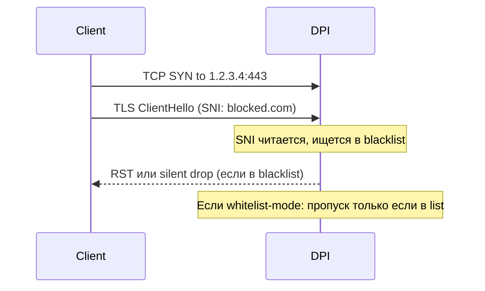

# SNI-фильтрация — L7-блокировка по домену

## TL;DR
**SNI** (Server Name Indication) — поле в TLS-ClientHello с именем сервера, к которому идёт соединение. Передаётся **в открытом виде** в первых байтах TLS-handshake. ТСПУ читает SNI → сравнивает с blacklist (или whitelist) → пропускает / блокирует. Главная техника фильтрации HTTPS-трафика без расшифровки. Контр-меры: **ECH/ESNI** (теория), **VLESS-Reality** (handshake к разрешённому target'у), **CDN-фронтинг**.

## Какую проблему решает (с точки зрения регулятора)
- HTTPS-трафик зашифрован → нельзя читать payload.
- Но SNI **открытый** → можно фильтровать на уровне домена без расшифровки.
- Эффективно, дёшево, не требует доступа к private keys.

## Как работает



**Структура SNI в ClientHello:**
- Длина handshake-message (24 бита).
- Extensions section.
- В extension `server_name` (тип 0x00) — domain name as ASCII.

**Whitelist-режим:**
- Пакет проходит **только** если SNI в списке разрешённых.
- На мобильных (src-01, src-05): ~0.14% доменов разрешены.

**Blacklist-режим:**
- Большинство трафика проходит.
- Конкретные домены блокируются.

## Где ломается / почему может не работать (для регулятора)
1. **VLESS-Reality**: SNI = разрешённый target (microsoft.com), handshake реально к нему. ТСПУ видит «легитимный SNI», пропускает.
2. **CDN-фронтинг**: SNI = popular CDN-domain.
3. **ECH** (теоретически): зашифрованный SNI. Но в РФ ECH-extension сам по себе детектируется и блокируется (см. [[ECH и ESNI]]).
4. **Domain fronting** (классический, до 2018): SNI = decoy, Host = real. Обход CDN-проверки. Cloudflare закрыл.

**Уязвимость whitelist'а:**
- Если разрешён `*.cloudflare.com` — можно поднять свой VPN под этим SNI (через Cloudflare).
- Если разрешён `microsoft.com` — VLESS-Reality к microsoft.com работает.

## Минимальный сценарий диагностики
```bash
# Wireshark или tcpdump:
tcpdump -i any -X 'tcp port 443'
# В ClientHello: ищи "server_name" extension.

# Тест блокировки:
curl --resolve blocked.com:443:1.2.3.4 https://blocked.com/
# Если RST → SNI-фильтрация на blocked.com.
# Если timeout → может быть IP-blacklist.
```

## Связи
- **Базируется на:** [[TLS — рукопожатие]] (механизм SNI).
- **Используется в:** [[ТСПУ]] (исполнитель), [[Белые списки]] (стратегия).
- **Соседи по уровню:** [[Session freezing]] (другая DPI-стратегия), [[Active probing]] (тоже).
- **Обходится:** [[VLESS-Reality]], [[CDN-фронтинг]], [[Self-Steal — свой домен]], [[ECH и ESNI]] (теоретически).

## Источники
- src-01, src-05, src-06.
