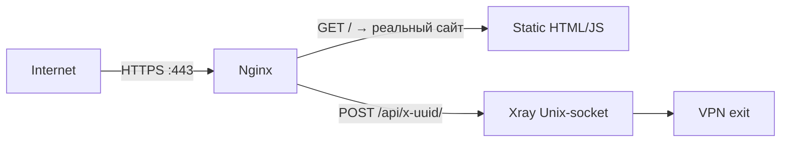

# Self-Steal — свой домен для маскировки

## TL;DR
Альтернативный подход к Reality: **вместо чужого target-сайта** (microsoft.com) для маскировки **поднимаешь свой**: реальный сайт на nginx с Let's Encrypt-сертификатом, валидным контентом (например, копия landing-page какого-то open-source-проекта). Прокси-логика «прячется» рядом — определённый path отдаёт VPN-трафик. Защищает от **active probing** лучше, чем «голый» VLESS+TLS, потому что DPI-сканер видит реальный сайт.

## Какую проблему решает
- **Reality с чужими target'ами** в РФ-2026 теряет надёжность: target-IP может попасть в whitelist, твой сервер — нет.
- **VLESS+TLS со своим доменом** легко детектируется через active probing (на «обычный» domain никто не приходит, кроме VPN-клиентов).
- Self-Steal: сервер выглядит **как обычный сайт**, на который **есть** трафик (поисковые боты, случайные посетители).

## Как работает

**Архитектура:**
- Nginx на 443 с TLS (Let's Encrypt + auto-renew).
- Главная страница `/` отдаёт **реальный контент** (можно clone какого-то популярного landing).
- Specific path `/api/secret-uuid/` — proxypass на Xray-Unix-socket.
- Xray слушает Unix-socket, не TCP — снаружи невидим.



**ALPN/HTTP/2** — если nginx поддерживает h2, и Xray тоже, путь обходчика не отличить от обычного API.

## Где ломается / почему может не работать
- **Контент-claim:** если копируешь чужой landing — ловить за copyright.
- **Боты на /api/...** просто 404. Но active probing на конкретный path — palется (атакующий с UUID не знает, что тестировать).
- **DPI-deep-inspection:** если ML-классификатор будет смотреть **на shape запросов внутри path** — может отличить.
- **Cert-Transparency:** домен publically logged — атакующий через CT-logs может найти твой VPN-домен.

## Минимальный пошаговый сценарий
1. Регистрация домена (`unique-name.com`).
2. Nginx + Let's Encrypt: `certbot --nginx -d unique-name.com`.
3. На главной — статический landing какого-то innocuous-проекта (или собственный).
4. Xray-config: `inbound: vless+xhttp` на Unix-socket.
5. Nginx-block:
   ```nginx
   location /api/x-aaa-bbb-ccc/ {
     proxy_pass http://unix:/var/run/xray.sock:;
     proxy_http_version 1.1;
   }
   ```
6. Клиент: VLESS-link с `host=unique-name.com`, `path=/api/x-aaa-bbb-ccc/`.

## Что нужно
- Свой домен (~$10/год).
- VPS с public IP.
- Nginx + Let's Encrypt + Xray.
- Контент landing'а (можно сгенерировать AI или взять open-source).

## Связи
- **Базируется на:** [[X.509 сертификаты]] (LE), [[HTTPS]], [[VLESS-Reality]] (концептуальный родитель).
- **Соседи по уровню:** [[CDN-фронтинг]] (другой подход), [[xHTTP]] (часто внутри Self-Steal).
- **Используется в:** [[PB5 — РФ-каскад с xHTTP+packet-up]] (Self-Steal на входе), [[PB6 — Nginx+LE с разделением IP]].
- **Противопоставляется:** Reality с target'ом — там target чужой; здесь — свой.

## Источники
- src-06.
