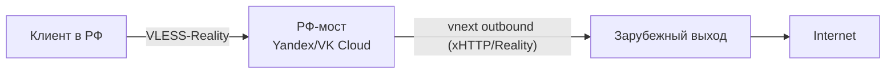

# vnext-цепочка (chain через РФ-мост)

## TL;DR
Архитектурный паттерн в Xray: одна нода (РФ-мост) **проксирует трафик** на другую ноду (зарубежный выход) через **outbound с типом vnext**. С точки зрения клиента — он подключается к мосту в РФ; мост сам прозрачно перебрасывает в Европу. DPI видит только короткие соединения «клиент → РФ-сервер», не длинную сессию «клиент → Европа», что обходит **session-freezing** + **whitelist** (РФ-IP допускается).

## Какую проблему решает
- **Whitelist:** прямое соединение к зарубежному IP может быть заблокировано; РФ-IP пропускается.
- **Session freezing:** длинная сессия «клиент → Европа» замораживается через 16 KB; короткая «клиент → мост» с пере-handshake не успевает.
- **Latency маскировки:** traceroute от клиента не видит зарубежных хопов.

## Как работает



**Конфиг моста (outbound = vnext):**
```json
"outbounds": [{
  "protocol": "vless",
  "settings": {
    "vnext": [{
      "address": "exit-server.com",
      "port": 443,
      "users": [{ "id": "...", "flow": "xtls-rprx-vision" }]
    }]
  },
  "streamSettings": { "security": "reality", "network": "xhttp", ... }
}]
```

**Routing на мосту:**
- RU-домены (`*.yandex.ru`, `*.mail.ru`) → DIRECT (не идти через выход).
- Остальное → outbound vnext к Europe.
- Geo-файлы (`geosite.dat`, `geoip.dat`) от Loyalsoldier для классификации.

## Где ломается / почему может не работать
- **РФ-VPS должен быть в whitelist:** Yandex.Cloud / VK Cloud / EDGE подходят; обычные хостеры (Selectel, Timeweb) — переменно.
- **Yandex/VK могут детектировать abuse-pattern** — long-lived xHTTP-traffic больше похож на VPN, чем на API-app.
- При сбое любого узла цепочка ломается.
- **Двойной cost:** 2 VPS + 2 raz больше latency.

## Минимальный пошаговый сценарий
См. [[PB2 — vnext-цепочка через РФ-мост]].

## Что нужно
- РФ-VPS в whitelist-AS (Yandex/VK/DiNet/EDGE/etc).
- Зарубежный VPS (Хетцнер, OVH, и т.п.).
- Xray-core ≥ v25.12.8 на обеих нодах.
- Geo-файлы для split routing.

## Связи
- **Базируется на:** [[VLESS-Reality]] (внутри туннелей), [[xHTTP]] (transport), [[Туннелирование]] (концепт).
- **Используется в:** [[PB2 — vnext-цепочка через РФ-мост]], [[PB3 — 4-уровневая архитектура за 265₽]] (концептуально).
- **Соседи по уровню:** [[Yandex API Gateway фронтинг]] (другой РФ-фронт), [[Split routing]].
- **Противопоставляется:** прямой VPN к Европе — ломается на whitelist+freezing.

## Источники
- src-02.
