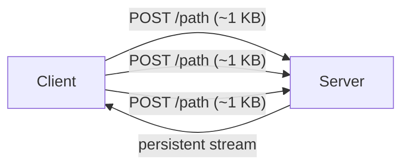

# xHTTP (packet-up)

## TL;DR
Transport-обёртка Xray, упаковывающая VLESS-трафик в **HTTP/2 или HTTP/3-запросы** так, что DPI видит **обычный HTTP-веб-трафик**. Режим **packet-up** дополнительно фрагментирует upstream — каждый «пакет» уходит отдельным POST-запросом, что ломает heuristic'и связывания запросов и **обходит замораживание длинных TCP-сессий** (см. [[Session freezing]]).

## Какую проблему решает
DPI в РФ-2025+ **замораживают** TCP-соединение после ~16 KB или после длительной активности (см. src-09, src-02) — не RST, просто перестают пропускать. xHTTP с packet-up разбивает поток на отдельные короткие POST'ы → каждый запрос **новый** для DPI → нет «длинной» сессии для заморозки.

## Как работает

**Без packet-up (vanilla xHTTP):**
- Клиент: HTTP/2-stream к серверу с длинной body.
- Сервер: читает body, отдаёт ответ stream.

**С packet-up:**
- Клиент: каждое sendto → **отдельный POST-запрос**.
- Сервер: каждый POST → push в outbound, ответы — через persistent SSE-stream или отдельные long-poll.
- DPI видит обычный пользовательский HTTP/2-traffic с множеством коротких POST.



## Где ломается / почему может не работать
- **CPU overhead:** много мелких HTTP-запросов = больше overhead'а на сервере и клиенте, чем у Reality.
- **Latency:** для intеractive (SSH, WebRTC) — выше задержка, чем у TCP.
- **Старые версии Xray** не поддерживают xHTTP — нужен **≥ v25.12.8** (src-02).
- На сервере должен быть **TLS-фронт** (Reality, classical TLS, или Caddy/Nginx-proxy).

## Минимальный пошаговый сценарий

Серверный конфиг:
```json
"streamSettings": {
  "network": "xhttp",
  "xhttpSettings": { "mode": "packet-up", "path": "/api/v1" },
  "security": "reality",
  "realitySettings": { ... }
}
```
То же на клиенте.

## Что нужно
- Xray-core ≥ v25.12.8.
- TLS-обёртка (обычно Reality или TLS+валидный сертификат).

## Связи
- **Базируется на:** [[HTTP-2 и HTTP-3|HTTP/2 и HTTP/3]] (transport), [[TLS — рукопожатие]] (security).
- **Используется в:** [[PB2 — vnext-цепочка через РФ-мост]], [[PB5 — РФ-каскад с xHTTP+packet-up]].
- **Соседи по уровню:** [[VLESS-Reality]] (часто в паре), [[XTLS-Vision]] (альтернатива).
- **Противопоставляется:** plain TCP-VLESS — длинные сессии замерзают.

## Источники
- src-02, src-06.
